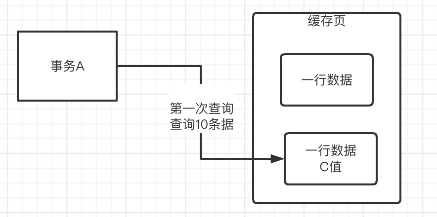
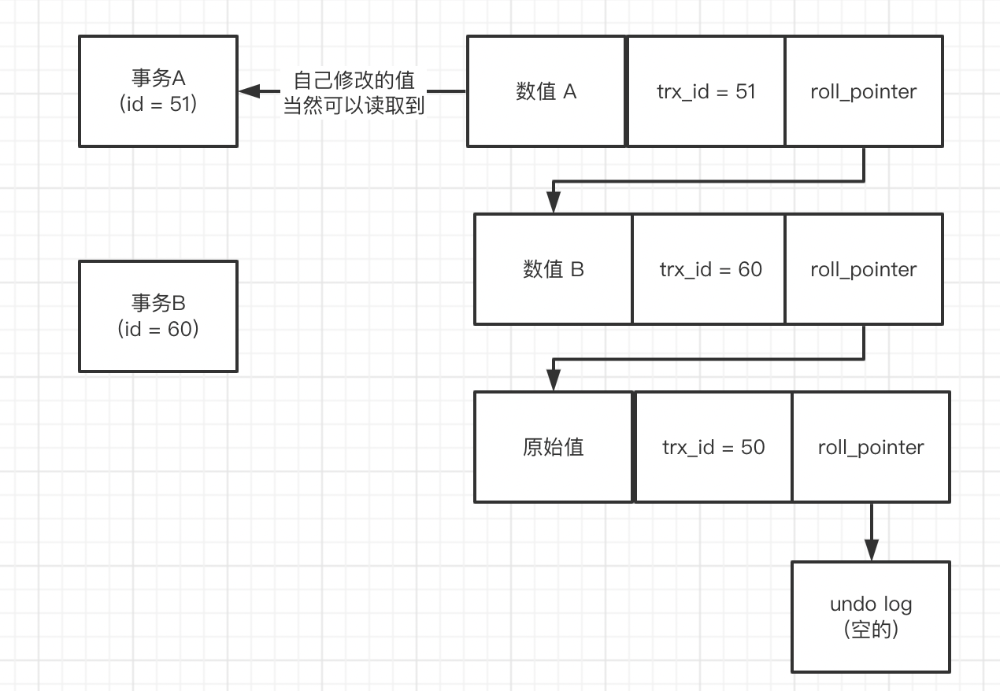
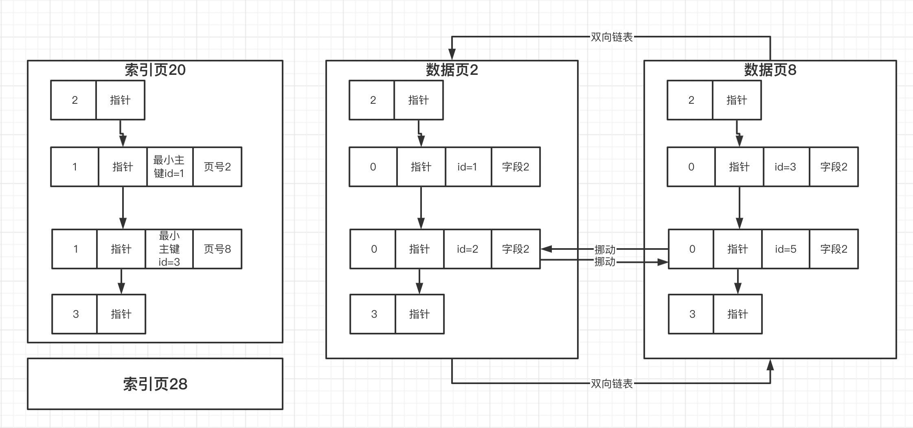
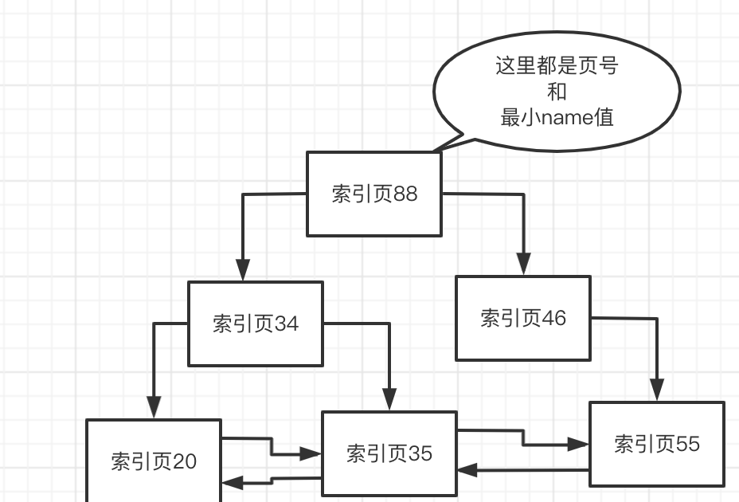

MySQL 知识概览

## 1. 基础知识

### 1.1 基础架构设计

一个数据库连接发送到了MySQL上，然后肯定会经过SQL接口、解析器、优化器、执行器几个环节，解析SQL语句，生成执行计划，接着去由执行器负责这个计划的执行，调用InnoDB存储引擎的接口去执行


- sql语句从connection读取出来了之后，就会交给「SQL接口」来处理，可以理解为一个门面
- 一条sql语句，是人使用的语法，mysql没办法理解的，mysql需要转化成自己能理解的语法。那么mysql就提供了一个「SQL查询解析器」去解析sql语句，对sql进行拆解
- sql的执行，可能会有多种路径，比如遍历表，一条一条对比，比如直接根据id定位到那一条数据。「查询优化器」，要优化出一条最优的查询路径，提高查询的效率。他会生成一个查询路径树，然后从里面选择一条最优查询路径，你就按照这个查询的步骤和顺序来执行操作就好了。
- 查询优化器给出来一条sql执行计划，就需要有人来执行 这个执行计划。「执行器」接下来就会根据这个执行计划，去多次调度 存储引擎的接口, 执行器是非常核心的一个组件，负责跟存储引擎配合完成一个SQL语句在磁盘与内存层面的全部数据更新操作
- 「存储引擎」是真正的存储和处理数据的地方，数据主要是存储在内存和磁盘。存储引擎接口，是一个Facade，对执行器提供简单的调用方法，屏蔽掉了内部复杂的处理逻辑。

### 1.2 innodb 存储引擎结构

为什么要有不同的存储引擎

> 满足不同的场景需求，比如性能、事务、存储限制、索引的支持等等

三种模型：

- 完全基于内存存储的，要求速度快，性能高，但是存储的容量小，数据会丢失；

- 完全基于磁盘的，存储容量大，数据不丢失，但是速度慢，性能低；

- 基于内存+磁盘，兼顾上面两种的优缺点。

#### 1.2.1 重要组成部分「缓冲池 buffer pool」

InnoDB存储引擎中有一个非常重要的放在內存里的组件，就是缓冲池(Butfer Pool)，这里面会缓存很多的数据，以
便于以后在查询的时候，万一你要是内存缓冲池里有数据，就可以不用去查磁盘了,  **因为我们想一下，在我们更新"id=10*这一行数据的时候，肯定是不允许别人同时更新的，所以必须要对这行记录加独占锁**


#### 1.2.2 undo日志文件(让你更新的数据回滚)

接着下一步，假设“id=10"这行数据的name原来是"zhangsan’，现在我们要更新为“xxx”，那么此时我们得先把要更新的
原来的值“zhangsan"和"id=10"这些信息，写入到undo日志文件中去。

其实稍微对数据库 有一点了解的同学都应该知道，如果我们执行一个更新语句，要是他是在一个事务里的话，那么事
务提交之前我们都是可以对数据进行回滚的，也就是把你更新为“xxx”的值回滚到之前的“zhangsan”去。


#### 1.2.3 更新 buffer pool 中的缓存数据 && Redo Log Buffer

当我们把要更新的那行记录从磁盘文件加载到缓冲池，同时对他加锁之后，而且还把更新前的旧值写入undo日志文件
之后，我们就可以正式开始更新这行记录了，更新的时候，先是会更新缓冲池中的记录，此时这个数据就是 `脏数据
了`, 这里所谓的更新内存缓冲池里的数据，意思就是把内存里的"id=10"这行数据的name字段修改为"xxx”
那么为什么说此时这行数据就是脏数据了呢？

> 因为这个时候磁盘上 “id=10” 这行数据的name字段还是 “zhangsan"，但是内存里这行数据已经被修改了，所以就会叫他
> 是`脏数据`。


现在内存中的数据是已经更新过了, 但是磁盘的数据还未更改, 此时两处的数据不一致, 忽然在此时机器宕机了, 数据为更新至磁盘, 怎么办呢?

> 这个时候，就必须要把对內存所做的修改写入到一个Redo Log Buffer里去，这也是内存里的一个缓冲区，是用来存放
> redo日志的, 所谓的redo日志，就是记录下来你对数据做了什么修改，比如对"id=10这行记录修改了name字段的值为xxx”，这就是一个日志。


此时 redo log 中的数据还是存在内存中,还没有落入磁盘, 此时机器宕机, 依然存在数据未落盘的问题, 在数据库中，`哪怕执行一条SQL语句，其实也可以是一个独立的事务`，只有当你提交事务之后，SQL语句才算执行结束。在还没有提交事务，那么此时如果MySQL崩溃，必然导致内存里 Buffer Pool 中的修改过的数据都丢失，同时你写入Redo Log Buffer中的redo日志也会丢失


那么此时机器宕机会有影响么(数据丢失会造成沉重影响么)?

> 其实是不要紧的，因为你一条更新语句，没提交事务，就代表他没执行成功，此时MySQL宕机虽然导致内存里的数据
> 都丢失了，但是你会发现，磁盘上的数据依然还停留在原样子。
>
> 也就是说，“id=1”的那行数据的name字段的值还是老的值，“zhangsan”，所以此时你的这个事务就是执行失败了，没
> 能成功完成更新，你会收到一个数据库的异常。然后当mysq!重启之后，你会发现你的数据并没有任何变化。
>
> 所以此时如果mysql宕机，不会有任何的问题。

#### 1.2.4 将 Redo Log 落盘

接着我们想要提交一个事务了，此时就会根据一定的策略把redo日志从 redo log buffer 里刷入到磁盘文件里去。
此时这个策略是通过 `innodb_flush_log_at_trx _commit` 来配置, 这就是常说的三种配置方式, 我们普遍选择 1 


- 1: redo必须刷盘并强制更新到磁盘，然后事务才能成功。
- 0: 就代表mysql定时器每秒去刷盘并强制更新到磁盘
- 2: 就代表事务提交的时候先刷盘，由os自己去更新到磁盘。

**0 和 2 模式下, 机器宕机会有 redo log 数据丢失的问题**

#### 1.2.5 总结

**事务没提交，更新的数据要回滚怎么办? (在内存修改了数据，但是后面需要回滚怎么办?)**

在更新数据之前，把这条记录需要改修的字段的信息记录到磁盘上的 undo 日志里面，后面回滚的时候在提取出来还原。

**事务没提交，为什么会出现脏数据？**

事务没有提交，在缓冲池修改了数据，此时内存数据和磁盘上存储的数据不一样，这条数据就成了脏数据。

**事务没有提交，系统宕机了怎么办？**

事务还没有提交，磁盘上的数据还没有修改，系统宕机了，客户端会收到一个数据库异常，此时对系统没有任何影响，等mysql恢复了，磁盘上的数据还是原来的数据。

此时恢复了对事务进行回滚

**事务提交过程中，系统宕机了怎么办？**

redo log prepare阶段：

已经flush redo log了，没有flush binlog，此时，crash，系统恢复后，事务回滚

已经flush redo log了，也flush binlog了，此时，crash，系统恢复后，会继续提交

**事务提交之后，系统宕机了怎么办？**

redo log commit了，commit字段更新了，此时crash，可能缓冲池里面的数据还没有刷盘，缓冲池里面的数据就没了。为了能够还原缓冲池的状态就引入了redo日志。redo log commit了 redo 日志从 redo log buffer 里刷入到磁盘文件里去, mysql重启之后，他可以根据redo日志去恢复之前做过的修改


### 1.3 BinLog

实际上我们之前说的redo log，他是一种偏向物理性质的重做日志，因为他里面记录的是类似这样的东西，“对哪个数
据页中的什么记录，做了个什么修改”。`而且redo log本身是属于InnoDB存储引擎特有的一个东西`

`binlog叫做归档日志`，他里面记录的是偏向于逻辑性的日志，类似于"对users表中的id=10的一行数据做了更新操
作，更新以后的值是什么”binlog不是InnoDB存储引擎特有的日志文件，`是属于mysql server自己的日志文件`。

#### 1.3.1 binlog 什么时间落盘

提交事务阶段：redo log flush，mysql执行器会将binlog flush到磁盘


「执行器」负责跟「InnoDB」进行交互，包括从磁盘里加载数据到Buffer Pool中进行缓存，包括写入undo日志，包括更新Buffer
Pool里的数据，以及写入redo log buffer， redo log刷入磁盘，写binlog，等等,「执行器」是非常核心的一个组件，负责跟存储引|擎配合完成一个SQL语句在磁盘与内存层面的全部数据更新操作。

1,2,3,4 为一个大步骤, 在更新操作的过程执行, 图中的 5, 6 步骤是你在进行 `事务 commit` 时执行的操作

#### 1.3.2 binlog 落盘策略

- 0 : binlog不是直接进入磁盘文件，而是进入 os cache 内存缓存。也就是实时flush , 定时 fsync 交给OS维护定时器，因此会丢数据(默认值是0)


- 1 : sync_binlog参数设置为1的话，那么此时会强制在提交事务的时候，把binlog直接写入到磁盘文件里去，
  那么这样提交事务之后，哪怕机器宕机，磁盘上的binlog是不会丢失的


#### 1.3.3 基于 binlog 和 redo log 完成事务的提交

redolog flush + binlog flush 之后，还需要把写入binlog的文件名和写入位置，以及commit标记更新到redolog。才算事务提交成功


**那么 commit 标记的意义在哪里呢?**

保证redolog和binlog的一致性，只有redolog和binlog都写入成功了，才能判定事务提交成功。

否则只有redolog成功，binlog没有成功，或者binlog日志位置信息没有写入redolog，都判定事务不成功。

> 事务判定成功的三个步骤：redolog刷盘+binlog刷盘+commit标记写入redo日志


### 1.4 io线程刷盘内存缓冲区的脏数据

MySQL有一个后台的 IO 线程，会在之后某个时间里，随机的把内存buffer pool 中的修改后的脏数据给刷回到磁盘
上的数据文件里去


如果系统宕机了，系统恢复之后，可以根据redo日志重做缓冲区的脏数据。之后io线程又可以继续刷盘了。

## 2. Buffer Pool

buffer pool 是内存和磁盘结合，帮助提高数据库的性能, 因为内存大小不是无限的，所以需要对buffer pool进行容量的配置, my.cnf配置文件里面可以配置大小，如下是配置了20GB，`默认值是128MB`

````
[server]
innodb_buffer_pool_size = 2147483648
````

### 2.1 数据在磁盘 和 buffer pool 中存放的规则

在实际物理存储(磁盘)的时候，每个表里面的行的数据都是按照一页一页来存储的，一页的大小是`16kb`。

有了buffer pool这样一个内存的容器，磁盘的数据必定需要按照一定的约定和格式存放进去。mysql的数据在磁盘上是16kb的大小存放在一页上，`定位一行数据，需要先找到这一页，那么对应的读取一页的数据`，将这一页的数据加载到 buffer pool 中,  `物理和内存结构映射，就是一个一个的缓存页和物理页对应`


### 2.2 常见问题

**数据放到buffer pool怎么和物理数据对应？**

这就有了一个描述数据，里面存放这页数据，在 buffer pool 的地址，以及对应的物理表空间，页编号等信息。

**描述数据放哪里？怎么放，大小是多少？**

放到bufferpool的最前面，大小是一页的5%，800个字节。多出来的一个一个描述数据的大小，会导致buffer pool的总容量撑出来变大。比如128MB的buffer pool可能最终大小就是130MB

**bufferpool的初始化**

其实这个也很简单，数据库只要一启动，就会按照你设置的Buffer Pool大小，稍微再加大一点，去找操作系统申请一块內存区
域，作为Buffer Pool的内存区域。

然后当內存区域申请完半之后，数据库就会按照默认的缓存页的16KB的大小以及对应的800个字节左右的描述数据的大小，在
Buffer Pool中划分出来一个一个的缓存页和一个一个的他们对应的描述数据。

只不过这个时候，Bufer Pool 中的一个一个的缓存页都是空的，里面什么都没有，要等数据库运行起来之后，当我们要对数据
执行增删改查的操作的时候，才会把数据对应的页从磁盘文件里读取出来，放入Buffer Pool中的缓存页中。

**bufferpool会有内存碎片吗？**

会有，因为buffer pool的大小是人设定的，很可能划分完所有的缓存页和描述数据块之后，还剩一点点的内存，这一点点内存放不下任何一个缓存页了，就没办法使用了。就变成了内存碎片。同时，再划分缓存页和描述数据块的时候，会让它们紧密的挨在一起，这样能尽可能的减少内存浪费，就尽可能的减少内存碎片的产生了。如果缓存页东一块西一块，必然有很多间隙，就形成了内存碎片
**那怎么减少内存碎片呢？**

其实也很简单，数据库在Buffer Pool中划分缓存页的时候，会让所有的缓存页和描述数据块都紧密的挨在一起(采用数组结构存放)，这样尽可能减少内存浪费，就可以尽可能的减少内存碎片的产生了。如果你的Buffer Pool 里的缓存页是东一块西一块，那么必然导致缓存页的内存之间有很多内存空際，这就会有大量的内存碎片了。

## 3. Free 链表

buffer pool 在初始化的时候, 会生成一个一个的缓存空白页, 但是此时在从磁盘上读取数据页放入Buffer Pool中的缓存页的时候，必然涉及到一个问题，那就是哪些缓存页是空闲的？

> 因为默认情况下磁盘上的数据页和缓存页是一一对应起来的，都是16KB，一个数据页对应一个缓存页。
> 所以我们必须要知道Buffer Pool中哪些缓存页是空闲的状态。
> 所以数据库会为Buffer Pool设计一个 `free链表`，他是一个`双向链表数据结构`，这个free链表里，`每个节点就是一个空闲的缓存
> 页的描述数据块的地址`，也就是说，只要你一个缓存页是空闲的，那么他的描述数据块就会被放入这个free链表中。
> 刚开始数据库启动的时候，可能所有的缓存页都是空闲的，因为此时可能是一个空的数据库，一条数据都没有，所以此时所有
> 缓存页的描述数据块，都会被放入这个free链表中
>
> free链表里面就是各个缓存页的描述数据块，只要缓存页是空闲的，那么他们对应的描述数据块就会加入到这个free链表中，每个节点都会双向链接自己的前后节点，组成一个双向链表。
>
> free链表有一个基础节点，他会引1用链表的头节点和尾节点，里面还存储了链表中有多少个描述数据块的节
> 点，也就是有多少个空闲的缓存页。


### 3.1 数据从物理页到内存页放入的全部过程？

首先读取了一页数据之后，先去free链表的外观基础节点里面去找到一个空闲的描述数据。然后把这页数据，写入描述数据对应的内存页地址，把数据灌装进去。然后把数据的物理表空间、页编号，更新到描述数据，完成映射。最后把这个描述数据从free链表中摘除

### 3.2 如何知道一页数据有没有缓存?

我们在执行增删改查的时候，肯定是先看看这个数据页有没有被缓存，如果没被缓存就走上面的逻辑，从free链表中找到一个空闲的缓存页，从磁盘上读取数据页写入缓存页，写入描述数据，从free链表中移除这个描述数据块。但是如果数据页已经被缓存了，那么就会直接使用了。

所以其实数据库还会有一个哈希表数据结构，他会用表空间号+数据页号，作为一个key，然后缓存页的地址作为value。

当你要使用一个数据页的时候，通过"表空间号+数据页号”作为key去这个哈希表里查一下，如果没有就读取数据页，如果已经有了，就说明数据页已经被缓存了。由此引入了一个数据页缓存哈希表的结构。也就是说，每次你读取一个数据页到缓存之后，都会在这个哈希表中写入一个key-value对，key就是表空间号+数据页号，value就是缓存页的地址．那么下次如果你再使用这个数据页．就可以从哈希表里直接读取出来他已经被放入一个缓存页了。


### 3.3 SQL 中的 表 行 和 表空间 数据页 他们之间的关系是什么呢？

其实简单来讲，一个是逻辑概念，一个是物理概念。

表、列、 行，都是逻辑概念，我们只知道数据库里有一个表，表里有几个字段，有多少行，但是这些表里的数据，在
数据库的磁盘上如何存储的，你知道吗？我们是不关注的，所以他们都是逻辑上的概念。

表空间、数据页，这些东西，都是物理上的概念，实际上在物理层面，你的表里的数据都放在一个表空间中，表空间
是由一堆磁盘上的数据文件组成的，这些数据文件里都存放了你表里的数据，这些数据是由一个一个的数据页组织起
来的，这些都是物理层面的概念，这就是他们之间的区别。

## 4. Flush链表

我们都是知道在内存里更新的脏页的数据，都是要被刷新回磁盘文件的。但是这里就有一个问题了，不可能所有的缓存页都刷回磁盘的，因为有的缓存页可能是因为查询的时候被读取到Buffer Pool里去的，可能根本没修改过！

所以数据库在这里引入了另外一个跟free链表类似的flush链表，这个flush链表本质也是通过缓存页的描述数据块中的两个指
针，让被修改过的缓存页的描述数据块，组成一个双向链表。凡是被修改过的缓存页，都会把他的描述数据块加入到flush链表中去，flush的意思就是这些都是脏页，后续都是要flush刷新到磁盘上去的所以flush链表的结构如下图所示，跟free链表几乎是一样的。


## 5. LRU 链表

随着你不停的把磁盘上的数据页加载到空闲的缓存页里去，free链表中的空闲缓存页是不是会越来越少？因为只要你把一个数据页加载到一个空闲缓存页里去，free链表中就会减少一个空闲缓存页。

所以，当你不停的把磁盘上的数据页加载到空闲缓存页里去，free链表中不停的移除空闲缓存页，迟早有那么一瞬间，你会发现free链表中已经没有空闲缓存页了这个时候，当你还要加载数据页到一个空闲缓存页的时候，怎么办呢？

萌生的第一想法就是淘汰一些缓存页数据, 再把你需要的新数据加载到缓存页中, 那么淘汰的规则怎样设计合理呢? 这里就设计到了`缓存命中率`的概念

> 此时就要引入一个新的LRU链表了，这个所谓的LRU就是Least Recently Used，最近最少使用的意思。
>
> 通过这个LRU链表，我们可以知道哪些缓存页是最近最少被使用的，那么当你缓存页需要腾出来一个刷入磁盘的时
> 候，不就可以选择那个LRU链表中最近最少被使用的缓存页了么, 这个LRU链表大致是怎么个工作原理呢？
>
> 简单来说，当我们从磁盘加载一个数据页到缓存页的时候，就把这个缓存页的描述数据块放到LRU链表头部去，那么只要有数据的缓存页，他都会在LRU里了，而且最近被加载数据的缓存页，都会放到LRU链表的头部去。
>
> 然后假设某个缓存页的描述数据块本来在LRU链表的尾部，后续你只要查询或者修改了这个缓存页的数据，也要把这
> 个缓存页挪动到LRU链表的头部去，也就是说最近被访问过的缓存页，一定在LRU链表的头部
>
> 那么这样的话，当你的缓存页没有一个空闲的时候，你是不是要找出来那个最近最少被访问的缓存页去刷入磁盘？此
> 时你就直接在LRU链表的尾部找到一个缓存页，他一定是最近最少被访问的那个缓存页！
>
> 然后你就把LRU链表尾部的那个缓存页刷入磁盘中，然后把你需要的磁盘数据页加载到腾出来的空闲缓存页中就可以了！


### 5.1 单纯的LRU链表带来的问题

#### 5.1.1 预读机制

首先会带来隐患的就是MySQL的预读机制，这个所谓预读机制，说的就是当你从磁盘上加载一个数据页的时候，他可
能会连带着把这个数据页相邻的其他数据页，也加载到缓存里去！

举个例子，假设现在有两个空闲缓存页，然后在加载一个数据页的时候，连带着把他的一个相邻的数据页也加载到缓
存里去了，正好每个数据页放入一个空闲缓存页！

但是接下来呢，实际上只有一个缓存页是被访问了，另外一个通过预读机制加载的缓存页，其实并没有人访问，此时
这两个缓存页可都在LRU链表的前面

预读机制加载进来的缓存页可能根本不会有人访问，结果他却放在了LRU链表的前面, 此时可能会把LRU尾部的那些被频繁访问的缓存页刷入磁盘中


**那么那些行为会出发预读机制呢?**

- 顺序的访问了一个区里的多个数据页，访问的数据页的数量超过了这个阈值，此时就会触发预读机制，把下一个相邻区中的所有数据页都加载到缓存里去 `innodb_read_ahead_threshold，他的默认值是56`

-  一个区里的13个连续的数据页，而且这些数据页都是比较频繁会被访问的，此时就会直接触发预读机制，把这个区里的其他的数据页都加载到缓存里去, 这个机制是通过参数 `innodb_random_read_ahead` 来控制的，他默认是OFF，也就是这个规则是关闭的

  > 所以默认情况下，主要是第一个规则可能会触发预读机制，一下子把很多相邻区里的数据页加载到缓存里去，这些缓存页如果一下子都放在LRU链表的前面，而且他们其实并没什么人会访问的话，导致本来就在缓存里的一些频繁被访问的缓存页在LRU链表的尾部。这样的话，一旦要把一些缓存页淘汰掉，刷入磁盘，腾出来空闲缓存页，就会把LRU链表尾部一些频繁被访问的缓存页给刷入磁盘和清空掉了！这是完全不合理的，并不应该这样！

- 另外一种是全表扫描，把整个表的页数据，全部加载进来了这个所谓的全表扫描，意思就是类似如下的SQL语句：`SELECT * FROM USERS`，没有where条件

  > 全表扫描会导致他直接一下子把这个表里所有的数据页，都从磁盘加载到Buffer Pool里去。这个时候他可能会一下子就把这个表的所有数据页都一一装入各个缓存页里去！此时可能LRU链表中排在前面的一大串缓存页，都是全表扫描加载进来的缓存页！那么如果这次全表扫描过后，后续几乎没用到这个表里的数据呢？
  >
  > 此时LRU链表的尾部，可能全部都是之前一直被频繁访问的那些缓存页！
  >
  > 然后当你要淘汰掉一些缓存页腾出空间的时候，就会把LRU链表尾部一直被频繁访问的缓存页给淘汰掉了，而留下了之前全表扫描加载进来的大量的不经常访问的缓存页！

**预读机制这么不好,为什么MySQL还要设计预读机制呢?**

说白了还是为了提升性能。假设你读取了数据页01到缓存页里去，那么好，接下来有可能会接着顺序读取数据页01相邻的数据页02到缓存页里去，这个时候，是不是可能在读取数据页02的时候要再次发起一次磁盘IO?

所以为了优化性能，MySQL才设计了预读机制，也就是说如果在一个区内，你顺序读取了好多数据页了，比如数据页01~数据页56都被你依次顺序读取了，MySQL会判断，你可能接着会继续顺序读取后面的数据页。那么此时他就干脆提前把后续的一大堆数据页（比如数据页57~数据页72）都读取到Buffer Pool里去，那么后续你再读取数据页60的时候，就可以直接从Buffer Pool里拿到数据了

但是现实可能很骨感。当你预读的一大堆数据页要是占据了LRU链表的前面部分，可能这些预读的数据页压根儿后续没人会使用，那你这个预读机制就是在捣乱了

### 5.2 如何解决简单LRU链表淘汰掉热点数据的问题

所以为了解决上一讲我们说的简单的LRU链表的问题，真正MySQL在设计LRU链表的时候，采取的实际上是**LRU冷热数据
分离**的思想

之前一系列的问题，都是因为所有缓存页都混在一个LRU链表里，才导致的

所以真正的LRU链表，会被拆分为两个部分，一部分是热数据，一部分是冷数据，这个冷热数据的比例是由`innodb_old_blocks_pct`参`数控制的，他默认是37，也就是说冷数据占比37%


**那数据页第一次被加载到缓存的时候，这个时候缓存页会被放在LRU链表的哪个位置呢?**

> 实际上这个时候，缓存页会被放在冷数据区域的链表头部，也就是第一次把一个数据页加载到缓存页之后，这个缓存页实际上是被放在下图箭头的位置，也就是冷数据区域的链表头部位置。


**冷数据区域的绣存页什么时候会被放入到热数据区域?**

MySQL设定了一个规则，他设计了一个 `innodb_old_blocks_time` 参数，默认值1000，也就是1000毫秒, 也就是说，必须是一个数据页被加载到缓存页之后，在1s之后，你访问这个缓存页，他才会被挪动到热数据区域的链表头部去。

因为假设你加载了一个数据页到缓存去，然后过了1s之后你还访问了这个缓存页，说明你后续很可能会经常要访问它，这个时间限制就是1s，因此只有1s后你访问了这个缓存页，他才会给你把缓存页放到热数据区域的链表头部去。

#### 5.2.1 MySQL-LRU冷热数据分离 常见问题

**预读机制以及全表扫描加载进来的一大堆缓存页，他们会放在哪里？**
明显是放在LRU链表的冷数据区域的前面啊！预读机制和全表扫描加载进来的一大堆缓存页，此时都在冷数据区域里，跟热数据区域里的频繁访问的缓存页，是没关系的！

**预读机制和全表扫描加载进来的缓存页，能进热数据区域吗？**
如果你仅仅是一个全表扫描的查询，此时你肯定是在1s内就把一大堆缓存页加载进来，然后就访问了这些缓存页一下，通常这些操作1s内就结束了。所以基于目前的一个机制，可以确定的是，这种情况下，那些缓存页是不会从冷数据区域转移到热数据区域的！除非你在冷数据区域里的缓存页，在1s之后还被人访问了，那么此时他们就会判定为未来可能会被频繁访问的缓存页，然后移动到热数据区域的链表头部去！

### 5.3 如果此时缓存页不够了，需要淘汰一些缓存，会怎么样?

#### 5.3.1 定时将 LRU 尾部部分缓存页刷新到磁盘

首先第一个时机，并不是在缓存页满的时候，才会挑选LRU冷数据区域尾部的几个缓存页刷入磁盘，而是有「一个后台
线程」，他会运行「一个定时任务」，这个定时任务每隔一段时间就会把LRU链表的冷数据区域的尾部的一些缓存页，刷入
磁盘里去，清空这几个缓存页，把他们加入回free链表去！

#### 5.3.2 把flush链表中的一些缓存页定时刷入磁盘

如果仅仅是把LRU链表中的冷数据区域的缓存页刷入磁盘，明显不够啊，因为在 LRU 链表的热数据区域里的很多缓存页可能也会被频繁的修改，难道他们永远都不刷入磁盘中了吗？

所以这个后台线程同时也会在MySQL不怎么繁忙的时候，找个时间把flush链表中的缓存页都刷入磁盘中，这样被你修改过的数据，迟早都会刷入磁盘的！只要fush链表中的一波缓存页被刷入了磁盘，那么这些缓存页也会从fush链表和lru链表中移除，然后加入到free链表
中去！

「后台线程」不停的在把 LRU 链表的冷数据区域的缓存页以及flush链表的缓存页，刷入磁盘中来清空缓存页，然后flush链表和lru链表中的缓存页在减少，free链表中的缓存页在增加

#### 5.3.3 实在没有空闲页了怎么办

此时可能所有的free链表都被使用了，然后flush链表中有一大堆被修改过的缓存页，Iru链表中有一大堆的缓存页，根
据冷热数据进行了分离，大致是如此的效果

这个时候如果要从磁盘加载数据页到一个空闲缓存页中，此时就会从LRU链表的冷数据区域的尾部找到一个缓存页，
他一定是最不经常使用的缓存页！然后把他刷入磁盘和清空，然后把数据页加载到这个腾出来的空闲缓存页里去

## 6. MySQL 中几个链表的使用总结(Free Flush LRU)

Buffer Pool在运行中被使用的时候，实际上会频繁的从磁盘上加载数据页到他的缓存页里去，然后free链表、flush链表、lru链表都会在使用的时候同时被使用。

比如数据加载到一个缓存页，free链表里会移除这个缓存页，然后lru链表的冷数据区域的头部会放入这个缓存页。

如果你要是修改了一个缓存页，那么flush链表中会记录这个脏页，lru链表中还可能会把你从冷数据区域移动到热数据区域的头部去。

如果你是查询了一个缓存页，那么此时就会把这个缓存页在lru链表中移动到热数据区域去，或者在热数据区域中也有可能会移动到头部去。

你一边不停的加载数据到缓存页里去，不停的查询和修改缓存数据，然后free链表中的缓存页不停的在减少，flush链表中的缓存页不停的在增加，lru链表中的缓存页不停的在增加和移动。

另外一边，你的后台线程不停的在把lru链表的冷数据区域的缓存页以及flush链表的缓存页，刷入磁盘中来清空缓存页，然后flush链表和lru链表中的缓存页在减少，free链表中的缓存页在增加。

## 7. 多 Buffer Pool 来优化数据库的并发性能

多线程访问一个 Buffer Pool，必然是要加锁的比如，先加锁，然后加载数据页到缓存页，更新free链表，更新lru链表，再释放锁，接着下一个线程再执行一系列的操作。

大部分情况下，线程都是查询或者更新缓存里的数据，操作都是发生在内存的，微秒级，包括更新free、flush、lru链表都是内存操作，速度极快。但是有些情况下，需要读取从磁盘读取数据到缓存页，发生了一次磁盘IO，耗时就长一些，后面排队的线程自然就多等一会。

因此 MySQL 设置多个 Buffer Pool 来优化他的并发能力。一般来说，MySQL默认的规则是，如果你给Buffer Pool分配的内存小于1GB， 那么最多就只会给你一个Buffer Pool但是如果你的机器内存很大，那么你必然会给Buffer Pool分配较大的内存，比如给他个8G内存，那么此时你是同时可以设置多个Buffer Pool的，比如说下面的MySQL服务器端的配置。

````
server
innodb _buffer_pool_size = 8589934592
innodb_buffer_pool_instances = 4
````

我们给buffer pool设置了8GB的总内存，然后设置了他应该有4个Buffer Pool，此时就是说，每个buffer pool的大小就是2GB这个时候，MySQL在运行的时候就会有4个Buffer Pool「 每个Buffer Pool负责管理一部分的缓存页和描述数据块，有自己独立的 free、flush、 Iru 等链表」。这个时候，假设多个线程并发过来访问，可以把压力分散开来了


### 7.1 buffer pool 这种大块头能在运行期间调整大小么

可以调整，但不这么做，因为性能太低下了，极为耗时。主要是因为 buffer pool需要连续的内存，比如你8g调整到16g, 就是需要这个时候向操作系统申请一块新的16GB的连续内存，然后把现在的buffer poo/中的所有缓存页、描述数据块、各种链表，都拷贝到新的16GB的内存中去。这个过程是极为耗时的，性能很低下，是不可以接受的！

### 7.2 buffer pool 如何高效得动态得调整大小呢(chunk)

MySQL设计了一个chunk机制，也就是说 buffer pool 是由很多 chunk 组成的，他的大小是`innodb _ buffer_pool_chunk_size`参数控制的，默认值就是`128MB`
所以实际上我们可以来做一个假设，比如现在我们给 buffer pool 设置一个总大小是8GB，然后有4个buffer pool，那么
每个buffer pool就是2GB，此时每个buffer pool是由一系列的128MB的chunk组成的，也就是说每个buffer pool会有16
个chunk
然后每个buffer pool里的每个chunk里就是一系列的描述数据块和缓存页，「每个buffer pool里的多个chunk共享一套
free、 flush、 Iru这些链表」


**chunk 有了, 基于chunk机制是如何支持运行期间，动态调整buffer pool大小的？**

比如buffer pool现在总大小是8GB，现在要动态加到16GB，那么此时只要申请一系列的128MB大小的chunk就可以了，只要每个chunk是连续的128MB内存就行了。然后把这些申请到的chunk内存分配给buffer pool就行了。有个这个chunk机制，此时并不需要额外申请16GB的连续内存空间，然后还要把已有的数据进行拷贝。

**知道了 chunk 机制, 那么 buffer pool 容量生成推荐配置成多少呢?***

 「buffer pool 容量推荐配置成总内存的 50%-60%」，系统和其他软件也要使用内存。32GB，配置60%就是20GB

```
buffer pool 总大小 = (chunk大小 * buffer pool数量）的倍数; 
```

buffer pool的数量是16个，这是没问题的，那么此时 `chunk大小 * buffer pool的数量 = 16 * 128MB = 2048MB`, 然后buffer pool总大小如果是20GB，此时buffer pool总大小就是2048MB的10倍，这就符合规则了。

buffer pool的数量是32个，那么此时buffer pool总大小（20GB）就是（chunk大小128MB * 32个buffer pool）的5倍，也是可以的。 那么此时你的buffer pool大小就是20GB，然后buffer pool数量是32个，每个buffer pool的大小是640MB，然后每个buffer pool包含5个128MB的chunk

- 比如 20GB buffer pool，16个buffer pool，128MB chunk容量，10个 chunk 数量

- 比如 20GB buffer pool，32个buffer pool，128MB chunk容量，5个 chunk 数量

## 8. innodb状态参数查询

```
mysql> show engine innodb status;

//.....
----------------------
BUFFER POOL AND MEMORY
----------------------
Total large memory allocated 137101312
Dictionary memory allocated 411622
Buffer pool size   8192
Free buffers       7083
Database pages     1104
Old database pages 427
Modified db pages  0
Pending reads      0
Pending writes: LRU 0, flush list 0, single page 0
Pages made young 0, not young 0
0.00 youngs/s, 0.00 non-youngs/s
Pages read 961, created 143, written 166
0.00 reads/s, 0.00 creates/s, 0.00 writes/s
No buffer pool page gets since the last printout
Pages read ahead 0.00/s, evicted without access 0.00/s, Random read ahead 0.00/s
LRU len: 1104, unzip_LRU len: 0
I/O sum[0]:cur[0], unzip sum[0]:cur[0]

// .....
```

- Total memory allocated，这就是说buffer pool最终的总大小是多少
- Buffer pool size，这就是说buffer pool一共能容纳多少个缓存页
- Free buffers，这就是说free链表中一共有多少个空闲的缓存页是可用的
- Database pages和Old database pages，就是说lru链表中一共有多少个缓存页，以及冷数据区域里的缓存页数量
- Modified db pages，这就是flush链表中的缓存页数量
- Pending reads 和 Pending writes，等待从磁盘上加载进缓存页的数量，还有就是即将从lru链表中刷入磁盘的数量、即将从flush链表中刷入磁盘的数量
- Pages made young 和 not young，这就是说已经lru冷数据区域里访问之后转移到热数据区域的缓存页的数量，以及在lru冷数据区域里1s内被访问了没进入热数据区域的缓存页的数量
- youngs/s 和 not youngs/s，这就是说每秒从冷数据区域进入热数据区域的缓存页的数量，以及每秒在冷数据区域里被访问了但是不能进入热数据区域的缓存页的数量
- Pages read xxxx, created xxx, written xxx，xx reads/s, xx creates/s, 1xx writes/s，这里就是说已经读取、创建和写入了多少个缓存页，以及每秒钟读取、创建和写入的缓存页数量
- Buffer pool hit rate xxx / 1000，这就是说每1000次访问，有多少次是直接命中了buffer pool里的缓存的
- young-making rate xxx / 1000 not xx / 1000，每1000次访问，有多少次访问让缓存页从冷数据区域移动到了热数据区域，以及没移动的缓存页数量
- LRU len：这就是lru链表里的缓存页的数量
- I/O sum：最近50s读取磁盘页的总数
- I/O cur：现在正在读取磁盘页的数量

buffer pool 的千次访问缓存命中率，这个命中率越高，说明你大量的操作都是直接基于缓存来执行的，性能越高。第二个是你的磁盘IO的情况，这个磁盘IO越多，说明你数据库性能越差

## 9. 一行数据在磁盘上的物理结构

### 9.1 为什么MySQL要设计这么一套复杂的数据存取机制, 为什么不能直接更新磁盘

因为来一个请求就直接对磁盘文件进行随机读写，然后更新磁盘文件里的数据，虽然技术上是可以做到的，但是那必然导致执行请求的性能极差。因为磁盘随机读写的性能是最差的，所以直接更新磁盘文件，必然导致我们的数据库完全无法抗下任何一点点稍微高并发一点的场景。所以MySQL才设计了如此复杂的一套机制，通过内存里更新数据，然后写redo log以及事务提交，后台线程不定时刷新内存里的数据到磁盘文件里通过这种方式保证，你每个更新请求，尽量就是更新内存，然后顺序写日志文件。更新内存的性能是极高的，然后顺序写磁盘上的日志文件的性能也是比较高的，因为顺序写磁盘文件，他的性能要远高于随机读写磁盘文件。也正是通过这套机制，才能让我们的MySQL数据库在较高配置的机器上，每秒可以抗下几千的读写请求。

### 9.2  为什么要有数据页

归根结底还是性能问题, 一条一条数据加载和写入性能低, 如果操作到一页数据里面的其他数据，就可以不用再次去读取磁盘了，提高了性能一页数据读取和后台线程flush数据页，相对单行读取和写入来说，降低了读取和写入的频率

### 9.3 一行数据在磁盘上究竟是怎样存储的(innodb 下数据存储格式)

涉及到一个概念「行格式」，意思是一行存储的格式，格式有多种

- Compact 格式
- Dynamic 格式
- Redundant 格式
- Compressed

```
-- 创建数据表时,显示指定行格式
CREATE TABLE 表名 (列的信息) ROW_FORMAT=行格式名称;

-- 创建数据表时,修改行格式
ALTER TABLE 表名 ROW_FORMAT=行格式名称;

-- 查看某数据表的行格式
show table status from 数据库名 like '<数据表名>';  // show table status from project like 'cookbook';
```


Compact 行格式：


Redundant 行格式 : 


对于Dynamic、Compressed行格式而言，其和compact行格式比较相似。不同的在于，对待处理行溢出的处理及策略，Dynamic、Compressed行格式会把记录中数据量过大的字段值全部存储到溢出页中，而不会在该记录的数据内容的相应字段处存储该字段值前768个字节的数据了。而compressed相比较dynamic行格式来说，前者会使用压缩算法对所有页面(自然也包括溢出页)进行压缩以减少存储占用

### 9.4 对于 varchar 这种变长字段是怎样存储的

现在有一行数据，他的几个字段的类型为       `VRACHAR(10)，CHAR(1)，CHAR(1)`

我现在有两行数据 `will1 a b` 和 `yi b c` 两行数据在底层磁盘文件里是不是挨着存储大致为 willabyinbc 的样子，一大坨数据放在一个
磁盘文件里都挨着存储的。

**这么一长串数据怎样进行读取**

没有一个明显的界定符, 难以真正区分两行数据啊......  MySQL 引入了一个 「变长字段的长度列表」来解决问题

“will1” 的长度是5，十六进制就是0x05，所以此时会在 “will1 a b” 前面补充一些额外信息，首先就是变长字段的长度列表，你会看到这行数据在磁盘文件里存储的时候，其实是类似如下的格式：0x05 null值列表 数据头 will1 a b, “yi b c” 就是：0x02 null值列表 数据头 yi b c，两行数据放在一起存储在磁盘文件里

```
0x05 null值列表 数据头 will1 a b 0x02 null值列表 数据头 yi b c
```

**如果有多个变长字段, 如何存放他们的长度**

VARCHAR(10) VARCHAR(5) VARCHAR(20) CHAR(1) CHAR(1)，一共5个字段，其中三个是变长字段，此时假设一行数据是这样的：will this is c c

此时在磁盘中存储的，必须在他开头的变长字段长度列表中存储几个变长字段的长度，一定要注意一点，他这里是「逆序存储」

will this is  三个字段的长度分别是 0x05 0x03 0x02 ，但是实际存放在变长字段长度列表的时候，是逆序放的，所以一行数据实际存储可能是下面这样

```
0x02 0x03 0x05 null值列表 数据头 will this is c c
```

**数据行里的 NULL值列表是什么, 为什么不直接存储**

所谓的NULL值列表，就是你一行数据里可能有的字段值是NULL，比如你有一个name字段，他是允许为NULL的，那么实际上在存储的时候，如果你没给他赋值，他这个字段的值就是NULL。假设这个字段的NULL值我们在磁盘上存储的时候，就是按照"NULL"这么个字符串来存储，是不是很浪费存储空间呢?所以实际在磁盘上存储数据的时候，一行数据里的NULL值是肯定不会直接按照字符串的方式存放在磁盘上浪费空间的, 所以退而求次采用了「二进制bit位来存储」

```sql
CREATE TABLE customer (
    name VARCHAR(10) NOT NULL,
    address VARCHAR(20)，
    gender CHAR(1),
    job VARCHAR(30)，
    school VARCHAR(50)
) ROW_FORMAT=COMPACT;
```

现在有这样一行数据 `will NULL m NULL MIT`, 他在磁盘中怎样存储呢?

NULL值列表是这样存放的，**你所有允许值为NULL的字段(注意: 是允许值为NULL，不是说一定值就是NULL了, 如果某字段为主键或被NOT NULL所修饰，则其值自然不允许为NULL) **只要是允许你为NULL的字段，在这里每个字段都有一个二进制bit位的值，**如果bit值是1说明是NULL，如果bit值是0说明不是 NULL**

比如上面4个字段都允许为NULL，每个人都会有一个bit位，这一行数据的值是 `will NULL m NULL MIT`，然后其中2个字段是null，1个 是 NOT NULL, 1个字段不是null，所以应该是3个bit位, 应该是：110

但是实际放在NULL值列表的时候，他是按逆序放的，所以在NULL值列表里，放的是：011，首先位向量中代表的列同样是按照列的顺序逆序排列的，其次对于位向量不足一个字节的部分，高位需补0，即按照一字节对齐

````
0x09 Ox04 00000011 头信息 column1=value1 column2=value2 .. columnN=valueN
````

**如果某条记录所有字段均不允许为NULL，则显然用于管理记录字段为NULL值的NULL值标志位在该条记录中是没有必要的，即不存在**

### 9.5  数据行中的数据头以及真实数据是如何存储的

数据头是用来描述这行数据的, 是 「40个bit」位，

- **预留位**: 第一个bit位和第二个bit位，都是预留位，是没任何含义的。(2 bit)
- **delete_mask**: 然后接下来有一个bit位是 delete_mask，他标识的是这行数据是否被删除了，在MySQL里删除一行数据的时候，未必是立马把他从磁盘上清理掉，而是给他在数据头里搞1个bit标记他已经被删了(1 bit)
- **min_rec_mask**：B+树的每层非叶子节点中的最小记录的标志位(1 bit)
- **n_owned**：当前记录拥有的记录数(4 bit)
- **heap_no**：当前记录在记录堆中的位置(13 bit)
- **record_type**: 这就是说这行数据的类型, 0代表的是普通类型，1代表的是B+树非叶子节点，2代表的是最小值数据，3代表的是最大值数据(3 bit)
- **next_record**：下一条记录的相对位置(16bit)

实际上字符串这些东西都是根据我们数据库指定的字符集编码，进行编码之后再存储的，所以大致看起来一行数据是如下所示
的：

```
Ox09 Ox04 00000101 0000000000000000000010000000000000011001 616161 636320 6262626262
```

大家会看到上面，我们的字符串和其他类型的数值最终都会根据字符集编码，搞成一些数字和符号存储在磁盘上所以其实一行数据是如何存储的

在实际存储一行数据的时候，会在他的真实数据部分，加入一些隐藏字段

- DB_ROW_ID字段，这就是一个行的唯一标识，是他数据库内部给你搞的一个标识，不是你的主键ID字段。如果我们没有指定主键和unique key唯一索引的时候，他就内部自动加一个ROW_ID作为主键。
- DB_TRX_ID字段，这是跟事务相关的，他是说这是哪个事务更新的数据，这是事务ID
- DB_ROLL_PTR字段，这是回滚指针，是用来进行事务回滚的

加上这几个隐藏字段之后，实际一行数据可能看起来如下所示：

```
0x09 Ox04 00000101 0000000000000000000010000000000000011001 00000000094C (DB_ROW_ID) 00000000032D
(DB_TRX ID) EA000010078E (DB_ROL_PTR) 616161 636320 6262626262
```

### 9.6 行溢出

我们每一行数据都是放在一个数据页里的，这个数据页默认的大小是16KB，那么万一一行数据的大小超过了页的大小怎么办呢？

比如有一个表的字段类型是VARCHAR(65532)，意思就是最大可以包含65532个字符，那也就是65532个字节，这就远大于
16kb的大小了，也就是说这一行数据的这个字段都远超一个数据页的大小

这个时候实际上会在那一页里存储你这行数据，然后在那个字段中，仅仅包含他一部分数据，同时包含一个20个字节的指针，
指向了其他的一些数据页，那些数据页用链表串联起来，存放这个VARCHAR(65532)超大字段里的数据。

这就叫做行溢出，就是说一行数据存储的內容太多了，一个数据页都放不下了，此时只能溢出这个数据页，把数据溢出存放到其他数据页里去，那些数据页就叫做溢出页。

包括其他的一些字段类型都是一样的，比如TEXT、BLOB这种类型的字段，都有可能出现溢出，然后一行数据就会存储在多个
数据页里。如果一个数据页里放不下一行数据，就会有行溢出问题，存放到多个数据页里去。


## 10. 数据页 && 数据组 && 数据区 && 表空间 

### 10.1 数据页的格式

数据页，实际上是默认有16kb的大小，那么这16kb的大小就是存放大量的数据行吗？

明显不是的，其实一个数据页拆分成了很多个部分，大体上来说包含了文件头、数据页头、最小记录和最大记录、多个数据行、空闲空间、数据页目录、文件尾部。


- 文件头占据了38个字节
- 数据页头占据了56个字节
- 最大记录和最小记录占据了26个字节，
- 数据行区域的大小是不固定的
- 空闲区域的大小也是不固定的
- 数据页目录的大小也是不固定的
- 然后文件尾部占据8个字节

**缓存页跟数据页是一一对应的，他在磁盘上的时候就是数据页，数据页加载到缓存页里了，我们就叫他缓存页了**

### 10.2 表空间

简单来说，就是我们平时创建的那些表，其实都是有一个「表空间」的概念，在磁盘上都会对应着「表名.ibd」这样的一个磁盘数据文件, 所以其实在物理层面，表空间就是对应一些磁盘上的数据文件。

有的表空间，比如系统表空间可能对应的是多个磁盘文件，有的我们自己创建的表对应的表空间可能就是对应了一个
“表名.ibd”数据文件。
然后在表空间的磁盘文件里，其实会有很多很多的数据页，因为大家都知道一个数据页不过就是16kb而已，所以一个表空间的磁盘文件里，其实是有很多的数据页的。

### 10.3 数据区 数据组

但是现在有一个问题，就是一个表空间里包含的数据页实在是太多了，不便于管理，所以在表空间里又引入了一个「数据区」的概念，英文就是extent

**一个数据区对应着连续的64个数据页，每个数据页是 16KB，所以一个数据区是 1MB，256个数据区被划分为了一组**


### 10.4 表空间/数据区 特殊数据页属性

**对于表空间而言，他的第一组数据区的第一个数据区的前3个数据页，都是固定的，里面存放了一些描述性的数据**

- FSP_HDR这个数据页，他里面就存放了表空间和这一组数据区的一些属性。
- IBUF_BITMAP数据页，里面存放的是这一组数据页的所有insert bufer的一些信息。
- INODE数据页，这里也是存放了一些特殊的信息

**然后这个表空间里的其他各组数据区，每一组数据区的第一个数据区的头两个数据页，都是存放特殊信息的**

- XDES数据页就是用来存放这一组数据区的一些相关属性的，其实就是很多描述这组数据区的东西

## 11. MySQL数据库的日志顺序读写以及数据文件随机读写的原理

**磁盘随机读**

MySQL在工作的时候，尤其是执行增删改操作的时候，肯定会先从表空间的磁盘文件里读取数据页出来，这个过程其实就是典型的「磁盘随机读」操作

一个磁盘文件的，里面有很多数据页，然后你可能需要在一个随机的位置读取一个数据页到缓存，这就是磁盘随机读

因为你要读取的这不数据页可能在磁盘的任意一不位蛋，所以你在读取磁盘里的数据页的时便只能是用随机读的这种方式。**磁盘随机读的性能是比较差的，所以不可能每次更新数据都进行磁盘随机读，必须是读取一个数据页之后放到ButferPool的缓存里去**，下次要更新的时候直接更新Buffer Pool里的缓存页。


**IOPS 响应延迟**

IOPS就是说底层的存储系统每秒可以执行多少次磁盘读写操作，比如你底层磁盘支持每秒执行1000个磁盘随机读写操作和每秒执行200个磁盘随机读写操作，对你的数据库的性能影响其实是非常大的。

这个IOPS指标如何观察，可以在压测的时候可以观察一下。这个指标实际上对数据库的crud操作的QPS影响是非常大的，因为他在某种程度上几乎决定了你每秒能执行多少个SQL语句，底层存储的IOPS越高，你的数据库的并发能力就越高。

磁盘随机读写操作的响应延迟，也是对数据库的性能有很大的影响。因为假设你的底层磁盘支持你每秒执行200个随机读写操作，但是每个操作是耗费10ms完成呢，还是耗费1ms完成呢，这个其实也是有很大的影响的，决定了你对数据库执行的单个crud SQL语句的性能。
比如你一个SQL语句发送过去，他磁盘要执行随机读操作加载多个数据页，此时每个磁盘随机读响应时间是50ms，那么此时可能你的SQL语句要执行几百ms，但是如果每个磁盘随机读仅仅耗费10ms，可能你的SQL就执行100ms就行了

**SSD固态硬盘**

一般对于核心业务的数据库的生产环境机器规划，我们都是推荐用SSD固态硬盘的，而不是机械硬盘，因为SSD固态硬盘的随机读写并发能力和响应延迟要比机械硬盘好的多，可以大幅度提升数据库的QPS和性能。

**磁盘顺序读写**

当你在Buffer Pool的缓存页里更新了数据之后，必须要写一条redo log日志，这个redo log日志，其实就是走的顺序写所谓顺序写，就是说在一个磁盘日志文件里，一直在末尾追加日志


所以上图可以清晰看到，写redo log日志的时候，其实是不停的在一个日志文件末尾追加日志的，这就是磁盘顺序写。「磁盘顺序写的性能其实是很高的」，某种程度上来说，几乎可以跟内存随机读写的性能差不多，尤其是在数据库里其实也用了 os cache 机制，就是redo log顺序写入磁盘之前，先是进入os cache，就是操作系统管理的内存缓存里。

对于这个写磁盘日志文件而言，最核心关注的是磁盘每秒读写多少数据量的吞吐量指标，就是说每秒可以写入磁盘100MB数据和每秒可以写入磁盘200MB数据，对数据库的并发能力影响也是极大的。因为数据库的每一次更新SQL语句，都必然涉及到多个磁盘随机读取数据页的操作，也会涉及到一条redo log日志文件顺序写的操作。

所以磁盘读写的IOPS指标，就是每秒可以执行多少个随机读写操作，以及每秒可以读写磁盘的数据量的吞吐量指标，就是每秒可以写入多少redo log日志，整体决定了数据库的并发能力和性能。包括你磁盘日志文件的顺序读写的响应延迟，也决定了数据库的性能，因为你写redo log日志文件越快，那么你的SQL语句性能就越高。

## 12 RAID 锂电池充放电导致 MySQL 设备抖动问题

在我们的 [MySQL 设备抖动问题.md](./MySQL 设备抖动问题.md) 中解释了抖动的原因, 那我们应该怎么避免这个问题呢

有这样一个数据库, 它部署在高配置服务器上的，磁盘就是用的RAID 10的阵列技术，用了6块磁盘组成了RAID 10磁盘阵列架构

- RAID 0: 很多磁盘组成了一个阵列，然后你所有的数据是分散写入不同磁盘的，因为有多块磁盘，所以你的磁盘阵列的整体容量就很大，而且同时写入多块磁盘，让你的磁盘读写并发能力很强


然后但是这种模式下，最大的问题就是万一你磁盘坏了一块，那么就会丢失一部分数据了！所以一般如果你要严格保
证磁盘数据不丢失的话，就得用RAID 1

- RAID 1: 就是两块磁盘为镜像关系，你写的所有数据，在两块磁盘上都有，形成了数据冗余，一块磁盘坏了，另外一块磁盘上还有数据。一块磁盘如果压力很大，可以让读请求路由到另外一块磁盘上去，分担压力，反正他俩的数据都是冗余的，是一样的


- 然后所谓的RAID 10，就是 RAID 0 + RAID 1 组合起来，就是说当时生产环境的服务器部署，我们有6块磁盘组成了一个 RAID 10 的阵列，那么其实就是每2块磁盘组成一个RAID 1互为镜像的架构，存放的数据是冗余一样的，一共有3组 RAID 1，然后对于每一 RAID 1 写入数据的时候，是用 RAID 0 的思路，就是不同组的磁盘的数据是不一样的，但是同一组内的两块磁盘的数据是冗余一致的


所以对于这样的一个使用了RAID 10架构的服务器，他必然内部是有一个锂电池的，然后这个锂电池的厂商设定的默认是30天进行一次充放电，每次锂电池充放电就会导致RAID写入时不经过缓存，性能会急剧下降，数据库每隔30天就会有一次剧烈性能抖动，数据库性能下降了10倍。

**针对电池充放电对 MySQL 抖动问题的解决办法**

- 给RAID卡把锂电池换成电容，电容是不用频繁充放电的，不会导致充放电的性能抖动，还有就是电容可以支持透明充放电，就是自动检查电量，自动进行充电，不会说在充放电的时候让写 IO 直接走磁盘，但是更换电容很麻烦，而且电容比较容易老化，这个其实一般不常用
- 手动充放电，这个比较常用，包括一些大家知道的顶尖互联网大厂的数据库服务器的RAID就是用了这个方案避免性能抖动，就是关闭
  RAID自动充放电，然后写一个脚本，脚本每隔一段时间自动在晚上凌晨的业务低峰时期，脚本手动触发充放电，这样可以避免业务高
  峰期的时候RAID自动充放电引起性能抖动
- 充放电的时候不要关闭write back，就是设置一下，锂电池充放电的时候不要把缓存级别从 write back 修改为 write through，这个也是可以做到的，可以和第二个策略配合起来使用

## 13 Too many connections

“ERROR 1040(HY000): Too many connections"，这个时候就是说数据库的连接池里已经有太多的连接了，不能再跟你建立新的连接了！

数据库自己其实是有一个连接池的，你的每个系统部署在一台机器上的时候，你那台机器上部署的系统实例/服务实例自己也是有一个连接池的，你的系统每个连接Socket都会对应着数据库连接池里的一个连接Socket，这就是TCP网络连接

所以当数据库告诉你Too many connections的时候，就是说他的连接池的连接已经满了，你业务系统不能跟他建立更多的连接了！

### 13.1 出现问题原因

首先我们 Go 程序中设置了最大的连接数为 200, 分布式部署两处服务, 也就是最大连接是 400 个, 在 my.conf 中设置的 `max_connections` 为 800

明明设置了MySQL最多可以建立800个连接，为什么居然两台机器要建立400个连接都不行呢？

这个时候我们可以用命令行或者一些管理工具登录到MySQL去，可以执行下面的命令看一下：

```
show variables like 'max_connections';
```

此时你可以看到，当前MySQL仅仅只是建立了214个连接而已！

是不是MySQL根本不管我们设置的那个mac_connections，就是直接强行把最大连接数设置为214了？于是我们可以去检查一下MySQL的启动日志，可以看到如下的字样：

```
Could not increase number of max_open_files to more than mysqld (request: 65535)
Changed limits: max_connections: 214 (requested 2000)
Changed limits: table _open_cache: 400 (requested 4096)
```

看看日志就很清楚了，MySQL发现自己无法设置max_connections为我们期望的800，只能强行限制为214了！这是为什么呢？

简单来说，就是**因为底层的linux操作系统把进程可以打开的文件句柄数限制为了1024了**，导致MySQL最大连接数是214！


### 13.2 文件句柄限制 && 解决办法

其实核心就是一行命令：

```
--- 重置文件句柄数量
ulimit -HSn 65535

--- 然后就可以用如下命令检查最大文件句柄数是否被修改了
cat /etc/security/imits.conf
cat /etc/rc.local
```

如果都修改好之后，可以在 MySQL 的 `my.cnf` 里确保 `max_connections` 参数也调整好了，然后可以重启服务器，然后重启MySQL，这样的话，Linux 的最大文件句柄就会生效了，MySQL的最大连接数也会生效了

**为什么linux的最大文件句柄限制为1024的时候，MySQL的最大连接数是214呢？**

这个其实是MySQL源码内部写死的，他在源码中就是有一个计算公式，算下来就是如此

**这个 Linux 的 ulimit 命令是干嘛用的**

Linux 的话是默认会限制你每个进程对机器资源的使用的，包括可以打开的文件句柄的限制，可以打开的子进程数的限制，网络缓存的限制，最大可以锁定的内存大小。因为linux操作系统设计的初衷，就是要尽量避免你某个进程一下子耗尽机器上的所有资源，所以他默认都是会做限制的

那么对于我们来说，常见的一个问题，其实就是文件句柄的限制。因为如果linux限制你一个进程的文件句柄太少的话，那么就会导致我们没办法创建大量的网络连接，此时我们的系统进程就没法正常工作了

所以说，往往你在生产环境部署了一个系统，比如数据库系统、消息中间件系统、存储系统、缓存系统之后，都需要调整一下 Linux 的一些内核参数，这个文件句柄的数量是一定要调整的，「通常都得设置为65535」

所以我们平时可以用ulimit命令来设置每个进程被限制使用的资源量，用 `ulimit -a` 就可以看到进程被限制使用的各种资源的量

```
[root@99 ~]# ulimit -a
core file size          (blocks, -c) unlimited
data seg size           (kbytes, -d) unlimited
scheduling priority             (-e) 0
file size               (blocks, -f) unlimited
pending signals                 (-i) 5408
max locked memory       (kbytes, -l) 64
max memory size         (kbytes, -m) unlimited
open files                      (-n) 1024       // 允许的最大文件句柄数量
pipe size            (512 bytes, -p) 8
POSIX message queues     (bytes, -q) 819200
real-time priority              (-r) 0
stack size              (kbytes, -s) 8192
cpu time               (seconds, -t) unlimited
max user processes              (-u) 5408
virtual memory          (kbytes, -v) unlimited
file locks                      (-x) unlimited
[root@99 ~]# ulimit -n
1024
```

## 14. Redo Log

事务提交的时候保证你做的修改以日志形式写 入redo log日志，那么哪怕你此时突然宕机了，也没关系！因为你MySQL重启之后，把你之前事务更新过做的修改根据 redo log 在Buffer Pool 里重做一遍就可以了，就可以恢复出来当时你事务对缓存页做的修改，然后找时机再把缓存页刷入磁盘文件里去。


**事务提交的时候把修改过的缓存页都刷入磁盘，跟你事务提交的时候把你做的修改的redo log都写入日志文件，他们不都是写磁盘么？差别在哪里？**

如果你把修改过的缓存页都刷入磁盘，这首先缓存页一个就是16kb，数据比较大，刷入磁盘比较耗时，而且你可能就修改了缓存页里的几个字节的数据，难道也把完整的缓存页刷入磁盘吗？

而且你「缓存页刷入磁盘」是「随机写磁盘」，性能是很差的，因为他一个缓存页对应的位置可能在磁盘文件的一个随机位置，比如偏移量为45336这个地方。

但是如果是写redo log，第一个一行redo log可能就占据几十个字节，就包含表空间号、数据页号、磁盘文件偏移量、更新值，这个写入磁盘速度很快。此外，redo log写日志，是顺序写入磁盘文件，每次都是追加到磁盘文件末尾去，速度也是很快的。所以你提交事务的时候，用redo log的形式记录下来你做的修改，性能会远远超过刷缓存页的方式，这也可以让你的数据库的并发能力更强。

### 14.1 Redo Log 长什么样子(数据格式)

redo log里本质上记录的就是在对某个表空间的某个数据页的某个偏移量的地方修改了几个字节的值，具体修改的值是什么，他里面需要记录的就是**表空间号+数据页号+偏移量+修改几个字节的值+具体的值**

所以根据你修改了数据页里的几个字节的值，redo log就划分为了不同的类型，

- MLOG_1BYTE 类型的日志指的就是修改了1个字节的值
- MLOG_2BYTE 类型的日志指的就是修改了2个字节的值，

以此类推，还有修改了4个字节的值的日志类型，修改了8个字节的值的日志类型。当然，如果你要是一下子修改了一大串的值就是

- MLOG_WRITE_STRING，就是代表你一下子在那个数据页的某个偏移量的位置插入或者修改了一大串的值

redo log 大致结构

```
日志类型（就是类似MLOG_1BYTE之类的），表空间ID，数据页号，数据页中的偏移量，具体修改的数据
```

redo log表达的语义就很明确了，他的类型是什么，类型就告诉了你他这次增删改操作修改了多少字节的数据；然后在哪个表空间里操作的，这个就是跟你SQL在哪个表里执行的是对应的；接着就是在这个表空间的哪个数据页里执行的，在数据页的哪个偏移量开始执行的，具体更新的数据是哪些呢。有了上述信息，就可以精准完美的还原出来一次数据增删改操作做的变动了

如果是MLOG_WRITE_STRING类型的日志，因为不知道具体修改了多少字节的数据，所以其实会多一个修改数据长度，就告诉你他这次修改了多少字节的数据，如下所示他的格式：

```
日志类型（MLOG_WRITE_STRING），表空间ID，数据页号，数据页中的偏移量，修改数据长度，具体修改的数据
```

### 14.2 redo log block

redo log就是按照上述格式，是怎样写入磁盘的? 一条一条的直接就写入到磁盘上的日志文件里去了吗？显然不是的！

其实MySQL内有另外一个数据结构，叫做`redo log block`，大概你可以理解为，我们的数据存放在数据页信息，用一页一页的数据页来存放数据。那么对于redo log也不是单行单行的写入日志文件的，他是用一个`redo log block来`存放多个单行日志的。一个`redo log block`是「512字节」

redo log block 的 512字节 分为3个部分

- 12字节的header块头
- 496字节的body块体
- 4字节的trailer块尾

12字节 的 header头 又分为了4个部分。

- 4个字节的block no，就是块唯一编号
- 2个字节的 data length，就是block里写入了多少字节数据
- 2个字节的 first record group 。这个是说每个事务都会有多个redo log，是一个redo log group，即一组redo log。那么在这个block里的第一组redo log的偏移量，就是这2个字节存储的
- 4个字节的checkpoint on


对于 redo log 而言，他确实是不停的追加写入到redo log磁盘文件里去的，但是其实每一个redo log都是写入到文件里的一个 「redo log block」里去的，**一个block最多放496自己的redo log日志**。

**到底一个一个的redo log block在日志文件里是怎么存在的？那么一条一条的redo log又是如何写入日志文件里的redo log block里去的呢？**

- 先在内存里把这个redo log给弄到一个redo log block数据结构里去
- 等内存里的一个redo log block 的 512字节 都满了，再一次性把这个redo log block写入磁盘文件
- 依次在磁盘文件里的末尾追加不停的写字节数据，就是磁盘顺序写；但是假设现在磁盘文件里已经有很多很多的redo log block了,此时要在磁盘里某个随机位置找到一个redo log block去修改他里面几个字节的数据，这就是磁盘随机写


### 14.3 redo log buffer

redo log到底是如何通过内存缓冲之后，再进入磁盘文件里去的，这就涉及到了一个新的组件，`redo log buffer`，他就是MySQL专门设计了用来缓冲redo log写入的。这个redo log buffer其实就是MySQL在启动的时候，就跟操作系统申请的一块连续内存空间，大概可以认为相当于是buffer pool。

- MySQL通过 `innodb_log_buffer_size` 可以指定这个 redo log buffer 的大小，默认的值就是 `16MB`，其实已经够大了，毕竟一个redo log block 才 512字节 而已，每一条redo log其实也就几个字节到几十个字节罢了。redo log都是先写入内存里的redo log block数据结构里去的，然后才会把 redo log block 写入到磁盘文件里去的

- 写满了一个redo log block，就会继续写下一个redo log block，以此类推，直到所有的redo log block都写满, 此时必然会强制把`redo log block`刷入到磁盘中去的！(其实就是把512字节的redo log block追加到redo log日志文件里去就可以了, 在磁盘文件里不停的追加一个又一个的redo log block)

- 时执行一个事务的过程中，每个事务会有多个增删改操作，那么就会有多个redo log，这多个 redo log 就是一组 redo log，其实每次一组redo log都是先在别的地方暂存，然后都执行完了，再把一组 redo log 给写入到 redo log buffer 的 block 里去的
- 如果一组redo log实在是太多了，那么就可能会存放在两个redo log block中, 如果说一个redo log group比较小， 那么也可能多个redo log group 是在一个 redo log block 里的


### 14.3 redo log buffer 中数据什么时间刷入磁盘呢

- 如果写 入redo log buffer的日志`已经占据了redo log buffer总容量的一半`了，也就是超过了 8MB 的redo log在缓冲里了，此时就会把他们刷入到磁盘文件里去
- 一个事务提交的时候，必须把他的那些redo log所在的redo log block都刷入到磁盘文件里去，只有这样，当事务提交之后，他修改的数据绝对不会丢失，因为redo log里有重做日志，随时可以恢复事务做的修改 (PS：redo log哪怕事务提交的时候写入磁盘文件，也是先进入os cache,  这里的刷盘机制可以通过 0 1 2 来配置, 默认是1 通过刷盘）
- 后台线程定时刷新，有一个后台线程每隔1秒就会把redo log buffer里的redo log block刷到磁盘文件里去
- MySQL关闭的时候，redo log block都会刷入到磁盘里去

**对于不停的执行增删改，那么MySQL会不停的产生大量的redo log写入日志文件，那么日志文件就用一个写入全部的redo log？对磁盘占用空间越来越大怎么办？**

这些问题都可以解决，实际上默认情况下，redo log都会写入一个目录中的文件里，这个目录可以通过`show variables like 'datadir'`来查看，可以通过innodb_log_group home_dir参数来设置这个目录的。然后redo log是有多个的，写满了一个就会写下一个redo log，而且可以限制redo log文件的数量，通过`innodb_log_file_size`可以指定每个redo log文件的大小，默认是48MB，通过`innodb log_files_in_group`可以指定日志文件的数量，默认就2个。

所以默认情况下，目录里就两个日志文件，分别为`ib_logflle0`和`ib_logfile1`，每个48MB，最多就这2个日志文件，就是先写第一个，写满了写第二个。那么如果第二个也写满了呢？别担心，继续写第一个，覆盖第一个日志文件里原来的 redo log 就可以了所以最多这个redo log，mysql就给你保留了最近的 「96MB」的 redo log 而已，不过这其实已经很多了，毕竟redo log真的很小，一条通常就几个字节到几十个字节不等，96MB足够你存储上百万条redo log

如果你还想保留更多的redo log，其实调节上述两个参数就可以了，比如每个redo log文件是96MB，最多保留100个redo log文件,


## 15. Undo Log

在执行事务的时候，才必须引入另外一种日志，就是undo log回滚日志, 这个回滚日志，他记录的东西其实非常简单，比如你要是在缓存页里执行了一个insert语句，那么此时你在undo log日志里，对这个操作记录的回滚日志就必须是有一个主键和一个对应的delete操作，要能让你把这次insert操作给回退了

那么比如说你要是执行的是delete语句，那么起码你要把你删除的那条数据记录下来，如果要回滚，就应该执行一个
insert操作把那条数据插入回去

如果你要是执行的是update语句，那么起码你要把你更新之前的那个值记录下来，回滚的时候重新update一下，把你
之前更新前的旧值给他更新回去

如果你要是执行的是select语句呢？~~~ select语句压根儿没有在buffer pool里执行任何修改，所以根本不需要undo log!
好


### 15.1 各类操作 undo log 数据结构

`INSERT` 语句的 `undo log` 的类型是 `TRX_UNDO_INSERT_REC`，这个 `undo log` 里包含了以下一些东西：

- 这条日志的开始位置
- **主键的各列长度和值** (如果你自己指定了一个主键，那么可能这个主键就是一个列，比如id之类的，也可能是多个列组成的一个主键，比如"id+name+type”三个字段组成的一个联合主键，也是有可能的。主键的各列长度和值 就是你插入的这条数据的主键的每个列，他的长度是多少，具体的值是多少。即使你没有设置主键，MySQL 自己也会给你弄一个 row_id 作为隐藏字段，做你的主键)
- 表id (接着是表id，你插入一条数据必然是往一个表里插入数据的，那当然得有一个表 id，记录下来是在哪个表里插入的数据了)
- undo log日志编号 ( 每个 undo log 日志都是有自己的编号的。而在一个事务里会有多个SQL语句，就会有多个undo log日志，在每个事务里的undo log日志的编号都是从 0 开始的, 然后依次递增)
- undo log日志类型 (就是TRX_UNDO_INSERT_REC，insert语句的undo log日志类型就是这个东西)
- 这条日志的结束位置 


delete 和 update 与之类似, 这里不展开赘述了

## 16. MySQL 事务

每个事务都会执行各种增删改查的语句，把磁盘上的数据页加载到 buffer pool 的缓存页里来，然后更新缓存页，记录 redo log 和 undo log，最终提交事务或者是回滚事务，多个事务会并发干上述一系列事情。
如果多个事务要是对缓存页里的同一条数据同时进行更新或者查询，此时会产生一些问题 , 实际上会涉及到`脏写、脏读、不可重复读、幻读，四种问题。`

### 16.1 脏写、脏读

所以此时事务A的undo log日志大概就是：更新之前这行数据的值为NULL，主键为XX
那么此时事务B更新完了数据的值为B，结果此时事务A突然回滚了，那么就会用他的undo log日志去回滚。
此时事务A一回滚，直接就会把那行数据的值更新回之前的NULL值！所以此时事务A回滚了，可能看起来这行数据的
值就是NULL了


事务B一看，更新的B值没了？就因为你事务A反悔了就把数据值回滚成NULL.搞的我更新的B值也没了
**对于事务B看到的场景，就是自己明明更新了，结果值却没了，这就是脏写！**

事务A更新了一行数据的值为A值，此时事务B去查询了一下这行数据的值，看到了A值


现在事务B可能还挺high的，拿着刚才查询到的A值做各种业务处理。此时事务A突然回滚了事务，导致他刚才更新的A值没了，此时那行数据的值回滚为NULL值！然后事务B紧接着此时再次查询那行数据的值，看到的居然此时是NULL值


**本质其实就是事务B去查询了事务A修改过的数据，但是此时事务A还没提交，所以事务A随时会回滚导致事务B再次查询就读不到刚才事务A修改的数据了！这就是脏读**

**其实一句话总结，无论是脏写还是脏读，都是因为一个事务去更新或者查询了另外一个还没提交的事务更新过的数据**

### 16.2 不可重复读

假设我们有一个事务A开启了，在这个事务A里会多次对一条数据进行查询然后呢，另外有两个事务，一个是事务B，一个是事务C，他们俩都是对一条数据进行更新的。

**然后我们假设一个前提，就是比如说事务B更新数据之后，如果还没提交，那么事务A是读不到的，必须要事务B提交之后，他修改的值才能被事务A给读取到，其实这种情况下，就是我们首先避免了脏读的发生。**

我们现在假设的前提是事务A只能在事务B提交之后读取到他修改的数据，所以此时必然是不会发生脏读的

假设缓存页里一条数据原来的值是A值，此时事务A开启之后，第一次查询这条数据，读取到的就是A值


接着事务B更新了那行数据的值为B值，同时事务B立马提交了，然后事务A此时可是还没提交！此时事务A是没提交的，他在事务执行期间第二次查询数据，此时查到的是事务B修改过的值，B值，因为事务B已经提交了，所以事务A可以读到的


紧接着事务C再次更新数据为C值，并且提交事务了，此时事务A在没提交的情况下，第三次查询数据，查到的值为C值


发现事务A在 commit 之前重复读取同一条数据两次, 结果读取到的数值不一致~

### 16.3 幻读

- 「脏读」就是一个事务修改了一条数据的值，结果还没提交呢，另外一个事务就读到了你修改的值，然后你回滚了，人家事务再次读，就读不到了，也就是说人家事务读到了你修改之后还没提交的值，这就是脏读了
- 「不可重复读」针对的是已经提交的事务修改的值，被你事务给读到了，你事务内多次查询，多次读到的是别的已经提交的事务修改过的值，这就导致不可重复读了

一个事务A，先发送一条SQL语向，里面有一个条件，要查询一批数据出来，比如`"select* from tablewhere id > 10”`，类似这SQL
然后呢，他一开始查询出来了10条数据



接着这个时候，别的事务B往表里插入了几条数据，而且事务B还提交了, 多了几行数据出来


接着事务A此时第三次查询，再次按照之前的一模一样的条件执行“select * from table where id>10”这条SQL语句，由
于其他事务插入了几条数据，导致这次他查询出来了12条数据，如下图所示。


**幻读指的就是你一个事务用一样的SQL多次查询，结果每次查询都会发现查到了一些之前没看到过的数据注意，幻读特指的是你查询到了之前查询没看到过的数据！此时就说你是幻读了。**

脏写、脏读、不可重复读、幻读，都是因为业务系统会多线程并发执行，每个线程可能都会开启一个事务，每个事务都会执行增删改查操作。然后数据库会并发执行多个事务，多个事务可能会并发的对缓存页里的同一批数据进行增删改查操作，于是这个并发增删改查同一批数据的问题，可能就会导致我们说的脏写、脏读、不可重复读、幻读，这些问题。

所以这些问题的本质，都是数据库的多事务并发问题，那么为了解决多事务并发问题，数据库才设计了事务隔离机制、MVCC多版本隔离机制、锁机制，用一整套机制来解决多事务并发问题

### 16.4 事务隔离级别

事务隔离级别包括了：

- read uncommitted（读未提交)
- read committed（读已提交)
- repeatable read（可重复读）
- serializable（串行化）

不同的隔离级别是可以避免不同的事务并发问题的

read uncommitted隔离级别: 是不允许发生脏写的也就是说，不可能两个事务在没提交的情况下去更新同一行数据的值，但是在这种隔离级别下，可能发生脏读，不可重复读，幻读。

read committed隔离级别: 这个级别下，不会发生脏写和脏读也就是说，人家事务没提交的情况下修改的值，你是绝对读不到的！但是呢，可能会发生不可重复读和幻读问题

repeatable read 隔离级别: 就是可重复读级别这个级别下，不会发生脏写、脏读和不可重复读的问题，因为你一个事务多次查询一个数据的值，哪怕别的事务修改了这个值还提交了，没用，你不会读到人家提交事务修改过的值，你事务一旦开始，多次查询一个值，会一直读到同一个值

serializable级别 : 这种级别，根本就不允许你多个事务并发执行，只能串行起来执行，先执行事务A提交，然后执行事务B提交，接着执行事务C提交，所以此时你根本不可能有幻读的问题，因为事务压根儿都不并发执行！(脑子坏了才会使用)

### 16.5 MVCC机制的前奏：undo log版本链

MySQL中多个事务并发执行时的隔离到底是怎么做的? 

因为我们知道默认是骚气的RR隔离级别，也就是说脏写、脏读、不可重复读、幻读，都不会发生，每个事务执行的时候，跟别的事务压根儿就没关系，甭管你别的事务怎么更新和插入，我查到的值都是不变的，是一致的！但是这到底是怎么做到的呢？

这就是由经典的MVCC多版本并发控制机制做到的，了解MVCC机制之前，先看下 「undo log版本链」 的内容, 这是一个前奏，了解了这个机制，才能更好的理解MVCC机制

每条数据其实都有两个隐藏字段

- trx_id: 近一次更新这条数据的事务id
- roll_pointer: 指向你了你更新这个事务之前生成的undo log (关于undo log之前都讲过了，这里不用多说了)

现在假设有一个事务A (id=50)，插入了一条数据，那么此时这条数据的隐藏字段以及指向的 undo log，插入的这条数据的值是值A，因为事务A的id是50，所以这条数据的txr_id就是50, roll_pointer指向一个空的undo log，因为之前这条数据是没有的


接着假设有一个事务B跑来修改了一下这条数据，把值改成了值B，事务B的id是58，那么此时更新之前会生成一个
undo log记录之前的值，然后会让 roll_pointer 指向这个实际的undo log回滚日志


事务B修改了值为值B，此时表里的那行数据的值就是值B了，那行数据的txr_id就是事务B的id，也就是58，roll_pointer 指向了undo log，这个undo log就记录你更新之前的那条数据的值。所以大家看到roll_pointer指向的那个undo log，里面的值是值A，txr_id是50，因为undo log里记录的这个值是事务A插入的，所以这个undo log的txr_id就是50

由此可以看到 不管多个事务并发执行是如何执行的，起码先搞清楚一点

**就是多个事务串行执行的时候，每个人修改了一行数据，都会更新隐藏字段 txr_id 和 roll_pointer，同时之前多个数据快照对应的undo log，会通过roll_pinter指针串联起来，形成一个重要的版本链！**

### 16.6 基于undo log多版本链条实现的 ReadView

这个ReadView呢，简单来说，就是你执行一个事务的时候，就给你生成一个ReadView，里面比较关键的东西有4个

- m_ ids，这个就是说此时有哪些事务在MySQL里执行还没提交的
- min_trx_id，就是m_ids里最小的值
- max_trx_id，这是说mysql下一个要生成的事务id，就是最大事务id
- creator_trx_id，就是你这个事务的id

举例说明, 假设原来数据库里就有一行数据，很早以前就有事务插入过了，事务id是50，他的值就是初始值, 接着呢，此时两个事务并发过来执行了，一个是事务A (id=51)，一个是事务B (id=60），事务B是要去更新这行数据的，事务A是要去读取这行数据的值的


现在事务A直接开启一个 ReadView，这个 ReadView 里的m_ids就包含了事务A和事务B的两个id，51 和 60，然后
min_trx _id就是51，max_trx_id就是61，creator_trx _id就是51，是事务A自己。这个时候事务A第一次查询这行数据，会走一个判断，就是判断一下当前这行数据的txr_id是否小于ReadView中的mintrx_ id，此时发现txr_id=50，是小于ReadView里的min_trx_id就是51的，说明你事务开启之前，修改这行数据的事务早就提交了，所以此时可以查到这行数据


接着事务B这行数据的值修改为了值B，然后这行数据的txr_id设置为自己的id，也就是60，同时roll_pointer指向了修改之前生成的一个undo log，接着这个事务B就提交了


这个时候事务A再次查询，此时查询的时候，会发现一个问题，那就是此时数据行里的txr_id=60，那么这个txr_id是大于ReadView里的min_txr_id(51)，同时小于ReadView里的max_trx_id（61）的，说明更新这条数据的事务，很可能就跟自己差不多同时开启的，于是会看一下这个txr_id=60，是否在ReadView的m_ids列表里？果然，在ReadView的 m_ids 列表里，有51和60两个事务id，直接证实了，这个修改数据的事务是跟自己同一时段并发执行然后提交的，所以对这行数据是不能查询的


**那么既然这行数据不能查询，那查什么呢？**
简单，顺着这条数据的roll_pointer顺着undo log日志链条往下找，就会找到最近的一条undo log, trx_ id是50，此时发现tx id=50，是小于ReadView里的min_trx id（51） 的，说明这个undolog版本必然是在事务A开启之前就执行且提交的。那么就查询最近的那个undo log里的值好了，这就是undo log多版本链条的作用，他可以保存一个快照链条，让你可以读到之前的快照值


接着假设事务A自己更新了这行数据的值，改成值A，trx_id修改为51，同时保存之前事务B修改的值的快照


此时事务A来查询这条数据的值，会发现这个trx_id=51，居然跟自己的ReadView里的creator_trx_id（51） 是一样的，
说明什么？说明这行数据就是自己修改的啊！自己修改的值当然是可以看到的了！



同时添加一个事务C (id = 65), 进行了值添加, 自行脑补 事务A 的查询过程

通过undo log多版本链条，加上你开启事务时候生产的一个ReadView，然后再有一个查询的时候，根据Read View进行判断的机制，你就知道你应该读取哪个版本的数据。而且他可以保证你只能读到你事务开启前，别的提交事务更新的值，还有就是你自己事务更新的值。假如说是你事务开启之前，就有别的事务正在运行，然后你事务开启之后，别的事务更新了值，你是绝对读不到的！或者是你事务开
启之后，比你晚开启的事务更新了值，你也是读不到的！

通过这套机制就可以实现多个事务并发执行时候的数据隔离

### 16.7 Read Committed 隔离级别是如何基于ReadView机制实现的

所谓的ReadView机制，之前我们讲过，他是基于undo log版本链条实现的一套读视图机制，他意思就是说你事务生成一个Readview，然后呢，如果是你事务自己更新的数据，自己是可以读到的，或者是在你生成Readview之前提交的事务修改的值，也是可以读取到的。

但是如果是你生成ReadView的时候，就已经活跃的事务，在你生成ReadView之后修改了数据，接着提交了，此时你是读不到的，或者是你生成ReadView以后再开启的事务修改了数据，还提交了，此时也是读不到的。

**如何基于ReadView机制来实现RC隔离级别呢？**

> 其实这里的一个非常核心的要点在于，当你一个事务设置他处于RC隔离级别的时候，他是每次发起查询，都重新生成一个ReadView


数据库里有一行数据，是事务id=50的一个事务之前就插入进去的，然后现在呢，活跃着两个事务，一个是事务A (id=60），一个是事务B(id=70），此时如下图所示。


现在的情况就是，事务B发起了一次update操作，更新了这条数据，把这条数据的值修改为了值B，所以此时数据的
trx _id会变为事务B的id=70，同时会生成一条undo log，由roll_pointer来指向


这个时候，事务A要发起一次查询操作，此时他一发起查询操作，就会生成一个ReadView，此时ReadView里的
min_trx_id=60, max_trx_id=71， creator_trx_id=60


这个时候事务A发起查询，发现当前这条数据的trx_id是70。也就是说，属于ReadView的事务id范围之间，说明是他生成ReadView之前就有这个活跃的事务，是这个事务修改了这条数据的值，但是此时这个事务B还没提交，所以ReadView的m_ids活跃事务列表里，是有[60,70]两个id的，所以此时根据ReadView的机制，此时事务A是无法查到事务B修改的值B的。

接着，咱们假设事务B此时就提交了，好了，那么提交了就说明事务B不会活跃于数据库里了，事务B现在提交了。那么按照RC隔离级别的定义，事务B此时一旦提交了，说明事务A下次再查询，就可以读到事务B修改过的值了，因为事务B提交了。

那么到底怎么让事务A能够读到提交的事务B修改过的值呢？**就是让事务A下次发起查询，再次生成一个ReadView**。此时再次生成ReadView，数据库内活跃的事务只有事务A了，因此min_trx_id是60，mac_trx_id是71，但是m_ids这个活跃事务列表里，只会有一个60了，事务B的id=70不会出现在m_ids活跃事务列表里了


此时事务A再次基于这个ReadView去查询，会发现这条数据的trx_id=70，虽然在ReadView的min_ trx_ id和max_ trx_id范围之间，但是此时并不在m_ids列表内，说明事务B在生成本次ReadView之前就已经提交了。那么既然在生成本次Readview之前，事务B就已经提交了，就说明这次你查询就可以查到事务B修改过的这个值了，此时事务A就会查到值B


**RC隔离级别的实现的关键点在于每次查询都生成新的ReadView**，那么如果在你这次查询之前，有事务修改了数据还提交了，你这次查询生成的ReadView里，那个m_ids列表当然不包含这个已经提交的事务了，既然不包含已经提交的事务了，那么当然可以读到人家修改过的值了。

基于 **undo log多版本链条 + ReadView机制实现的多事务并发执行的RC隔离级别、RR隔离级别，就是数据库的MVCC多版本并发控制机制**。他本质是协调你多个事务并发运行的时候，并发的读写同一批数据，此时应该如何协调互相的可见性。

### 16.8 RR隔离级别，是如何基于ReadView机制实现的

在MySQL中让多个事务并发运行的时候能够互相隔离，避免同时读写一条数据的时候有影响，是依托 `undo log版本链条 + ReadView机制`来实现的。

基于ReadView机制可以实现RC隔离级别，即你每次查询的时候都生成一个ReadView，这样的话，只要在你这次查询之前有别的事务提交了，那么别的事务更新的数据，你是可以看到的。

**那么如果是RR级别呢？**

RR级别下，你这个事务读一条数据，无论读多少次，都是一个值，别的事务修改数据之后哪怕提交了，你也是看不到人家修改的值的，这就避免了不可重复读的问题。同时如果别的事务插入了一些新的数据，你也是读不到的，这样你就可以避免幻读的问题。

假设有一条数据是事务id=50的一个事务插入的，同时此时有事务A和事务B同时在运行，事务A的id是60，事务B的id是70。这个时候，事务A发起了一个查询，他就是第一次查询就会生成一个ReadView，此时ReadView里的creator_trx_id是60，min_trx _id是60，max_trx_id是71，m_ids是[60,70]

这个时候事务A基于这个ReadView去查这条数据，会发现这条数据的trx_id为50，是小于ReadView里的min_trx _id
的，说明他发起查询之前，早就有事务插入这条数据还提交了，所以此时可以查到这条原始值的


接着就是事务B此时更新了这条数据的值为值B，此时会修改trx_id为70，同时生成一个undo log，而且关键是事务B此时他还提交了，也就是说此时事务B已经结束了


ReadView中的m_ids此时还会是60和70吗？那必然是的，因为ReadView一旦生成了就不会改变了，这个时候虽然事务B已经结束了，但是事务A的ReadView里，还是会有60和70两个事务id。事务A开启查询的时候，事务B当时是在运行的

接着此时事务A去查询这条数据的值，他会惊讶的发现此时数据的trx_id是70了，70一方面是在ReadView的min_trx _id和max_trx _id的范围区间的，同时还在m_ids列表中, 说明起码是事务A开启查询的时候，id为70的这个事务B还是在运行的，然后由这个事务B更新了这条数据，所以此时事务A是不能查询到事务B更新的这个值的，因此这个时候继续顺着指针往历史版本链条上去找

接着事务A顺着指针找到下面一条数据，trx_id为50，是小于ReadView的min_trx _id的，说明在他开启查询之前，就已经提交了这个事务了，所以事务A是可以查询到这个值的，此时事务A查到的是原始值


**这一下子就避免了不可重复读的问题, 事务A多次读同一个数据，每次读到的都是一样的值，除非是他自己修改了值，否则读到的一直会一样的值。不管别的事务如何修改数据，事务A的ReadView始终是不变的， 他基于这个ReadView始终看到的值是一样的**

**那幻读问题究竟是怎么解决的呢?**

现在有一个事务C插入了一条数据，然后提交了, 接着，此时事务A再次查询，此时会发现符合条件的有2条数据，一条是原始值那个数据，一条是事务C插入的那条数据，但是事务C插入的那条数据的trx _id是80，这个80是大于自己的ReadView的max_trx id的，说明是自己发起查询之后，这个事务才启动的，所以此时这条数据是不能查询的。因此事务A本次查询，还是只能查到原始值一条数据


**事务A根本不会发生幻读，他根据条件范围查询的时候，每次读到的数据都是一样的，会读到人家插入进去的数据，这都是依托ReadView机制实现的！**

### 16.9 数据库的多事务并发运行的隔离机制

MySQL中的多事务并发运行的隔离原理，就是MVCC机制，也就是 multi-version concurrent control，就是多版本并发控制机制，专门控制多个事务并发运行的时候，互相之间会如何影响。

首先我们先要明白，多个事务并发运行的时候，同时读写一个数据，可能会出现脏写、脏读、不可重复读、幻读几个问题

- 脏写，就是两个事务都更新一个数据，结果有一个人回滚了把另外一个人更新的数据也回滚没了
- 脏读，就是一个事务读到了另外一个事务没提交的时候修改的数据，结果另外一个事务回滚了，下次读就读不到了
- 不可重复读，就是多次读一条数据，别的事务老是修改数据值还提交了，多次读到的值不同。
- 幻读，就是范围查询，每次查到的数据不同，有时候别的事务插入了新的值，就会读到更多的数据。

针对这些问题，所以才有 RU、RC、 RR 和 串行 四个隔离级别

- RU隔离级别，就是可以读到人家没提交的事务修改的数据，只能避免脏写问题；
- RC隔离级别，可以读到人家提交的事务修改过的数据，可以避免脏写和脏读问题。
- RR是不会读到别的已经提交事务修改的数据，可以避免脏读、脏写和不可重复读的问题；
- 串行是让事务都串行执行，可以避免所有问题。

MySQL实现MVCC机制的时候，是基于 `undo log多版本链条+ReadView机制`来做的，`默认的RR隔离级别`，就是基于这套机制来实现的，依托这套机制实现了RR级别，除了避免脏写、脏读、不可重复读，还能避免幻读问题。因此一般来说我们都用默认的RR隔离级别就好了

## 17 锁机制

按照锁级别划分: 可分为读锁(共享锁)、写锁(排它锁)

按照加锁方式划分: 可分为自动锁、显示锁(手动加锁)

按照操作划分: 可分为 DML 锁(DML只是对表内部数据操作，而不涉及表的定义，结构的修改，更不会涉及其他对象)、DDL 锁(DDL是数据定于语言的缩写，简单来说，就是对数据库内部的对象进行创建、删除、修改等操作的语言)

按照使用方式划分: 可分为乐观锁、悲观锁。其中乐观锁并发度较高，不会产生死锁

**在进行增删改时，MySQL 会默认加上写锁(排它锁)**

**一个事务在进行查询时，MySQL 会默认加上读锁(共享锁)，加上读锁时，其他事务依然可以读取数据，但不能修改数据(不能加上写锁)。**

**在 InnDB 中，MySQL 对 select 做了优化，可以实现非阻塞读，并且通过 MVCC 在可重复读的隔离级别下避免了幻读**

### 17.1 多个事务更新同一行数据时，是如何加锁避免脏写的

一个事务来更新数据，会给缓存页创建一个锁结构，都是在内存里面的。锁里面包含了事务id和等待状态。

数据更新的时候都要先去拿一下锁，锁里面记录了事务id和等待状态，拿到了等待状态就是false。拿不到就要排队，等待状态为true。

拿到锁的事务执行完了，就会去唤醒后面排队的事务，并把它的等待状态设置是false，后续拿到锁的事务就可以执行了。

### 17.2 独占锁(排他锁) 和 共享锁

**mysql 事务独占锁 更新的时候，其他事务读这个数据需要加锁吗？**

> 默认情况是不用加锁的，因为mysql是基于mvcc快照读，对一行数据的读和写操作是不会加锁互斥的，mvcc避免了读写加锁的互斥，提高了性能,
>
> 此时你读取数据，完全可以根据你的ReadView，去在undo log版本链条里找一个你能读取的版本，完全不用去顾虑别人在不在更新。
>
> 就算你真的等他更新完毕了还提交了，基于mvcc机制你也读不到他更新的值啊！因为ReadView机制是不允许的，所以你默认情况下的读，完全不需要加锁，不需要去care其他事务的更新加锁问题，直接基于mvcc机制读某个快照就可以了。

**手动加锁**

- **共享锁**: 就是S锁，这个共享锁的语法如下：select * from table lock in share mode，你在一个查询语句后面加上 `lock in share mode`，意思就是查询的时候对一行数据加共享锁。

- **独占锁(排他锁)**: 当事务拿到了独占锁，其实是X锁，也就是Exclude独占锁，其他锁就不能读写了, **在多个事务并发更新数据的时候，都是要在行级别加独占锁的，这就是行锁，独占锁都是互斥的，所以不可能发生脏写问题**，一个事务提交了才会释放自己的独占锁，唤醒下一个事务执行。`for update`  加写锁


在多个事务并发更新数据的时候，都是要在行级别加独占锁的，这就是行锁，独占锁都是互斥的，所以不可能发生脏写问题，一个事务提交了才会释放自己的独占锁，唤醒下一个事务执行。(此时的行级独占锁是事务自行提供的, 无需业务层面关心)

如果你此时去读取别的事务在更新的数据，有两种可能：

- 第一种可能是基于mvcc机制进行事务隔离，读取快照版本，这是比较常见的
- 第二种可能是查询的同时基于特殊语法去加独占锁或者共享锁。

开发业务系统的时候，其实你查询主动加共享锁，这种情况较为少见，数据库的行锁是实用功能，但是一般不会在数据库层面做复杂的手动加锁操作，反而会用基于redis/zookeeper的分布式锁来控制业务系统的锁逻辑

### 17.3 表级锁

有些人可能会以为当你执行增删改的时候默认加行锁，然后执行DDL语句的时候，比如alter table之类的语句，会默认在表级别加表锁。这么说也不太正确，但是也有一定的道理，因为确实你执行DDL的时候，会阻塞所有增删改操作；执行增删改的时候，会阻塞DDL操作。

但这是通过MySQL通用的元数据锁实现的，也就是Metadata Locks，但这还不是表锁的概念。因为表锁其实是InnoDB存储引擎的概念，InnoDB存储引擎提供了自己的表级锁，跟这里DDL语句用的元数据锁还不是一个概念。**只不过DDL语句和增删改操作，确实是互斥的**

**表锁和行锁互相之间的关系以及互斥规则是什么呢？**

MySQL的表锁，其实是极为鸡肋的一个东西，几乎一般很少会用到，**表锁分为两种，一种就是表锁，一种是表级的意向锁**

**手动加表锁，可以用如下语法来加：**

```
LOCK TABLES XXX READ：这是加表级共享锁
LOCK TABLES XXX WRITE：这是加表级独占锁
```

**事务自动加表级意向锁**

事务在表里执行增删改操作，会在行级加独占锁，会在表级加一个意向独占锁

事务在表里执行查询操作，会在表级加一个意向共享锁

**意向锁之间是不会互斥的**，比如你两个事务，分别更新id=1和id=10两条数据，互斥没有任何意义。你查询一个数据和更新一个数据，互斥也没有任何意义。

**「手动加表级共享锁」「手动加表级独占锁」「执行查询操作自动在表级加的意向共享锁」 「执行增删改操作自动在表级加的意向独占锁」他们之间的互斥关系**


其实更新数据自动加的表级意向独占锁，会跟你用 LOCK TABLES xXX WRITE 手动加的表级独占锁是互斥的，所以
说，假设你手动加了表级独占锁，此时任何人都不能执行更新操作了！

用LOCK TABLES XXX READ手动加了表级共享锁，此时任何人也不能执行更新操作了，因为更新就要加意向独
占锁，此时是跟你手动加的表级共享锁，是互斥的！

#### 17.3.1 表锁总结

如果手动加了表锁和自动加的表锁是互斥的，会阻塞掉其他事务的一些正常的读写操作。

一般来说，根本就不会手动加表级锁，所以一般来说读写操作自动加的表级意向锁，互相之间绝对不会互斥。

基本上都是对同一行数据的更新操作加的行级独占锁是互斥，跟读操作都是不互斥的，读操作默认都是走mvcc机制读快照版本的！

## 18. 大量脏页刷盘带来的性能抖动

第一个，可能buffer pool的缓存页都满了，此时你执行一个SQL查询很多数据，一下子要把很多缓存页fuSh到磁盘上去，刷磁盘太慢了，就会导致你的查询语句执行的很慢。因为你必须等很多缓存页都fush到磁盘了，你才能执行查询从磁盘把你需要的数据页加载到 buffer pool 的缓存页里来。

第二个，可能你执行更新语句的时候，redo log在磁盘上的所有文件都写满了，此时需要回到第一个redo log文件覆盖写，覆盖写的时候可能就涉及到第一个redo log文件里有很多redo log日志对应的更新操作改动了缓存页，那些缓存页还没flush到磁盘，此时就必须把那些缓存页 flush 到磁盘，才能执行后续的更新语句，那你这么一等待，必然会导致更新执行的很慢了。

第一种情况我们前面介绍过了, 这里详细说下第二种情况:

### 18.1 redo log 刷盘引起性能抖动

redo log buffer里的redo log本身也是会随着各种条件刷入磁盘上的日志文件的，比如redo log buffer里的数据超过容量的一定比例了，或者是事务提交的时候，都会强制buffer里的redo log刷入磁盘上的日志文件。

磁盘上是有多个日志文件的，他会依次不停的写，如果所有日志文件都写满了，此时会重新回到第一个日志文件再次写入，这些日志文件是不停的循环写入的，所以其实在日志文件都被写满的情况下，也会触发一次脏页的刷新。为什么呢？

因为假设你的第一个日志文件的一些redo log对应的内存里的缓存页的数据都没被刷新到磁盘上的数据页里去，一旦你把第一个日志文件里的这部分redo log覆盖写了别的日志，那么此时万一你数据库崩溃，是不是有些你之前更新过的数据就彻底丢失了？所以一旦你把所有日志文件写满了，此时重新从第一个日志文件开始写的时候，他会判断一下，如果要是你第一个日志文件里的一些redo log对应之前更新过的缓存页，迄今为止都没刷入磁盘，那么此时必然是要把 那些马上要被覆盖的redo log更新的缓存页都刷入磁盘的


### 18.2 针对两种抖动情况的解决办法

**提升flush的速度**

- flush缓存页到磁盘是随机io的行为，需要在磁盘上找到各个缓存页所在的位置，写入数据。采用ssd固态硬盘，随机io并发能力强。

- 配置innodb_io_capacity=2000，刷盘是刷新多少脏页。把innodb_io_capacity调整为ssd固态硬盘的iops

```
单盘 sas/sata：200左右（10000rpm转速） 

sas*12/raid10 ：2000 

ssd 硬盘：8000

fusion-io（闪存卡）：25000~50000
```

- 配置innodb_flush_neighbors=0, 禁止刷盘临近的缓存页，降低了刷盘缓存页的数量

>innodb_flush_neighbors，他意思是说，在flush缓存页到磁盘的时候，可能会控制把缓存页临近的其他缓存页也刷到磁盘，但是这样有时候会导致Hush的缓存页太多了。
>
>实际上如果你用的是SSD固态硬盘，并没有必要让他同时刷邻近的缓存页，可以把innodb_flush_neighbors参数设置为0，禁止刷临近缓存页，这样就把每次刷新的缓存页数量降低到最少了。

## 19 索引

###  19.1 **磁盘数据页的存储结构**

磁盘文件存储数据页是按顺序一页一页存放的，然后两两相邻的数据页之间会采用双向链表的格式互相引用


其实一个数据页在磁盘文件里就是一段数据，可能是二进制或者别的特殊格式的数据，然后数据页里包含两个指针，一个指针指向自己上一个数据页的物理地址，一个指针指向自己下一个数据页的物理地址

MySQL每个数据页在磁盘文件里都是连续的一段数据。然后每个数据页里，可以认为就是DataPage打头一直到 || 符号的一段磁盘里的续的数据，你可以认为每一个数据页就是磁盘文件里这么一段连续的东西。

一个数据页内部会存储一行一行的数据，也就是平时我们在一个表里插入的一行一行的数据就会存储在数据页里，然后数据页里的每一行数据都会按照主键大小进行排序存储，同时每一行数据都有指针指向下一行数据的位置，组成单向链表


### 19.2 **没有索引如何查询数据**

**数据页之间是组成双向链表的，然后数据页内部的数据行是组成单向链表的，而且数据行是根据主键从小到大排序的。**然后每个数据页里都会有一个页目录，里面根据数据行的主键存放了一个目录，同时数据行是被分散存储到不同的槽位里去的，所以实际上每个数据页的目录里，就是这个页里每个主键跟所在槽位的映射关系


根据主键查找一条数据，而且假设此时你数据库里那个表就没几条数据，那个表总共就一个数据页

> 首先就会先到数据页的页目录里根据主键进行二分查找, 然后通过二分查找在目录里迅速定位到主键对应的数据是在哪个槽位里，然后到那个槽位里去，遍历槽位里每一行数据，就能快速找到那个主键对应的数据了。每个槽位里都有一组数据行，你就是在里面遍历查找就可以了。

但是假设你要是根据非主键的其他字段查找数据呢？

> 此时你是没办法使用主键的那种页目录来二分查找的，只能进入到数据页里，根据单向链表依次遍历查找数据了,这就性能很差了。

那么现在假如我们有很多数据页呢？(没有建立索引)

>你要是没有建立任何索引，
>
>那么无论是根据主键查询，还是根据其他字段来条件查询，实际上都没有什么取巧的办法。
>
>一个表里所有数据页都是组成双向链表，直接从第一个数据页开始遍历所有数据页，从第一个数据页开始，你得先把第一个数据页从磁盘上读取到内存 buffer pool 的缓存页里来。然后你就在第一个数据页对应的缓存页里，按照上述办法查找，假设是根据主键查找的，你可以在数据页的页目录里二分查找，假设你要是根据其他字段查找的，只能是根据数据页内部的单向链表来遍历查找

假设第一个数据页没找到你要的那条数据呢(很多数据页)？

> 只能根据数据页的双向链表去找下一个数据页，然后读取到buffer poo!的缓存页里去，然后按一样的方法在一个缓存页内部查找那条数据。

如果依然还是查找不到呢(很多数据页)？

> 那只能根据双向链表继续加载下一个数据页到缓存页里来了 ，以此类推，循环往复。

### 19.3 在表中插入数据时，物理存储是如何进行页分裂的

大家都知道，正常情况下我们在一个表里插入一些数据后，他们都会进入到一个数据页里去，在数据页内部，他们会
组成一个单向链表，这个数据页内部的单向链表大致如下所示


里面就是一行一行的数据，刚开始

- 第一行是个起始行，他的行类型是2，就是最小的一行，然后他有一个指针指向了下一行数据，每一行数据都有自己每个字段的值, 然后每一行通过一个指针不停的指向下一行数据，
- 普通的数据行的类型都是0
- 最后一行是一个类型为3的，就是代表最大的一行。

假设你不停的在表里插入数据，那么刚开始是不是就是不停的在一个数据页插入数据？接着数据越来越多，越来越多，此时就要再搞一个数据页了


但是此时会遇到一个问题，索引运作的一个核心基础就是要求你后一个数据页的主键值都大于前面一个数据页的主键值，如果你的主键是自增的，那还可以保证这一点，因为你新插入后一个数据页的主键值一定都大于前一个数据页的主键值。

**但是有时候你的主键并不是自增长的，所以可能会出现你后一个数据页的主键值里，有的主键是小于前一个数据页的主键值的。**

比如在第一个数据页里有一条数据的主键是10，第二个数据页里居然有一条数据的主键值是8，那此时肯定有问题了。所以此时就会出现一个过程，叫做页分裂，就是万一你的主键值都是你自己设置的，那么在增加一个新的数据页的时候，实际上会把前一个数据页里主键值较大的，挪动到新的数据页里来，然后把你新插入的主键值较小的数据挪动到上一个数据页里去，保证新数据页里的主键值一定都比上一个数据页里的主键值大。

假设新数据页里，有两条数据的主键值明显是小于上一个数据页的主键值的


第一个数据页里有1、5 两条数据，第二个数据页里有2、3两条数据，明显第二个数据页里的数据的主键值比第一个数据页里的5小，所以这个是不行的。

**此时就会出现页分裂的行为，把新数据页里的一条数据挪动到上一个数据页，上一个数据页里挪一条数据到新数据页里去**


### 19.4 主键的索引是如何设计的，以及如何根据主键索引查询？

假设你要搜id=4的数据，你怎么知道在哪个数据页里？没有任何证据可以告诉你他到底是在哪个数据页里啊！所以假设没有设置主键的话，你也就只能全表扫描了，从第一个数据页开始，每个数据页都进入到页目录里查找主键，最坏情况下，所有数据页你都得扫描一遍

所以其实此时就需要针对主键设计一个索引了，针对主键的索引实际上就是主键目录，**主键目录呢，就是把每个数据页的页号，还有数据页里最小的主键值放在一起，组成一个索引的目录**


现在我们有了上图的主键目录就方便了，直接就可以到主键目录里去搜索，比如你要找id=2的数据，此时就会跟每个数据页的最小主键来比，首先id=2大于了数据页2里的最小主键值1，接着小于了数据页8里的最小主键值3。所以既然如此，你直接就可以定位到lid=2的数据一定是在数据页2里

假设你有很多的数据页，在主键目录里就会有很多的数据页和最小主键值，此时你完全可以根据二分查找的方式来找你要找的id到底在哪个数据页里

### 19.5 B+ Tree 的实现

但是现在问题来了，你的表里的数据可能很多很多，比如有几百万，几千万，甚至单表几亿条数据都是有可能的, 此时你可能有大量的数据页，然后你的主键目录里就要存储大量的数据页和最小主键值，这怎么行呢？所以在考虑这个问题的时候

**实际上是采取了一种把索引数据存储在数据页里的方式来做的**

你的表的实际数据是存放在数据页里的，然后你表的索引其实也是存放在页里的，此时索引放在页里之后，就会有索引页，假设你有很多很多的数据页，那么此时你就可以有很多的索引页



但是现在又会存在一个问题了，你现在有很多索引页，但是此时你需要知道，你应该到哪个索引页里去找你的主键数据，是索引页20？还是索引页28？这也是个大问题于是接下来我们又可以**把索引页多加一个层级出来，在更高的索引层级里，保存了每个索引页和索引页里的最小主键值**


现在就好了，假设我们要查找id=3的，直接先到最顶层的索引页35里去找，直接通过二分查找可以定位到下一步应该到索引页20里去找，接下来到索引页20里通过二分查找定位，也很快可以定位到数据应该在数据页8里，再进入数据页8里，就可以找到id=3的那行数据了。

那么现在问题再次来了，假如你最顶层的那个索引页里存放的下层索引页的页号也太多了，怎么办呢？**此时可以再次分裂，再加一层索引页**


以上就是 B+ Tree 的主要内容, 当你为一个表的主键建立起来索引之后，其实这个主键的索引就是一颗B+树，然后当你要根据主键来查数据的时候，直接就是从B+树的顶层开始二分查找，一层一层往下定位，最终一直定位到一个数据页里，在数据页内部的目录里二分查找，找到那条数据。这就是索引最真实的物理存储结构，采用跟数据页一样的页结构来存储，一个索引就是很多页组成的一颗B+树。

**聚簇索引**


把上面的图连起来看，有没有发现一些特点，就是说假设你把索引页和数据页综合起来看，他们都是连接在一起的，看起来就如同一颗完整的大的B+树一样，从根索引页88开始，一直到所有的数据页，其实组成了一颗巨大的B+树。在这颗B+树里，最底层的一层就是数据页，数据页也就是B+树里的叶子节点了！所以，**如果一颗大的B+树索引数据结构里，叶子节点就是数据页自己本身，那么此时我们就可以称这颗B+树索引为聚簇索引！**

也就是说 **索引页 + 数据页组成的B+ Tree = 聚簇索引**

其实在InnoDB存储引擎里，你在对数据增删改的时候，就是直接把你的数据页放在聚簇索引里的，数据就在聚簇索引里，聚簇索引就包含了数据！比如你插入数据，那么就是在数据页里插入数据。如果你的数据页开始进行页分裂了，他此时会调整各个数据页内部的行数据，保证数据页内的主键值都是有顺序的，下一个数据页的所有主键值大于上一个数据页的所有主键值同时在页分裂的时候，会维护你的上层索引数据结构，在上层索引页里维护你的索引条目，不同的数据页和最小主键值。

然后如果你的数据页越来越多，一个索引页放不下了，此时就会再拉出新的索引页，同时再搞一个上层的索引页，上层索引页里存放的索引条目就是下层索引页页号和最下主键值。按照这个顺序，以此类推，如果你的数据量越大，此时可能就会多出更多的索引页层级来，不过说实话，一般索引页里可以放很多索引条目，所以通常而言，即使你是**亿级的大表索引的层级也就三四层而已**

### 19.5 **针对主键之外的字段建立的二级索引，又是如何运作的？**

其实假设你要是针对其他字段建立索引，比如name、age之类的字段，这都是一样的原理，简单来说，比如你插入数据的时侯，一方面会把完整数据插入到聚族索引1的叶子节点的数据页里去，同时维护好聚簇索引，另一方面会为你其他字段建立的索引，重新再建立一颗B+树

比如你基于name字段建立了一个索引，那么此时你插入数据的时候，就会重新搞一颗B+树，B+树的叶子节点也是数据页，但是这个数据页里仅仅放主键字段和name字段

这就形成了独立于聚簇索引之外的另外一个索引B+树了，严格来说是name字段的索引B+树，所以在name字段的索引B+树里，叶子节点的数据页里仅仅放主键和name字段的值，至于排序规则之类的，都是跟以前说的一样的。

**name字段的索引B+树里，叶子节点的数据页中的name值都是按大小排序的，同时下一个数据页里的name字段值都大于上一个数据页里的name字段值**，这个整体的排序规则都跟聚簇索引按照主键的排序规则是一样的。

然后呢，name字段的索引B+树也会构建多层级的索引页，这个索引页里存放的就是下一层的页号和最小name字段值，整体规则都是一样的，只不过存放的都是name字段的值，根据name字段值排序罢了



所以假设你要根据name字段来搜索数据，那搜索过程简直都一样了，不就是从name字段的索引B+树里的根节点开始
找，一层一层往下找，一直找到叶子节点的数据页里，定位到name字段值对应的主键值。

针对`select * from table where name=' xx'`这样的语句，你先根据name字段值在name字段的索引B+树里找，找到叶子节点也仅仅可以找到对应的主键值，而找不到这行数据完整的所有字段。所以此时还需要进行**回表**，这个回表，就是说还需要根据主键值，再到聚簇索引里从根节点开始，一路找到叶子节点的数据页，定位到主键对应的完整数据行，此时才能把 「select *」 要的全部字段值都拿出来。

因为我们根据name字段的索引B+树找到主键之后，还要根据主键去聚簇索引里找，所以一般把name字段这种**普通字段的索引称之为二级索引，一级索引就是聚簇索引**，这就是普通字段的索引的运行原理。

其实我们也可以把多个字段联合起来，建立**联合索引**，比如name+age, 此时联合索引的运行原理也是一样的，只不过是建立一颗独立的B+树，叶子节点的数据页里放了id+name+age，然后默认按照name排序，name一样就按照age排序，不同数据页之间的name+age值的排序也如此。然后这个name+age的联合索引的B+树的索引页里，放的就是下层节点的页号和最小的name+age的值，以此类推

所以当你根据name+age搜索的时候，就会走name+age联合索引的这颗B+树了，搜索到主键，再根据主键到聚簇索引里去搜索。

### 19.6 **插入数据索引字段最小值一样怎么处理？**

插入一条数据，从根节点二分法一个一个往下找，如果下一个节点的索引字段最小值都相同，怎么比较？

> 为了解决这个问题，索引页里面放的 是索引字段最小值 + 主键id

### 19.7 索引的优劣

**索引的好处**

你可以直接根据某个字段的索引B+树来查找数据，不需要全表搜索，性能提升是很高的。

**建立过多索引的坏处**

- 空间：每个索引都是一棵b+树，每一棵b+树都要占用磁盘空间，索引太多，耗费磁盘空间。

- 时间：需要维护各个索引的有序性，数据页内的有序性，索引页的有序性，不停的增删改，必然导致数据在页之间的移动，不停的增加索引页。如果索引太多，必然导致增删改的速度就下降了。查询速度是提高了，但是增删改的速度下降了，因此，不建议一个表里搞太多的索引。

### 19.8 联合索引

设计系统的时候一般都是设计联合索引，很少用单个字段做索引，原因之前讲过，我们还是要尽可能的让索引数量少一些，避免磁盘占用太多，增删改性能太差。

### 19.9 **联合索引查询原理以及全值匹配规则**

针对学生班级、学生姓名和科目名称建立一个联合索引。

下图每条数据都包含了联合索引的三个字段的值和主键值，数据页内部是按照顺序排序的。首先按照班级字段的值来排序，如果一样则按照学生姓名字段来排序，如果一样，则按照科目名称来排序，所以数据页内部都是按照三个字段的值来排序的，而且还组成了单向链表。
然后数据页之间也是有顺序的，第二个数据页里的三个字段的值一定都大于上一个数据页里三个字段的值，比较方法也是按照班级名称、学生姓名、科目名称依次来比较的，数据页之间组成双向链表。

索引页里就是两条数据，分别指向两个数据页，索引存放的是每个数据页里最小的那个数据的值，大家看到，索引页
里指向两个数据页的索引项里都是存放了那个数据页里最小的值！

索引页内部的数据页是组成单向链表有序的，如果你有多个索引页，那么索引页之间也是有序的，组成了双向链表。


假设我们想要搜索：1班+张晓强+语文的成绩，此时你可能会写一个类似下面的SQL语句，`select*from student_score where class_name='1班' and student_name='张晓强' and subject_name='语文'`

此时就涉及到了一个索引|使用的规则，那就是你发起的SQL语句里，where条件里的几个字段都是基于等值来查询，都
是用的等于号, 而且where条件里的几个字段的名称和顺序也跟你的联合索引一模一样！此时就是等值匹配规则，上面
的SQL语句是百分百可以用联合索引来查询的。

那么查询的过程也很简单了，首先到索引页里去找，索引页里有多个数据页的最小值记录，此时直接在索引页里基于二分查找法来找就可以了，先是根据班级名称来找1班这个值对应的数据页，直接可以定位到他所在的数据页

然后你就直接找到索引指向的那个数据页就可以了，在数据页内部本身也是一个单向链表，你也是直接就做二分查找就可以了，先按1班这个值来找，你会发现几条数据都是1班，此时就可以按照张晓强这个姓名来二分查找，此时会发现多条数据都是张晓强，接着就按照科目名称语文来二分查找。很快就可以定位到下图中的一条数据，1班的张晓强的语文科目，他对应的数据的id是114

然后就根据主键id=114到聚簇索引里按照一样的思路，从索引根节点开始二分查找迅速定位下个层级的页，再不停的找，很快就可以找到id=127的那条数据，然后从里面提取所有字段，包括分数，就可以了。

### 19.10  **常见和最基本的索引使用规则**

1.**等值匹配规则**

就是你where语句中的几个字段名称和联合索引的字段完全一样，而且都是基于等号的等值匹配，那百分百会用上我们的索引, **即使你where语句里写的字段的顺序和联合索引里的字段顺序不一致，也没关系，MySQL会自动优化为按联合索引的字段顺序去找**。

2.**最左侧列匹配**

假设我们联合索引是KEY(class_name, student_name, subject_name)，那么不一定必须要在where语句里根据三个字段来查，其实只要根据最左侧的部分字段来查，也是可以的。

比如你可以写select * from student_score where class_name='' and student_name=''，就查某个学生所有科目的成绩，这都是没有问题的。

但是假设你写一个select * from student_score where subject_name=''，那就不行了，因为联合索引的B+树里，是必须先按class_name查，再按student_name查，不能跳过前面两个字段，直接按最后一个subject_name查的。

另外，假设你写一个select * from student_score where class_name='' and subject_name=''，那么只有class_name的值可以在索引里搜索，剩下的subject_name是没法在索引里找的，道理同上。

所以在建立索引的过程中，你必须考虑好联合索引字段的顺序，以及你平时写SQL的时候要按哪几个字段来查。

3. **最左前缀匹配原则**

**如果你要用like语法来查，比如select * from student_score where class_name like '1%'，查找所有1打头的班级的分数，那么也是可以用到索引的。**

因为你的联合索引的B+树里，都是按照class_name排序的，所以你要是给出class_name的确定的最左前缀就是1，然后后面的给一个模糊匹配符号，那也是可以基于索引来查找的，这是没问题的。

但是你如果写class_name like '%班'，在左侧用一个模糊匹配符，那他就没法用索引了，因为不知道你最左前缀是什么，怎么去索引里找啊？

4. **范围查找规则**

我们可以用select * from student_score where class_name>'1班' and class_name<'5班'这样的语句来范围查找某几个班级的分数。

这个时候也是会用到索引的，因为我们的索引的最下层的数据页都是按顺序组成双向链表的，所以完全可以先找到'1班'对应的数据页，再找到'5班'对应的数据页，两个数据页中间的那些数据页，就全都是在你范围内的数据了！

但是如果你要是写select * from student_score where class_name>'1班' and class_name<'5班' and student_name>''，这里只有class_name是可以基于索引来找的，student_name的范围查询是没法用到索引的！

**这也是一条规则，就是你的where语句里如果有范围查询，那只有对联合索引里最左侧的列进行范围查询才能用到索引！**

5. **等值匹配+范围匹配的规则**

如果你要是用select * from student_score where class_name='1班' and student_name>'' and subject_name<''，那么此时你首先可以用class_name在索引里精准定位到一波数据，接着这波数据里的student_name都是按照顺序排列的，所以student_name>''也会基于索引来查找，但是接下来的subject_name<''是不能用索引的。(KEY(class_name, student_name, subject_name))

#### 一般我们如果写SQL语句，都是用联合索引的最左侧的多个字段来进行等值匹配+范围搜索，或者是基于最左侧的部分字段来进行最左前缀模糊匹配，或者基于最左侧字段来进行范围搜索，这就要写符合规则的SQL语句，才能用上我们建立好的联合索引！

### 19.11 进行排序的时候(order by)，如何才能使用索引？

排序不用索引的话，把一堆数据放到一个临时磁盘文件里，然后直接硬上各种排序算法在磁盘文件里搞一通排序，接着按照你指定的要求走limit语句拿到指定分页的数据，速度会非常的慢。

**限定规则**

- 多字段的排序方向一致

> 因为联合索引里的字段值在索引树里都是从小到大依次排列的 ，所以你在order by里要不然就是每个字段后面什么都不加，直接就是order by xx1,xx2,xx3，要不然就都加DESC降序排列，就是order by xx1 DESC,xx2 DESC,xx3 DESC。
>
> 如果都是升序排列，直接就从索引树里最小的开始读取一定条数就可以了，要是都是降序排列，就是从索引树里最大的数据开始读取一定的条数就可以了，但是你不能order by语句里有的字段升序有的字段降序，那是不能用索引的

- order by字段需要在索引里 

  > 要是你order by语句里有的字段不在联合索引里，不能使用索引

- 不能使用复杂函数

> order by语句里的字段用了复杂的函数，也不能使用索引

**使用场景**

ORDER BY 子句索引列组合满足索引最左前列

```
explain select id from user order by id; //对应(id)、(id,name)索引有效
```

WHERE子句+ORDER BY子句索引列组合满足索引最左前列

```
explain select id from user where age=18 order by name; //对应(age,name)索引
```

**使用filesort方式的排序(order), 非索引排序的场景**

对索引列同时使用了ASC和DESC

```
explain select id from user order by age asc,name desc; //对应(age,name)索引
```

WHERE子句和ORDER BY子句满足最左前缀，但where子句使用了范围查询（例如>、<、in等）

```
explain select id from user where age>10 order by name; //对应(age,name)索引
```

ORDER BY或者WHERE+ORDER BY索引列没有满足索引最左前列

```
explain select id from user order by name; //对应(age,name)索引
```

使用了不同的索引，MySQL每次只采用一个索引，ORDER BY涉及了两个索引

```
explain select id from user order by name,age; //对应(name)、(age)两个索引
```

WHERE子句与ORDER BY子句，使用了不同的索引

```
explain select id from user where name='tom' order by age; //对应(name)、(age)索引
```

WHERE子句或者ORDER BY子句中索引列使用了表达式，包括函数表达式

```
explain select id from user order by abs(age); //对应(age)索引
```


---

#### FileSort 拓展:

文件排序，也叫 filesort ，通常我们在Mysql中使用explain关键字时就可以看到，在Extra列中就是文件排序。

含义：文件排序的含义是排序的过程将用外部排序而不是索引排序，数据较小时从内存排序，否则需要在磁盘完成排序。这种情况下一 般也是要考虑使用索引来优化的

**缓存区 sort **

> Mysql会给sql语句的执行过程提供一块缓存区，叫 sort buffer ，这个区域的默认大小为1m，放在内存中，但是可以通过如下参数修改。具体有什么用 `max_length_for_sort_data`

**文件排序一般分为两种方式，一种是单路排序，一种是双路排序**

- 单路排序

  > 单路排序的意思是在一条sql语句查询时，会将需要查询的字段以及需要排序的字段全部拿出来，放到上面所说的 sort buffer 这个区域中，进行排序，前提是可以放的下。

- 双路排序

  > 当上面在 sort buffer 中放不下的时候，就会进行双路排序，双路排序是只拿出需要排序的字段以及主键id去 sort buffer 中排序，排好序之后进行回表操作，访问主键聚簇索引，再进行数据的获取。

### 19.12 分组的时候(group by)，如何才能使用索引？

对于group by后的字段，最好也是按照联合索引里的最左侧的字段开始，按顺序排列开来，这样的话，其实就可以完美的运用上索引来直接提取一组一组的数据，然后针对每一组的数据执行聚合函数就可以了。

这个group by和order by用上索引的原理和条件都是差不多的，本质都是在group by和order by之后的字段顺序和联合索引中的从最左侧开始的字段顺序一致，然后就可以充分利用索引树里已经完成排序的特性，快速的根据排序好的数据执行后续操作了。

### 19.13 回表查询对性能的损害

**大批量回表查询，性能也会降低**

不管是单列索引还是联合索引，其实一个索引就对应着一颗独立的索引B+树，索引B+树的节点仅仅包含了索引里的几个字段的值以及主键值。

即使我们根据索引树按照条件找到了需要的数据，那也仅仅是索引里的几个字段的值和主键值，万一你搞了一个select *还需要很多其他的字段，那还得走一个回表操作，根据主键跑到主键的聚簇索引里去找，聚簇索引的叶子节点是数据页，找到数据页里才能把一行数据的所有字段值提取出来。

类似select * from table order by xx1,xx2,xx3的语句，可能你就是得从联合索引的索引树里按照顺序取出来所有数据，接着对每一条数据都走一个主键的聚簇索引的查找，其实性能也是不高的。

有的时候MySQL的执行引擎甚至可能会认为，你要是类似select * from table order by xx1,xx2,xx3的语句，相当于是得把联合索引和聚簇索引，两个索引的所有数据都扫描一遍了，那还不如就不走联合索引了，直接全表扫描得了，这样还就扫描一个索引而已。

**小量数据回表查询，性能高**

但是你如果要是select * from table order by xx1,xx2,xx3 limit 10这样的语句，那执行引擎就知道了，你先扫描联合索引的索引树拿到10条数据，接着对10条数据在聚簇索引里查找10次就可以了，那么就还是会走联合索引的。

**覆盖索引**

类似select xx1,xx2,xx3 from table order by xx1,xx2,xx3这样的 语句，这种情况下，你仅仅需要联合索引里的几个字段的值，那么其实就只要扫描联合索引的索引树就可以了，不需要回表去聚簇索引里找其他字段了。

所以这个时候，需要的字段值直接在索引树里就能提取出来，不需要回表到聚簇索引，这种查询方式就是覆盖索引。

**联合索引使用建议**

在写SQL语句的时候，一方面是你要注意一下也许你会用到联合索引，但是是否可能会导致大量的回表到聚簇索引，如果需要回表到聚簇索引的次数太多了，可能就直接给你做成全表扫描不走联合索引了；

一方面是尽可能还是在SQL里指定你仅仅需要的几个字段，不要搞一个select *把所有字段都拿出来，甚至最好是直接走覆盖索引的方式，不要去回表到聚簇索引。

即使真的要回表到聚簇索引，那你也尽可能用limit、where之类的语句限定一下回表到聚簇索引的次数，就从联合索引里筛选少数数据，然后再回表到聚簇索引里去，这样性能也会好一些。

### 19.14 索引的设计原则

- **表结构设计完毕，不要着急设计索引** 

  >等待开发完毕，sql语句都写出来了，再设计索引

- **第一个索引设计原则 where order by group by 最左匹配联合索引**

  >针对你的SQL语句里的where条件、order by条件以及group by条件去设计索引
  >
  >
  >
  >你的where条件里要根据哪些字段来筛选数据？order by要根据哪些字段来排序？group by要根据哪些字段来分组聚合？
  >
  >
  >
  >设计一个或者两三个联合索引，每一个联合索引都尽量去包含上你的where、order by、group by里的字段，接着你就要仔细审查每个SQL语句，是不是每个where、order by、group by后面跟的字段顺序，都是某个联合索引的最左侧字段开始的部分字段？
  >
  >
  >
  >比如你有一个联合索引是INDEX(a,b,c)，此时你一看发现有三个SQL，包含了where a=? and b=?，order by a,b，group by a这些部分，那么此时where、order by、group by后续跟的字段都是联合索引的最左侧开始的部分字段，这就可以了，说明你的每个SQL语句都会用上你的索引了。
  >
  >
  >
  >所以在设计索引的时候，首先第一条，就是要按照这个原则，去保证你的每个SQL语句的where、order by和group by都可以用上索引。
  >
  >
  >
  >如果有范围字段的查询，范围字段要放在最后


- **第二索引设计原则 使用那些基数比较大、类型较小的字段、前缀索引**

  >基数大 值较多，才能发挥B+树快速查找的优势
  >
  >
  >
  >类型小，比如tinyint，占用磁盘小，搜索的时候性能也会好一点
  >
  >
  >
  >varchar(256)太大，可以KEY my_index(name(20),age,course)，对字段的前缀建立索引
  >
  >
  >
  >此时你在where条件里搜索的时候，如果是根据name字段来搜索，那么此时就会先到索引树里根据name字段的前20个字符去搜索，定位到之后前20个字符的前缀匹配的部分数据之后，再回到聚簇索引提取出来完整的name字段值进行比对就可以了。
  >
  >
  >
  >同时，order by，group by是无法使用上前缀索引的，要注意。

- **第三设计原则，where条件里面不要函数和计算**

设计索引别太多，建议两三个联合索引就应该覆盖掉你这个表的全部查询了, 否则索引太多必然导致你增删改数据的时候性能很差，因为要更新多个索引树

### 19.15 索引设计案例

有一个user表,大致会包含你的地区（你在哪个省份、哪个城市，这个很关键，否则不在一个城市，可能线上聊的好，线下见面的机会都没有），性别，年龄，身高，体重，兴趣爱好，性格特点，还有照片，当然肯定还有最近一次在线时间（否则半年都不上线APP了，你把他搜出来干什么呢？）, 需要筛选，排序，分页

最终SQL语句可能是类似于：`select xx from user_info where xx=xx order by xx limit xx,xx`

那问题来了，假设你的SQL需要按照年龄进行范围筛选，同时需要按照用户的评分进行排序，类似下面的SQL：select xx from user_info where age between 20 and 25 order by score，那就有问题了。

假设你就一个联合索引，age在最左侧，那你的where是可以用上索引来筛选的，但是排序是基于score字段，那就不可以用索引了。那假设你针对age和score分别设计了两个索引，但是在你的SQL里假设基于age索引进行了筛选，是没法利用另外一个score索引进行排序的。

> 往往在类似这种SQL里(`select xx from user_info where age between 20 and 25 order by score`)，你的where筛选和order by排序实际上大部分情况下是没法都用到索引的！

**where和order by冲突怎么建立索引**

> `让where条件去使用索引来快速筛选出来一部分指定的数据，接着再进行排序，最后针对排序后的数据拿出来一页数据。`因为基于索引进行where筛选往往可以最快速度筛选出你要的少部分数据，如果筛选出来的数据量不是太大的话，那么后续排序和分页的成本往往不会太大！

**索引字段如何选择**

用户在搜索潜在好友的时候，一般会用上哪些条件呢？我们到底要把哪些字段包含到索引里去？到底在联合索引里，字段的顺序要如何排列呢？

我们首先应该在联合索引里包含省份、城市、性别，这三个字段！

因为「这三个字段都是在搜索里几乎必定包含的三个字段」，假设你要搜索潜在好友，那么必定是会搜索跟你同一个地方的，然后搜索某个性别的的其他用户，这几个条件在APP里完全可以做成必选项，用户也几乎必定会指定

假设你就因为省份、城市和性别几个字段的基数太小了，此时就不把他们几个包含到联合索引里去，那么你实际查询的时候都要基于这几个字段去搜索，此时你就只能把这几个字段放在where条件的最后，那么最后每次查询都必须要先用联合索引查询出来一部分数据，接着数据加载到内存里去，再根据where条件最后的省份、城市和性别几个字段进行过滤筛选，每次查询都得多这么一个步骤

所以与其如此，还不如就把省份、城市和性别三个字段，放在联合索引的最左侧，这样跟其他字段组合联合索引后，让大部分的查询都可以直接通过索引树就可以把where条件指定的数据筛选出来了。

> 可以把基数较低但是频繁查询（几乎每次查询都会指定）的省份、城市和性别几个字段放到联合索引的最左侧去，此时就可以让每次查询时指定的省份、城市和性别，都直接从索引树里进行筛选。

**联合索引带范围查询**

针对频繁使用的包含枚举值范围的一些字段，也完全可以加入到联合索引里去，可以设计成（province, city, sex, hobby, character, age）这样的一个联合索引，此时假设出现了这样一个查询，按照省份、城市、性格和年龄进行搜索，此时SQL怎么写？

还是用之前的那个策略和思路，就是写成where province=xx and city=xx and sex in(xx, xx) and hobby in (xx, xx, xx, xx) and character=xx and age>=xx and age<=xx

也就是说，即使你不需要按性别和爱好进行筛选，但是在SQL里你可以对这两个字段用in语句，把他们所有的枚举值都放进去。这样的话，就可以顺利的让province，city，character和age四个真正要筛选的字段用上索引，直接在索引里进行筛选都是没有问题的。

假设你where语句里有等值匹配，还有范围匹配，此时必须是先让联合索引最左侧开始的多个字段使用等值匹配，接着最后一个字段是范围匹配。

就比如上面的语句where province=xx and city=xx and sex in(xx, xx) and hobby in (xx, xx, xx, xx) and character=xx and age>=xx and age<=xx，他们完全是按照联合索引最左侧开始的，province、city、sex、hobby、character都是联合索引最左侧开始的多个字段，他们都是等值匹配，然后最后一个age字段使用的是范围匹配，这种就是可以完全用上索引的。但是如果age放到了中间，就无法使用索引了

> **一旦一个字段做范围查询用到了索引，那么这个字段接下来的条件都不能用索引了，这是规则**
>
> 所以说，实际设计索引的时候，必须把经常用做范围查询的字段放在联合索引的最后一个，才能保证你SQL里每个字段都能基于索引去查询。

**增加其他字段 7天内是否登录**

增加一个基数较低的 `does_login_in_latest_7_days` 字段(1/0), 1 登陆了, 0 未登陆

可以设计一个联合索引为：（province, city, sex, hobby, character, does_login_in_latest_7_days, age）

一般来说，假设你要是where语句里通过上述联合索引就可以过滤掉大部分的数据，就保留小部分数据下来基于磁盘文件进行order by语句的排序，最后基于limit进行分页，那么一般性能还是比较高的

**低基数字段筛选+其他字段排序**

设计辅助的（sex, score）索引

针对一些低基数字段筛选+评分排序的查询场景，可以设计类似（sex, score）的辅助索引来应对，让他快速定位到一大片低基数字段对应的数据，然后按照索引顺序去走limit语句获取指定分页的数据，速度同样会很快。

此时因为where条件里的字段是等值匹配，而且还是等于某个常量值，所以虽然order by后跟的score字段是（sex, score）索引里的第二个字段，order by没有从索引最左侧字段开始排列，但是他也可以使用到索引来排序。

因为具体到使用索引的层面，他会先对where条件里的sex='female'在索引树里筛选到这部分数据，接着在sex='female'的数据里，这些数据实际上都是排列在一起的，因为在索引里，会按照sex和score两个字段去进行排序，所以sex='female'的数据都是在一块儿的。

然后找到这部分数据之后，接着就可以确定，这部分数据肯定是按照score字段进行排序的，此时就可以按照score字段值的顺序，去读取你的limit语句指定的数据分页出来就可以了

> 所以此时你这种针对sex低基数的字段的筛选和基于评分排序的语句，整体运行的效率是非常高的，完全可以基于辅助索引来实现。

#### 总结

核心重点就是，尽量利用一两个复杂的多字段联合索引，抗下你80%以上的 查询，然后用一两个辅助索引抗下剩余20%的非典型查询，保证你99%以上的查询都能充分利用索引，就能保证你的查询速度和性能！

## 20. SQL 执行计划

### 20.1 **执行计划包含哪些内容**

**const**

通过聚簇索引 或者 唯一索引来查询 (唯一索引是：二级索引+聚簇索引回源), 性能非常高, 等值查询

**ref**

普通二级索引，列等值才是ref，无论是单列还是多列, 查询速度也较快，先根据索引去筛选，再回源。等值查询

**ref or null**

如果查询的时候，还带上了 or name is null，is not null，这种，则还要把null的值查出来，再回源, 等值查询 加上null数据

**range**

利用索引作了范围查询，一般性能都ok，除非数据量超级大。范围匹配

**index**

遍历二级索引，就可以拿到数据，不需要回源。

假设我们有一个表，里面完整的字段联合索引是KEY(x1,x2,x3)，好，现在我们写一个SQL语句是select x1,x2,x3 from table where x2=xxx，相信看到这里，都会觉得，完蛋了，x2不是联合索引的最左侧的那个字段啊！

对的，这个SQL是没办法直接从联合索引的索引树的根节点开始二分查找，快速一层一层跳转的，那么他会怎么执行呢？不知道大家是否发现这个SQL里要查的几个字段，就是联合索引里的几个字段，巧了！

所以针对这种SQL，在实际查询的时候，就会直接遍历KEY(x1,x2,x3)这个联合索引的索引树的叶子节点，大家还记得聚簇索引和普通索引的叶子节点分别存放了什么吗？

聚簇索引的叶子节点放的是完整的数据页，里面包含完整的一行一行的数据，联合索引的叶子节点放的也是页，但是页里每一行就x1、x2、x3和主键的值！

所以此时针对这个SQL，会直接遍历KEY(x1,x2,x3)索引树的叶子节点的那些页，一个接一个的遍历，然后找到 x2=xxx 的那个数据，就把里面的x1，x2，x3三个字段的值直接提取出来就可以了！这个遍历二级索引的过程，要比遍历聚簇索引快多了，毕竟二级索引叶子节点就包含几个字段的值，比聚簇索引叶子节点小多了，所以速度也快！

也就是说，此时只要遍历一个KEY(x1,x2,x3)索引就可以了，不需要回源到聚簇索引去！针对这种只要遍历二级索引就可以拿到你想要的数据，而不需要回源到聚簇索引的访问方式，就叫做index访问方式！

**all**

all意思就是直接全表扫描，扫描你的聚簇索引的所有叶子节点，也就是一个表里一行一行数据去扫描，如果一个表就几百条数据那还好，如果是有几万条，或者几十万，几百万数据，全表扫描性能非常差。

**查询的类型总结**

const、ref和range，本质都是基于索引树的二分查找和多层跳转来查询，所以性能一般都是很高的，然后接下来到index这块，速度就比上面三种要差一些了，因为他是走遍历二级索引树的叶子节点的方式来执行了，那肯定比基于索引树的二分查找要慢多了，但是还是比全表扫描好一些的。

### 20.2 **各种SQL语句的时候，会用什么执行计划**

**索引的交集 index_merge**

select * from table where x1=xx and x2=xx，然后x1和x2两个字段分别都有一个索引，那么执行计划很可能对两个索引取交集，再回表，提升了性能

类似x1=xx or x2=xx的语句，也可能会用多个索引，只不过查多个大索引树之后，会取一个并集，而不是交集罢了。

在执行SQL语句的时候，有可能是会同时查多个索引树取个交集，再回表到聚簇索引的，这个可能性是有的

**多表关联查询 - 嵌套循环关联**

先从一个表里查一波数据，这个表叫做「驱动表」，再根据这波数据去另外一个表里去查一波数据进行关联，另外一个表叫做「被驱动表」(一般选用小的结果集驱动大结果集)

首先，先给大家提出一个名词叫做：「嵌套循环关联 (nested-loop join）」

简单来说，假设有两个表要一起执行关联，此时会先在一个驱动表里根据他的where筛选条件找出一波数据，比如说找出10条数据吧, 接着呢，就对这10条数据走一个循环，用每条数据都到另外一个被驱动表里去根据ON连接条件和WHERE里的被驱动表筛选条件去查找数据，找出来的数据就进行关联。依次类推，假设驱动表里找出来10条数据，那么就要到被驱动表里去查询10次！那么如果是三个表进行关联呢？那就更夸张了，你从表1里查出来10条数据，接着去表2里查10次，假设每次都查出来3条数据，然后关联起来，此时你会得到一个30条数据的结果集，接着再用这批数据去表3里去继续查询30次！这种方法的伪代码有点类似下面这样：


我们往往从驱动表里查出来一波数据之后，要对每一条数据都循环一次去被驱动表里查询数据，所以万一你要是被
驱动表的索引都没建好，总不能每次都全表扫描吧？这就是一个很大的问题！

另外一个，刚开始对你的驱动表根据WHERE条件进行查询的时候，也总不能全表扫描吧？这也是一个问题！

**所以说，为什么有的时候多表关联很慢呢？答案就在这里了，你两个表关联，先从驱动表里根据WHERE条件去筛选一波数
据，这个过程如果你没给驱动表加索引，万一走一个all全表扫描，就会很慢**

### 20.3 **执行计划的成本计算**

- **数据页IO成本**: 数据从磁盘读取到内存，读一页的成本约定为1.0

- **数据监测的CPU成本**: 验证是否符合搜索条件，排序分组等，一条数据的成本约定为0.2

这个所谓1.0和0.2就是他自定义的一个成本值，代表的意思就是一个数据页1O成本就是1.0，一条数据检测的CPU成本就是
0.2，就这个意思罢了。

**总成本计算规则 = (数据页数量 * 1.0 + 微调值) + (行记录数 * 0.2 + 微调值)**

所以说，怎样计算一下这块成本有多少呢？

```
show table status like "表名"
```

通过以上命令可以拿到你的表的统计信息，你在对表进行增删改的时候，MySQL会给你维护这个表的一些统计信息，比如这里可以看到
rows 和 data_length 两个信息，不过对于innodb来说，这个rows是估计值。

拿到表的统计信息后，`data_length/1024得到kb单位大小，再除以16kb，得到多少页`。知道了「数据页数量」和 「rows记录数(行记录数)」就知道了全表扫描的成本。

IO成本就是：数据页数量 * 1.0+ 微调值，CPU成本就是：行记录数 * 0.2 +微调值，他们俩相加，就是一个总的成本值，比如
你有数据页100个，记录数有2万条，此时总成本值大致就是100 +4000=4100，在这个左右。

**走索引的成本**

- io 成本：二级索引 一个范围区间算一个数据页 成本为1.0,
- cpu 成本：二级索引内存里面估算数据量，每行数据cpu成本为0.2,

回表的io成本和cpu成本

**多表关联的成本**

驱动表计算一波成本，数据带入第二个表，再计算一波成本。最后合计

### 20.4 **如何基于各种规则去优化执行计划的**

**sql执行时的常量替换**

他本质都是在优化SQL语句的清晰语义

要是MySQL觉得你的SQL里有很多括号，那么无关紧要的括号他会给你删除了，其次比如你有类似于i = 5 and j > i这样的SQL，就会改写为i = 5 and j > 5，做一个常量替换。

还有比如x = y and y = k and k = 3这样的SQL，都会给你优化成x = 3 and y = 3 and k = 3，本质也是做个常量替换。或者是类似于什么b = b and a = a这种一看就是乱写的SQL，一看就是没意义的，就直接给你删了。

还有改写的案例 `select * from t1 join t2 on t1.x1=t2.x1 and t1.id=1`

这个SQL明显是针对t1表的id主键进行了查询，同时还要跟t2表进行关联，其实这个SQL语句就可能在执行前就先查询t1表的id=1的数据，然后直接做一个替换，把SQL替换为：

select t1表中id=1的那行数据的各个字段的常量值, t2.* from t1 join t2 on t1表里x1字段的常量值=t2.x1

上面的SQL就是直接把t1相关的字段都替换成了提前查出来的id=1那行数据的字段常量值了。

**子查询的优化**

- **先查子查询的值再带入查询语句**

> `select * from t1 where x1 = (select x1 from t2 where id=xxx)`
>
> 会被拆分为两个步骤：第一个步骤先执行子查询，也就是：select x1 from t2 where id=xxx，直接根据主键定位出一条数据的x1字段的值。接着再执行select * from t1 where x1=子查询的结果值，这个SQL语句。

- **先主查询执行，数据带入子查询验证是否匹配规则**

> select * from t1 where x1 = (select x1 from t2 where t1.x2=t2.x2)

- **先查子查询的值 优化**

> `select * from t1 where x1 in (select x2 from t2 where x3=xxx)`
>
> 先把子查询查询出来，数据写入临时表，也叫物化表，临时表依据大小，可能放内存，可能b+树放磁盘，同时给这个临时表增加索引。
>
> 同时会看临时表数据是否很小，如果很小，直接全表扫描临时表，带入主查询语句去匹配

- **半连接优化**

> 把子查询转换成半连接，但是要看场景确定是否可以优化
>
> `select * from t1 where x1 in (select x2 from t2 where x3=xxx)`
>
> 此时其实可能会在底层把他转化为一个半连接，有点类似于下面的样子：
>
> `select t1.* from t1 semi join t2 on t1.x1=t2.x2 and t2.x3=xxx`

## 20. Explain


- id 							 每个select子句对应一个id, 就是说每个SELECT都会对应一个id，其实说穿了，就是一个复杂的SQL里可能会有								 很多个SELECT，也可能会包含多, 条执行计划，每一条执行计划都会有一个唯一的id

- select_type 			  表示查询的类型

```
SIMPLE  							单表查询或者是多表连接查询

primary  							主查询

subquery 							子查询

union     						union的查询

union_result union 		去重结果

derived2             	临时表、物化表

MATERIALIZED					把结果集进行了物化
```

- table			     输出结果集的表
- partitions		  匹配的分区
- **type**				  表示表的连接类型

```
const 				主键/唯一索引查询

ref 					根据二级索引等值查询

eq_ref   			主表的数据，作为子表的主键来关联查询

ref_or_null 	除了等值查询还有null的数据

range    			根据二级索引范围查询

index    			对二级索引进行全索引扫描，直接扫描二级索引的叶子节点

index_merge		基于多个二级索引提取数据后进行合并

all       		对聚簇索引进行全表扫描
```

- **possible_keys **	   可以被使用的索引

- key				         真实被使用的索引
- key_len			       key选定索引后，最大索引长度
- ref				          索引列等值匹配类型const、ref、eq_ref、ref_or_null 你跟索引列等值匹配的是什么？是等值匹配一个常量值？还是等值匹配另外一个字段的值？

- rows				        扫描出的行数(估算的行数)

- filtered			        按表条件过滤的行百分比 比如rows =1000，filtered=10%,按条件过滤后=100条数据

- Extra			          执行情况的描述和说明 

```
Using index 		    		无需回表


Using index condition  	无需回表，并且条件筛选


Using where							全表扫描或者按索引匹配到数据后，where条件可以过滤数据


Using temporary   			表示MySQL需要使用临时表来存储结果集，常见于排序和分组查询，常见 group by ; order by


Using filesort					order by没有索引，只能内存或磁盘上排序


Using join buffer				改值强调了在获取连接条件时没有使用索引, 并且需要连接缓冲区来存储中间结果, 如果出现了这个值, 需要根据												 查询的具体情况可能需要添加索引来改进能。


No tables used					Query语句中使用 from dual 或不含任何 from 子句
```

**表join案例**


执行计划分为了两条，也就是会访问两个表

针对第一个表就是 firmware_different ，明显是先用ALL方式全表扫描他了，而且扫出了 11 条数据

对第二个表的访问，也就是 firmware_whole 表，同样是全表扫描，因为他这种多表关联方式，基本上是笛卡尔积的效果

firmware_different 表的每条数据都会去 firmware_whole 表全表扫描所有 35 条数据，跟 firmware_whole 表的每一条数据都会做一个关联

extra里说了是Nested Loop，也就是嵌套循环的访问方式，跟我们之前讲解的关联语句的执行原理都是匹配的。

上面两条执行计划的id都是1，是一样的，实际上一般来说，在执行计划里，一个SELECT会对应一个id，因为这两条执行计划对应的是一个SELECT语句，所以他们俩的id都是1，是一样。

**子查询案例**


第一条执行计划的id是1，第二条执行计划的id是2，这是为什么？

> 因为这个SQL里有两个SELECT，主查询SELECT的执行计划的id就是1, 子查询SELECT的执行计划的id就是2

第一条执行计划里，select_type是PRIMARY，不是SIMPLE了，说明第一个执行计划的查询类型是主查询的意思，对主查询而言，他有一个where条件是`name`='OTA'，所以他的possible_keys里包含了 name，就是x3字段的索引，但是他的key实际是NULL，而且type是ALL，所以说他最后没选择用x3字段的索引，而是选择了全表扫描, 这是为什么呢？

> 其实很简单，可能他通过成本分析发现，使用 name 字段的索引扫描 OTA 这个值，几乎就跟全表扫描差不多，可能 name 这个字段的值几乎都是 OTA，所以最后就选择还不如直接全表扫描呢。

第二条执行计划，他的select_type是SUBQUERY，也就是子查询，子查询针对的是 firmware_difference 这个表，当然子查询本身就是一个全表查询

**Union 查询**


两个SELECT子句对应两个id，就是分别从 firmware_whole 表和 firmware_difference 表里进行全表扫描

接着第三条执行计划是什么呢？其实union字句默认的作用是把两个结果集合并起来还会进行去重，所以第三条执行计划干的是个去重的活儿。

所以上面他的table是<union 1,2>，这就是一个临时表的表名，而且你看他的extra里，有一个using temporary，也就是使用临时表的意思，他就是把结果集放到临时表里进行去重的，就这么个意思。当然，如果你用的是union all，那么就不会进行去重了。

## 21. **千万级用户场景下的sql调优**

千万级用户，日活百万。

通过一些条件筛选出大量的用户，接着针对这些用户做一些推送，是互联网公司的运营系统里常见的一种功能，在这个过程中，比较坑爹，也比较耗时的，其实是筛选用户的这个过程。

```
SELECT id, name FROM users WHERE id IN (SELECT user_id FROM users_extent_info WHERE latest_login_time < xxxxx)
```

意思就是说一般存储用户数据的表会分为两张表，一个表用来存储用户的核心数据，比如id、name、昵称、手机号之类的信息，也就是上面SQL语句里的users表

另外一个表可能会存储用户的一些拓展信息，比如说家庭住址、兴趣爱好、最近一次登录时间之类的，就是上面的users_extent_info表

进行 explain (主动省略了一些不重要信息)

```
+----+-------------+-------------------+-----+------+-------+----------+---------+------+
| id | select_type | table             | type| key  | rows  | filtered | Extra |
+----+-------------+-------------------+------------+-------+---------------+----------+---------+------+
| 1 | SIMPLE       | <subquery2>       | ALL | NULL | NULL  | 100.00   | NULL  |
| 1 | SIMPLE       | users             | ALL | NULL | 49651 | 10.00    | Using where; Using join buffer(BlockNested Loop) |
| 2 | MATERIALIZED | users_extent_info | range | idx_login_time | 4561 | 100.00 | NULL  |
+----+-------------+-------+------------+-------+---------------+----------+---------+------+
```

针对子查询，是执行计划里的第三行实现的，他清晰的表明，针对users_extent_info，使用了idx_login_time这个索引，做了range类型的索引范围扫描，查出来了4561条数据，没有做其他的额外筛选，所以filtered是100%。

他这里的MATERIALIZED，表明了这里把子查询的4561条数据代表的结果集进行了物化，物化成了一个临时表，这个临时表物化，一定是会把4561条数据临时落到磁盘文件里去的，这个过程其实就挺慢的。

然后第二条执行计划表明，接着就是针对users表做了一个全表扫描，在全表扫描的时候扫出来了49651条数据，同时大家注意看Extra字段，显示了一个Using join buffer的信息，这个明确表示，此处居然在执行join操作

接着看执行计划里的第一条，这里他是针对子查询产出的一个物化临时表，也就是 <subquery2>，做了一个全表查询，把里面的数据都扫描了一遍，那么为什么要对这个临时表进行全表扫描呢?

>原因就是在让users表的每一条数据，都要去跟物化临时表里的数据进行[join](https://blog.csdn.net/qq_45404693/article/details/120630581)，所以针对users表里的每一条数据，只能是去全表扫描一遍物化临时表，找找物化临时表里哪条数据是跟他匹配的，才能筛选出来一条结果。
>
>第二条执行计划的全表扫描的结果表明是一共扫到了49651条数据，但是全表扫描的过程中，因为去跟物化临时表执行了一个join操作，而物化临时表里就4561条数据，所以最终第二条执行计划的filtered显示的是10%，也就是说，最终从users表里筛选出了也是4000多条数据。

**解决办法**

对子查询的结果做了一次物化表，落地磁盘了, 全表扫描了users表的所有数据, 每一条数据居然跑到一个没有索引的物化临时表里再做一次全表扫描找匹配数据。在这个过程里，对users表的全表扫描耗时不耗时？ 对users表的每一条数据跑到物化临时表里做全表扫描，耗时不耗时？所以这个过程必然是非常慢的，几乎就没怎么用到索引。

查看问题所在 

````
show warnings;
````

一个技巧，就是在执行完上述SQL的EXPLAIN命令，看到执行计划之后，可以执行一下show warnings命令。

这个show warnings命令此时显示出来的内容如下：

/* select#1 */ select count(`d2.`users`.`user_id``) AS `COUNT(users.user_id)`from `d2`.`users` `users` semi join xxxxxx，下面省略一大段内容，因为可读性实在不高，大家关注的应该是这里的semi join这个关键字

MySQL在这里，生成执行计划的时候，自动就把一个普通的IN子句，“优化”成了基于semi join来进行IN+子查询的操作，这个semi join是什么意思呢？简单来说，对users表不是全表扫描了么？对users表里每一条数据，去对物化临时表全表扫描做semi join，不需要把users表里的数据真的跟物化临时表里的数据join上。只要users表里的一条数据，在物化临时表里可以找到匹配的数据，那么users表里的数据就会返回，这就叫做semi join，他是用来筛选的。所以慢，也就慢在这里了，那既然知道了是semi join和物化临时表导致的问题，应该如何优化呢？

- 关闭掉半连接优化

  >执行SET optimizer_switch='semijoin=off'，也就是关闭掉半连接优化，此时执行EXPLAIN命令看一下此时的执行计划，发现此时会恢复为一个正常的状态。
  >
  >就是有一个SUBQUERY的子查询，基于range方式去扫描索引搜索出4561条数据，接着有一个PRIMARY类型的主查询，直接是基于id这个PRIMARY主键聚簇索引去执行的搜索，然后再把这个SQL语句真实跑一下看看，发现性能一下子提升了几十倍，变成了100多毫秒！

因此到此为止，这个SQL的性能问题，真相大白，其实反而是他自动执行的semi join半连接优化，给咱们导致了问题，一旦禁止掉semi join自动优化，用正常的方式让他基于索引去执行，性能那是嗖嗖的。

当然，在生产环境是不能随意更改这些设置的，所以后来我们想了一个办法，多种办法尝试去修改SQL语句的写法，在不影响他语义的情况下，尽可能的去改变SQL语句的结构和格式，最终被我们尝试出了一个写法，如下所示：

```
SELECT COUNT(id)

FROM users

WHERE ( id IN (SELECT user_id FROM users_extent_info WHERE latest_login_time < xxxxx) OR id IN (SELECT user_id FROM users_extent_info WHERE latest_login_time < -1))
```

在上述写法下，WHERE语句的OR后面的第二个条件，根本是不可能成立的，因为没有数据的latest_login_time是小于-1的，所以那是不会影响SQL语义的，但是我们发现改变了SQL的写法之后，执行计划也随之改变。

他并没有再进行semi join优化了，而是正常的用了子查询，主查询也是基于索引去执行的，这样我们在线上上线了这个SQL语句，性能从几十秒一下子就变成几百毫秒了。

认真体会这个SQL调优案例里的方法，其实最核心的，还是看懂SQL的执行计划，然后去分析到底他为什么会那么慢，接着你就是要想办法避免他全表扫描之类的操作，一定要让他去用索引，用索引是王道，是最重要的！

## 22. 亿级数量商品场景下的sql调优

线上数据库的频繁报警，这个报警的意思大致就是说，数据库突然涌现出了大量的慢查询，而且因为大量的慢查询，导致每一个数据库连接执行一个慢查询都要耗费很久。

那这样的话，必然会导致突然过来的很多查询需要让数据库开辟出来更多的连接，因此这个时候报警也告诉我们，数据库的连接突然也暴增了，而且每个连接都打满，每个连接都要执行一个慢查询，慢查询还跑的特别慢。

接着引发的问题，就是数据库的连接全部打满，没法开辟新的连接了，但是还持续的有新的查询发送过来，导致数据库没法处理新的查询，很多查询发到数据库直接就阻塞然后超时了，这也直接导致线上的商品系统频繁的报警，出现了大量的数据库查询超时报错的异常！

当时看到这一幕报警，让人是非常揪心的，因为这种情况，基本意味着你的商品数据库以及商品系统濒临于崩溃了，大量慢查询耗尽了数据库的连接资源，而且一直阻塞在数据库里执行，数据库没法执行新的查询，商品数据库没法执行查询，用户没法使用商品系统，也就没法查询和筛选电商网站里的商品了！

而且大家要知道，当时正好是晚上晚高峰的时候！也就是一个电商网站比较繁忙的时候，虽说商品数据是有多级缓存架构的，但是实际上在下单等过程中，还是会大量的请求商品系统的，所以晚高峰的时候，商品系统本身TPS大致是在每秒几千的。

因此这个时候，发现数据库的监控里显示，每分钟的慢查询超过了10w+！！！也就是说商品系统大量的查询都变成了慢查询！！！

那么慢查询的都是一些什么语句呢？其实主要就是下面这条语句：

```
select * from products where category='xx' and sub_category='xx' order by id desc limit xx,xx
```

看似一个普通的一句SQL, 为什么会执行需要几十秒, 一个连接要执行几十秒的SQL，然后才能执行下一个SQL，此时数据库基本就废了，没法执行什么查询了！！！ 以至整个系统都不能使用了

**explain分析**

KEY index_category(catetory,sub_category)肯定是存在的，所以基本可以确认上面的SQL绝对是可以用上索引的。

possible_keys里是有我们的 index_category 的，结果实际用的key不是这个索引，而是 PRIMARY！！而且Extra里清晰写了 Using where

本质上就是在主键的聚簇索引上进行扫描，一边扫描，一边还用了where条件里的两个字段去进行筛选，所以这么扫描的话，那必然就是会耗费几十秒了！

因此此时为了快速解决这个问题，就需要强制性的改变MySQL自动选择这个不合适的聚簇索引进行扫描的行为

那么怎么改变呢？交给大家一个办法，**就是使用 force index 语法**，如下：

```
select * from products force index(index_category) where category='xx' and sub_category='xx' order by id desc limit xx,xx
```

再次查看慢日志,问题就不存在了

**那次如果碰到如果MySQL使用了错误的执行计划，应该怎么办？**

其实答案很简单，就是这个案例里的情况，方法就是force index语法就可以了

#### 问题

**问题1：为什么在这个案例中MySQL默认会选择对主键的聚簇索引进行扫描？为什么没使用index_category这个二级索引进行扫描？**

> mysql优化的时候认为，从索引查出来的数据太多，还要导入磁盘去排序，limit 10，再回表，性能会比较差。
>
> 因此它就优化了一下，对id倒序扫描，where匹配，limit10。

**问题2：即使用了聚簇索引，为什么这个SQL以前没有问题，现在突然就有问题了？**

> 以前全表扫描很快就limit10满了10条数据，现状这个where条件，找不到10条数据，一直在上亿级别的数据里面全表扫描
>
> 这个表是一个亿级数据量的大表，那么对于他来说，index_category这个二级索引也是比较大的
>
> 所以此时对于MySQL来说，他有这么一个判断，他觉得如果要是从index_category二级索引里来查找到符合where条件的一波数据，接着还得回表，回到聚簇索引里去。
>
> 因为SQL语句是要select *的，所以这里必然涉及到一次回表操作，回到聚簇索引里去把所有字段的数据都查出来，但是在回表之前，他必然要做完order by id desc limit xx,xx这个操作
>
> 举个例子吧，比如他根据 `where category='xx' and sub_category='xx'` ，从index_category二级索引里查找出了一大堆数据。
>
> 比如从二级索引里假设搂出来了几万条数据，接着因为二级索引里是包含主键id值的，所以此时他就得按照order by id desc这个排序语法，对这几万条数据基于临时磁盘文件进行filesort磁盘排序，排序完了之后，再按照limit xx,xx语法，把指定位置的几条数据拿出来，假设就是limit 0,10，那么就是把10条数据拿出来。
>
> 拿出来10条数据之后，再回到聚簇索引里去根据id查找，把这10条数据的完整字段都查出来，这就是MySQL认为如果你使用index_category的话，可能会发生的一个情况。
>
> 所以他担心的是，你根据 `where category='xx' and sub_category='xx'`，从index_category二级索引里查出来的数据太多了，还得在临时磁盘里排序，可能性能会很差，因此MySQL就把这种方式判定为一种不太好的方式。
>
> 因此他才会选择换一种方式，也就是说，直接扫描主键的聚簇索引，因为聚簇索引都是按照id值有序的，所以扫描的时候，直接按order by id desc这个倒序顺序扫描过去就可以了，然后因为他知道你是limit 0,10的，也就知道你仅仅只要拿到10条数据就行了。
>
> 所以他在按顺序扫描聚簇索引的时候，就会对每一条数据都采用Using where的方式，跟 `where category='xx' and sub_category='xx'`条件进行比对，符合条件的就直接放入结果集里去，最多就是放10条数据进去就可以返回了。
>
> 此时MySQL认为，按顺序扫描聚簇索引，拿到10条符合where条件的数据，应该速度是很快的，很可能比使用index_category二级索引那个方案更快，因此此时他就采用了扫描聚簇索引的这种方式！

**问题3：为什么会在某一天晚上突然的就大量报慢查询，耗时几十秒了呢？**

>原因也很简单，其实就是因为之前的时候，`where category='xx' and sub_category='xx' `这个条件通常都是有返回值的，就是说根据条件里的取值，扫描聚簇索引的时候，通常都是很快就能找到符合条件的值以及返回的，所以之前其实性能也没什么问题。
>
>但是后来可能是商品系统里的运营人员，在商品管理的时候加了几种商品分类和子类，但是这几种分类和子类的组合其实没有对应的商品
>
>也就是说，那一天晚上，很多用户使用这种分类和子类去筛选商品，where category='新分类' and sub_category='新子类'这个条件实际上是查不到任何数据的！
>
>所以说，底层在扫描聚簇索引的时候，扫来扫去都扫不到符合where条件的结果，一下子就把聚簇索引全部扫了一遍，等于是上亿数据全表扫描了一遍，都没找到符合where category='新分类' and sub_category='新子类'这个条件的数据。
>
>也正是因为如此，才导致这个SQL语句频繁的出现几十秒的慢查询，进而导致MySQL连接资源打满，商品系统崩溃！

## 23. 十亿级评论场景下的sql调优

这个商品评论系统的数据量非常大，拥有多达十亿量级的评论数据, 每一个商品的所有评论都是放在一个库的一张表里的，这样可以确保你作为用户在分页查询一个商品的评论时，一般都是直接从一个库的一张表里执行分页查询语句就可以了

好，那么既然提到了商品评论分页查询的问题，我们就可以从这里开始讲我们的案例了。

大家都知道，在电商网站里，有一些热门的商品，可能销量多达上百万，商品的评论可能多达几十万条。

然后呢，有一些用户，可能就喜欢看商品评论，他就喜欢不停的对某个热门商品的评论不断的进行分页，一页一页翻，有时候还会用上分页跳转功能，就是直接输入自己要跳到第几页去。

所以这个时候，就会涉及到一个问题，**针对一个商品几十万评论的深分页问题。**

对评论表进行分页查询的SQL语句：

```
SELECT * FROM comments WHERE product_id ='xx' and is_good_comment='1' ORDER BY id  desc LIMIT 100000,20
```

其实他的意思就是，比如用户选择了查看某个商品的评论，因此必须限定Product_id，同时还选了只看好评，所以is_good_commit也要限定一下, 接着他要看第5001页评论，那么此时limit的offset就会是(5001 - 1) * 20，其中20就是每一页的数量，此时起始offset就是100000，所以limit后100000,20

**探究历程**

对这个评论表呢，最核心的索引就是一个，那就是index_product_id，所以对上述SQL语句，正常情况下，肯定是会走这个索引的，也就是说，会通过index_product_id索引，根据product_id ='xx'这个条件从表里先删选出来这个表里指定商品的评论数据。

那么接下来第二步呢？当然是得按照 is_good_comment='1' 条件，筛选出这个商品评论数据里的所有好评了！但是问题来了，这个index_product_id的索引数据里，并没有is_good_commet字段的值，所以此时只能很尴尬的进行回表了。

也就是说，对这个商品的每一条评论，都要进行一次回表操作，回到聚簇索引里，根据id找到那条数据，取出来is_good_comment字段的值，接着对is_good_comment='1'条件做一个比对，筛选符合条件的数据。

那么假设这个商品的评论有几十万条，岂不是要做几十万次回表操作？虽然每次回表都是根据id在聚簇索引里快速查找的，但还是架不住你每条数据都回表啊！！！

接着对于筛选完毕的所有符合WHERE product_id ='xx' and is_good_comment='1'条件的数据，假设有十多万条吧，接着就是按照id做一个倒序排序，此时还得基于临时磁盘文件进行倒序排序，又得耗时很久。

排序完毕了，就得基于limit 100000,20获取第5001页的20条数据，最后返回。

这个过程，因为有几十万次回表查询，还有十多万条数据的磁盘文件排序，所以当时发现，这条SQL语句基本要跑个1秒~2秒

但是我们这个案例里，就不是这么回事了，因为WHERE product_id ='xx' and is_good_comment='1'这两个条件，不是一个联合索引，所以必须会出现大量的回表操作，这个耗时是极高的。

**解决办法**

因此对于这个案例，我们通常会采取如下方式改造分页查询语句：SELECT * from comments a,(SELECT id FROM comments WHERE product_id ='xx' and is_good_comment='1' ORDER BY id  desc LIMIT 100000,20) b WHERE a.id=b.id

上面那个SQL语句的执行计划就会彻底改变他的执行方式，他通常会先执行括号里的子查询，子查询反而会使用PRIMARY聚簇索引，按照聚簇索引的id值的倒序方向进行扫描，扫描过程中就把符合WHERE product_id ='xx' and is_good_comment='1'条件的数据给筛选出来。

比如这里就筛选出了十万多条的数据，并不需要把符合条件的数据都找到，因为limit后跟的是100000,20，理论上，只要有100000+20条符合条件的数据，而且是按照id有序的，此时就可以执行根据limit 100000,20提取到5001页的这20条数据了。

接着你会看到执行计划里会针对这个子查询的结果集，一个临时表，<derived2>进行全表扫描，拿到20条数据，接着对20条数据遍历，每一条数据都按照id去聚簇索引里查找一下完整数据，就可以了。

所以针对我们的这个场景，反而是优化成这种方式来执行分页，他会更加合适一些，他只有一个扫描聚簇索引筛选符合你分页所有数据的成本，你的分页深度越深，扫描数据越多，分页深度越浅，那扫描数据就越少，然后再做一页20条数据的20次回表查询就可以了。

当时我们做了这个分页优化之后，发现这个分页语句一下子执行时间降低到了几百毫秒了，此时就达到了我们优化的目的。

但是这里还是要给大家提醒一点，大家会发现，SQL调优实际上是没有银弹的，比如对于第二个案例来说，按顺序扫描聚簇索引方案可能会因为找不到数据导致亿级数据量的全表扫描，所以对第二个案例而言，必须得根据二级索引去查找。

但是对于我们这第三个案例而言，因为前提是做了分库分表，评论表单表数据一般在一百万左右，所以首先，他即使一个商品没有评论，有全表扫描，也绝对不会像扫描上亿数据表那么慢

其次，如果你根据product_id的二级索引查找，反而可能出现几十万次回表查询，所以二级索引查找方式反而不适合，而按照聚簇索引顺序扫描的方式更加适合。

简而言之，针对不同的案例，要具体情况具体分析，他慢，慢的原因在哪儿，为什么慢，然后再用针对性的方式去优化他

## 24. 主从复制(高可用)

MySQL自己在执行增删改的时候会记录binlog日志, 所以这个binlog日志里就记录了所有数据增删改的操作

然后从库上有一个IO线程，这个IO线程会负责跟主库建立一个TCP连接，接着请求主库传输binlog日志给自己，这个时候主库上有一个IO dump线程，就会负责通过这个TCP连接把binlog日志传输给从库的IO线程

接着从库的IO线程会把读取到的binlog日志数据写入到自己本地的relay日志文件中去，然后从库上另外有一个SQL线程会读取relay日志里的内容，进行日志重做，把所有在主库执行过的增删改操作，在从库上做一遍，达到一个还原数据的过程。

简单来说，你只要给主节点挂上一个从节点，从节点的IO线程就会跟主节点建立网络连接，然后请求主节点传输binlog日志，主节点的IO dump线程就负责传输binlog日志给从节点，从节点收到日志后就可以回放增删改操作恢复数据。


首先在主库上要创建一个用于主从复制的账号：

```
create user 'backup_user'@'192.168.31.%' identified by 'backup_123';

grant replication slave on *.* to 'backup_user'@'192.168.31.%';

flush privileges;
```

详细配置过程参考后续章节内容

### 24.1 **半同步主从**

异步复制，不管从库是否收到数据，万一主库crash了，从库还没收到数据，数据就丢失了。半同步的意思是主库写完binlog之后，binlog要保证在从库上页写一份，这样自己宕机了，从库还有一份数据。高可用主从切换后，从变主，数据页是ok的。

**实现方式**

MySQL 5.7默认的方式，主库把日志写入binlog，并且复制给从库，然后开始等待从库的响应，从库返回说成功给主库了，主库再提交事务，接着返回提交事务成功的响应给客户端。

这种方式可以保证你每个事务提交成功之前，binlog日志一定都复制到从库了，所以只要事务提交成功，就可以认为数据在从库也有一份了，那么主库崩溃，已经提交的事务的数据绝对不会丢失的。

### 24.2 **数据延迟问题**

**监控**

那么这个主从之间到底延迟了多少时间呢？这个可以用一个工具来进行监控，比较推荐的是 percona-toolkit 工具集里的pt-heartbeat工具，他会在主库里创建一个heartbeat表，然后会有一个线程定时更新这个表里的时间戳字段，从库上就有一个monitor线程会负责检查从库同步过来的heartbeat表里的时间戳。

把时间戳跟当前时间戳比较一下，其实就知道主从之间同步落后了多长时间了，关于这个工具的使用，大家可以自行搜索一下，我们这里就不展开了，总之，主从之间延迟了多长时间，我们这里实际上是可以看到的。

**影响**

如果你做了读写分离架构，写都往主库写，读都从从库读，那么会不会你的系统刚写入一条数据到主库，接着代码里立即就在从库里读取，可能此时从库复制有延迟，你会读不到刚写入进去的数据！

没错，就是这个问题，这是我们之前也经常会遇到的一个问题。另外就是有可能你的从库同步数据太慢了，导致你从库读取的数据都是落后和过期的，也可能会导致你的系统产生一定的业务上的bug。

**解决**

所以针对这个问题，首先你应该做的，是尽可能缩小主从同步的延迟时间，那么怎么做呢？其实就是让从库也用多线程并行复制数据就可以了，这样从库复制数据的速度快了，延迟就会很低了。

MySQL 5.7就已经支持并行复制了，可以在从库里设置slave_parallel_workers>0，然后把slave_parallel_type设置为LOGICAL_CLOCK，就ok了。

另外，如果你觉得还是要求刚写入的数据你立马强制必须一定可以读到，那么此时你可以使用一个办法，就是在类似MyCat或者Sharding-Sphere之类的中间件里设置强制读写都从主库走，这样你写入主库的数据，强制从主库里读取，一定立即可以读到的。

### 24.3 高可用

一般生产环境里用于进行数据库高可用架构管理的工具是MHA，也就是Master High Availability Manager and Tools for MySQL，是日本人写的，用perl脚本写的一个工具，这个工具就是专门用于监控主库的状态，如果感觉不对劲，可以把从库切换为主库。

这个MHA自己也是需要单独部署的，分为两种节点，一个是Manager节点，一个是Node节点，Manager节点一般是单独部署一台机器的，Node节点一般是部署在每台MySQL机器上的，因为Node节点得通过解析各个MySQL的日志来进行一些操作。

Manager节点会通过探测集群里的Node节点去判断各个Node所在机器上的MySQL运行是否正常，如果发现某个Master故障了，就直接把他的一个Slave提升为Master，然后让其他Slave都挂到新的Master上去，完全透明。

准备4台机器，其中一台机器装一个mysql作为master，另外两台机器都装mysql作为slave，然后在每个机器上都得部署一个MHA的node节点，然后用单独的最后一台机器装MHA的master节点，整体就这么一个结构。

首先得确保4台机器之间都是免密码互相通信的，这个可以自行搜索一下，大量的方法可以做到，就是4台机器之间要不依靠密码可以直接ssh登录上去，因为这是MHA的perl脚本要用的。

接着就应该部署一个MySQL master和两个MySQL slave，搭建的过程就按照之前讲解的就行了，先装好MySQL，接着进行主从复制的搭建，全部按照之前的步骤走就行了，可以选择异步复制，当然也可以是半同步复制的。

搭建步骤自行补充~
