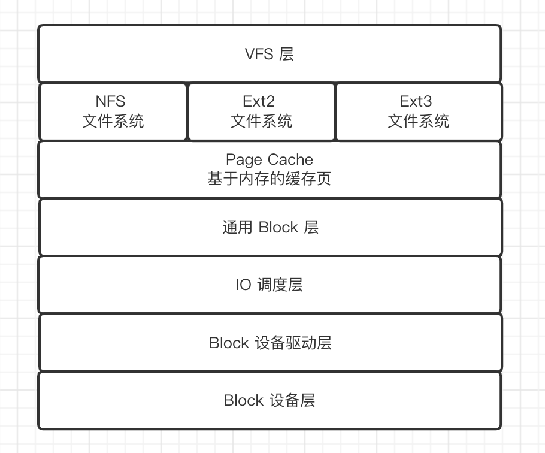
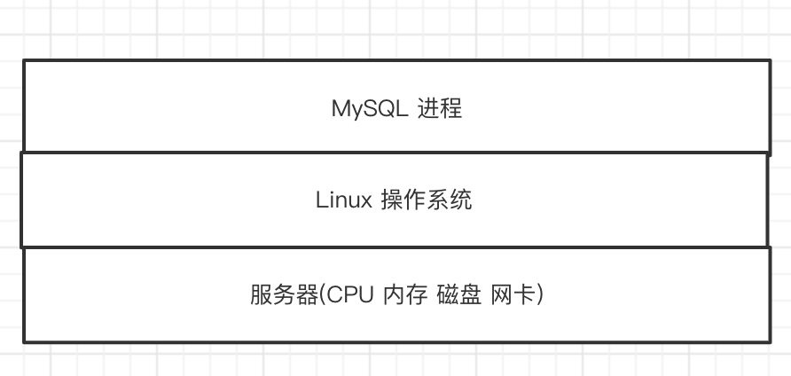
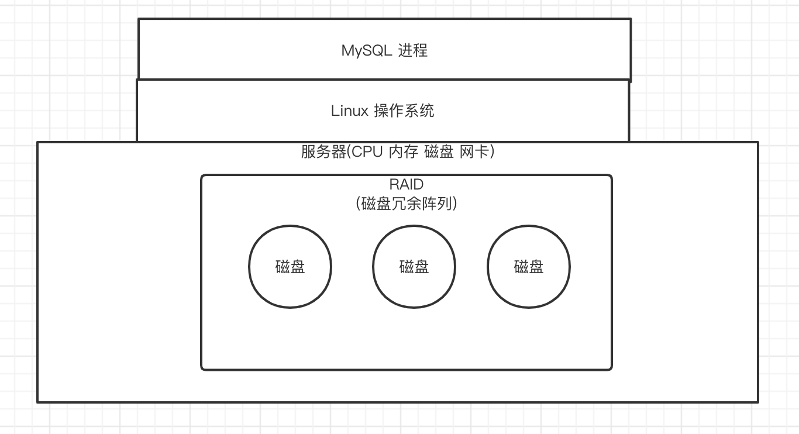
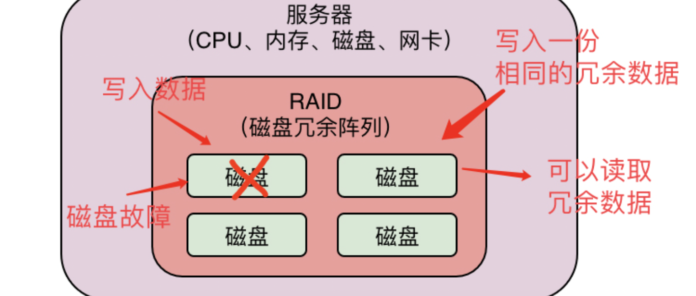
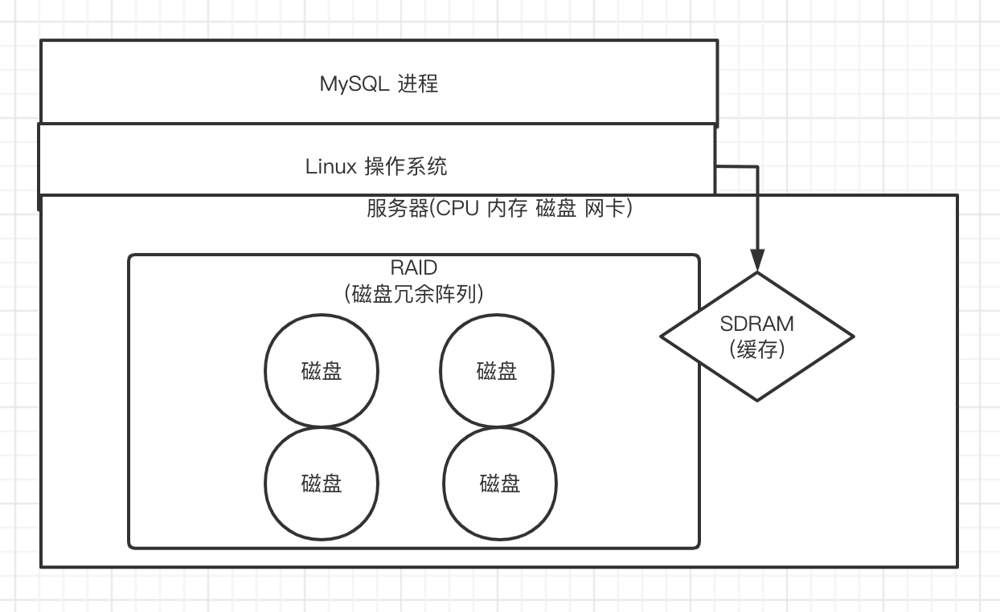
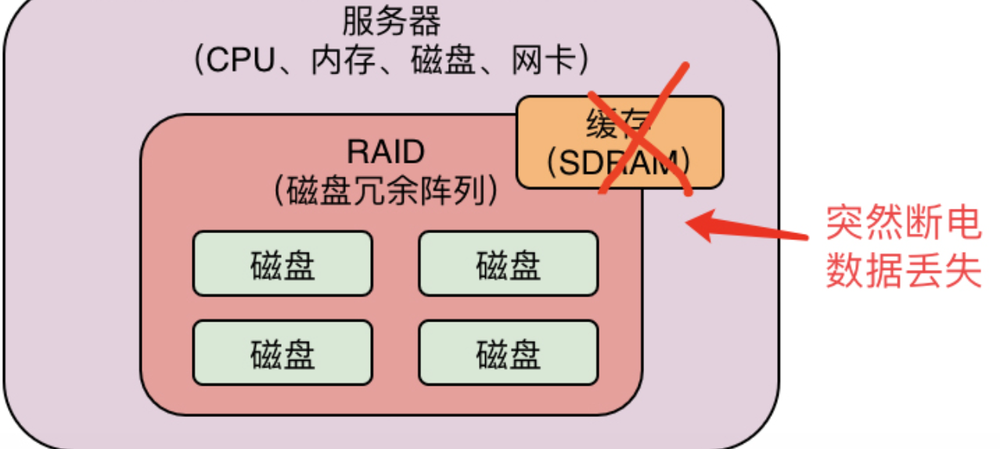
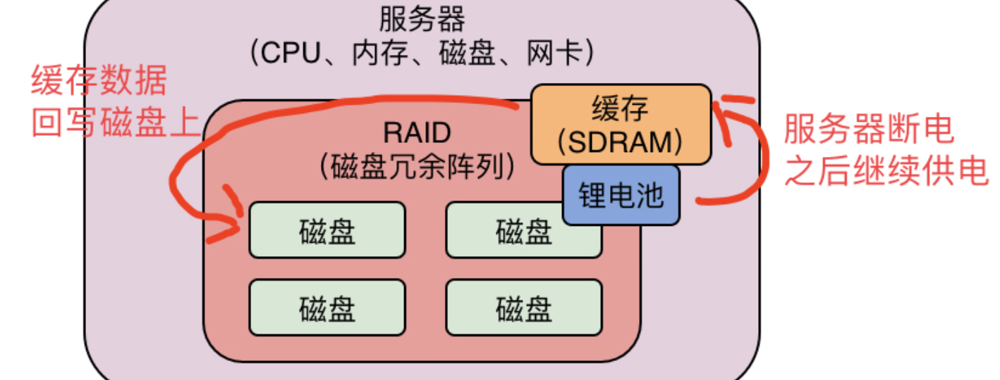

# MySQL 设备抖动问题

所谓的操作系统，无论是Linux也好，还是Windows也好，说白了他们自己本身就是软件系统，之所以需要操作系统，是因为我们不可能直接去操作CPU、内存、磁盘这些硬件，所以必须要用操作系统来管理CPU、内存、磁盘、网卡这些硬件设备。

拿 Linux 举例, Linux利用这套存储系统去管理我们的机器上的机械硬盘、SSD固态硬盘，这些存储设备，可以在里面读取数据，或者是写入数据, 那他的结构又是怎样的呢

Linux的存储系统分为「VFS层」、「文件系统层」、「Page Cache缓存层」、「通用Block层」、「IO调度层」、「Block设备驱动层」、「Block设备层」

### MySQL 发起请求执行流程

- 当MySQL发起一次数据页的随机读写，或者是一次redo log日志文件的顺序读写的时候，实际上会把磁盘 IO 请求交给Linux操作系统的VFS层, 这一层的作用，就是根据你是对哪个目录中的文件执行的磁盘 IO 操作，把 IO 请求交给具体的文件系统。举个例子，Linux中，有的目录比如 /xx1/xx2 里的文件其实是由NFS文件系统管理的，有的目录比如 /xx3/xx4 里的文件其实是由Ext3文件系统管理的，那么这个时候VFS层需要根据你是对哪个目录下的文件发起的读写 IO 请求，把请求转交给对应的文件系统
- 文件系统会先在Page Cache这个基于内存的缓存里找你要的数据在不在里面，如果有就基于内存缓存来执行读写，如果没有就继续往下一层走，此时这个请求会交给通用Block层，在这一层会把你对文件的IO请求转换为 Block IO 请求
- 接着 IO 请求转换为Block IO请求之后，会把这个Block IO 请求交给 IO 调度层，在这一层里默认是用CFQ公平调度算法
- 最后 IO 完成调度之后，就会决定哪个 IO 请求先执行，哪个 IO 请求后执行，此时可以执行的 IO 请求就会交给 Block 设备驱动层, 然后最后经过驱动把 IO 请求发送给真正的存储硬件，也就是Block设备层
- 硬件设备完成了 IO 读写操作之后，要不然是写，要不然是读，最后就把响应经过上面的层级反向依次返回，最终MySQL可以得到本次 IO 读写操作的结果

### RAID(磁盘冗余阵列)

一般来说，很多数据库部署在机器上的时候，存储都是搭建的RAID存储架构，其实这个RAID很深奥概念比较难以理解，我们一切从简了,

说白了，**RAID就是一个磁盘冗余阵列**

假设我们的服务器里的磁盘就一块，那万一一块磁盘的容量不够怎么办？此时是不是就可以再搞几块磁盘出来放在服务器里现在多搞了几块磁盘，机器里有很多块磁盘了，不好管理啊，怎么在多块磁盘上存放数据呢？

所以就是针对这个问题，在存储层面往往会在机器里搞多块磁盘，然后引入RAID这个技术，大致理解为用来管理机器里的多块磁盘的一种磁盘阵列技术！有了他以后，你在往磁盘里读写数据的时候，他会告诉你应该在哪块磁盘上读写数据

有了RAID这种多磁盘阵列技术之后，我们是不是就可以在一台服务器里加多块磁盘，扩大我们的磁盘存储空间

当我们往磁盘里写数据的时候，通过RAID技术可以帮助我们选择一块磁盘写入，在读取数据的时候，我们也知道从哪快磁盘去读取

### RAID 数据冗余机制

所谓的数据冗余机制，就是如果你现在写入了一批数据在RAID中的一块磁盘上，然后这块磁盘现在坏了，无法读取
了，那么岂不是你就丢失了一波数据？

所以其实有的RAID磁盘冗余阵列技术里，是可以把你写入的同样一份数据，在两块磁盘上都写入的，这样可以让两块
磁盘上的数据一样，作为冗余备份，然后当你一块磁盘坏掉的时候，可以从另外一块磁盘读取冗余数据出来，这一切
都是RAID技术自动帮你管理的                                      

### RAID 电池冲放原理

服务器使用多块磁盘组成的RAID阵列的时候，一般会有一个RAID卡，这个「RAID卡是带有一个缓存」的，这个缓存不是直接用我们的服务器的主内存的那种模式，他是一种跟内存类似的SDRAM

然后我们可以把RAID的缓存模式设置为 write back，这样的话，所有写入到磁盘阵列的数据，先会缓存在RAID卡的缓存里，后续慢慢再写入到磁盘阵列里去，这种写缓冲机制，可以大幅度提升我们的数据库磁盘写的性能。

那么现在有一个问题来了，假设突然断电了，或者是服务器自己故障关闭了，那么是不是这个RAID卡的缓存里的数据会突然丢失？那你MySQL写入磁盘的数据不就没了吗？

所以正是因为如此，为了解决这个问题，RAID卡一般都配置有自己独立的锂电池或者是电容，如果服务器突然掉电
了，无法接通电源了，RAID卡自己是基于锂电池来供电运行的，然后他会赶紧把缓存里的数据写入到阵列中的磁盘上
去

### 锂电池 充放电 导致设备抖动问题

但是锂电池是存在性能衰减问题的，所以一般来说锂电池都是要配置定时充放电的，也就是说每隔30天~90天（不同的锂电池厂商是不一样的），就会自动对锂电池充放电一次，这可以延长锂电池的寿命和校准电池容量。

如果你要是不这么做的话，那么可能锂电池用着用着就会发现容量不够了，可能容纳的电量在你服务器掉电之后，都没法一次性把缓存里的数据写回磁盘上去，那就会导致数据丢失了！

所以在锂电池充放电的过程中，RAID的缓存级别会从 write back 变成 write through，我们通过RAID写数据的时候，10就直接写磁盘了，如果写内存的话，性能也就是0.1ms这个级别，但是直接写磁盘，就性能退化10倍到毫秒级了！

所以说，对于那些在生产环境的数据库部署使用了RAID多磁盘阵列存储技术的公司来说，通常都会开启RAID卡的缓存机制，但是此时就一定要注意这个RAID的锂电池自动充放电的问题，因为只要你用了RAID缓存机制，那么锂电池就必然会定时进行充放电去延长寿命，保证服务器掉电的时候可以把缓存数据写回磁盘，数据不会丢失。

所以这个时候一旦RAID锂电池自动充放电，往往会导致你的数据库服务器的RAID存储定期的性能出现几十倍的抖动，间接导致你的数据库每隔一段时间就会出现性能几十倍的抖动！
