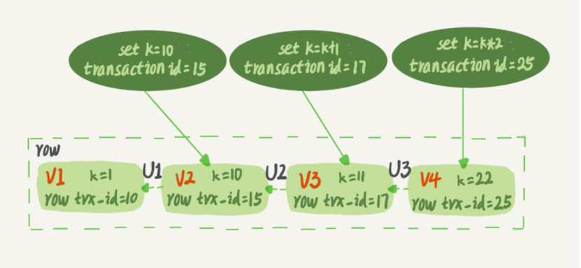
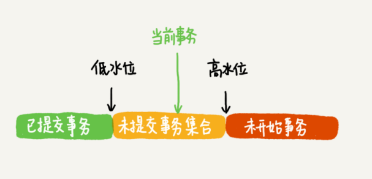
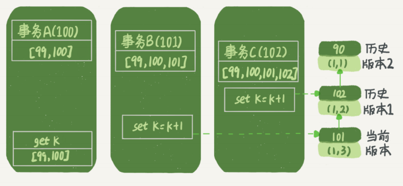
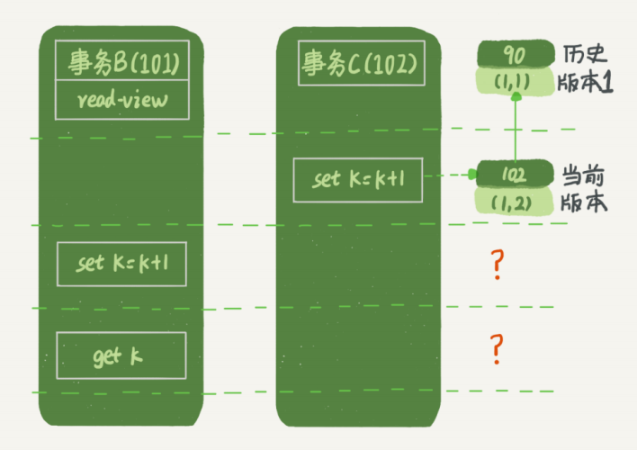
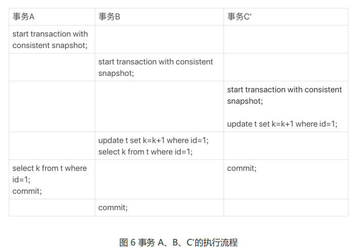
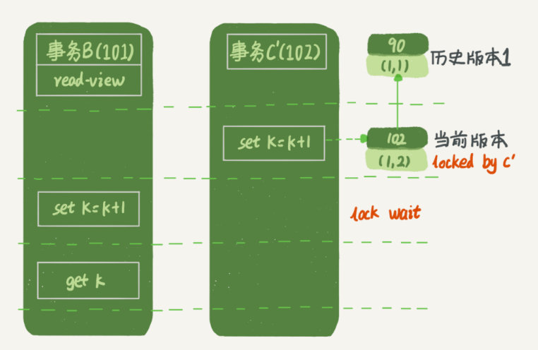
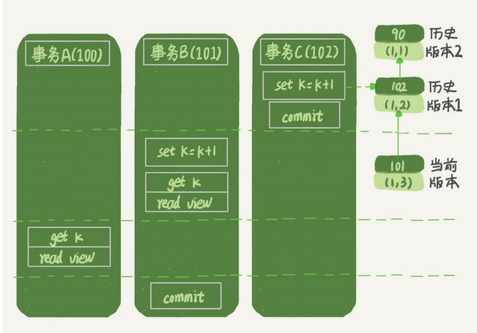

## MVCC 机制的原理及实现
在 MySQL 里，有两个“视图”的概念：
- 一个是 view。它是一个用查询语句定义的虚拟表，在调用的时候执行查询语句并生成结
  果。创建视图的语法是 ``create view user_view_test as SELECT * FROM user`` ，而它的查询方法与表一样。
  
- 另一个是 InnoDB 在实现 MVCC 时用到的一致性读视图，即 consistent read view，用
  于支持 RC（Read Committed，读提交）和 RR（Repeatable Read，可重复读）隔离级别的实现。
  
乐观锁 和 悲观锁 的概念。它俩主要是概念的理解。
- 悲观锁： 当一个线程需要对共享资源进行操作的时候，首先对共享资源进行加锁，当该线程持有该资源的锁的时候，其他线程对该资源进行操作的时候会被 阻塞。
- 乐观锁：当一个线程需要对一个共享资源进行操作的时候，不对它进行加锁，而是在操作完成之后进行判断。(比如乐观锁会通过一个版本号控制，
    如果操作完成后通过版本号进行判断在该线程操作过程中是否有其他线程已经对该共享资源进行操作了，如果有则通知操作失败，如果没有则操作成功)，
    当然除了 版本号 还有 CAS

很多人认为 `MVCC 就是一种 乐观锁 的实现形式，而我认为 MVCC 只是一种 乐观 的实现形式`，它是通过一种可见性算法来实现数据库并发控制。

MVCC 的两种读形式:
- 快照读：读取的只是当前事务的可见版本，不用加锁。而你只要记住 简单的 select 操作就是快照读(select * from table where id = xxx)。
- 当前读：读取的是当前版本，比如 特殊的读操作，更新/插入/删除操作
```sql
select * from table where xxx lock in share mode，
select * from table where xxx for update，
update table set....
insert into table (xxx,xxx) values (xxx,xxx)
delete from table where id = xxx
````
### 1.MVCC 实现原理
MVCC 使用了“三个隐藏字段”来实现版本并发控制
````
RowID	        DB_TRX_ID	    DB_ROLL_PTR	    id	name	password
自动创建的id	    事务id	        回滚指针	     id	name	password
````
- RowID：隐藏的自增ID，当建表没有指定主键，InnoDB会使用该RowID创建一个聚簇索引。
- DB_TRX_ID：最近修改（更新/删除/插入）该记录的事务ID。
- DB_ROLL_PTR：回滚指针，指向这条记录的上一个版本。

数据表中的一行记录，其实可能有多个版本 (row)，每个版本有自己的 row trx_id(DB_TRX_ID)



> 其实还有一个删除的flag字段，用来判断该行记录是否已经被删除。

而 MVCC 使用的是其中的 事务字段，回滚指针字段，是否删除字段, 我们来看一下现在的表格(isDelete是我自己取的，按照官方说法是在一行开头的content里面，这里其实位置无所谓，你只要知道有就行了)。
````
isDelete	    DB_TRX_ID	DB_ROLL_PTR	    id	name	password
true/false	    事务id	    回滚指针	    id	name	password
````
那么如何通过这三个字段来实现 MVCC 的 可见性算法 呢？ 还差点东西！ undoLog(回滚日志) 和 read-view(读视图)。
- undoLog: 事务的回滚日志，是 可见性算法 的非常重要的部分，分为两类。
- - insert undo log：事务在插入新记录产生的undo log，当事务提交之后可以直接丢弃
- - update undo log：事务在进行 update 或者 delete 的时候产生的 undo log，在快照读的时候还是需要的，所以不能直接删除，只有当系统没有比这个log更早的read-view了的时候才能删除。ps：所以长事务会产生很多老的视图导致undo log无法删除 大量占用存储空间。

> 实际上，图 2 中的三个虚线箭头，就是 undo log；而 V1、V2、V3 并不是物理上真实存
在的，而是每次需要的时候根据当前版本和 undo log 计算出来的。比如，需要 V2 的时
候，就是通过 V4 依次执行 U3、U2 算出来  

- read-view: 读视图，是MySQL秒级创建视图的必要条件，比如一个事务在进行 select 操作(快照读)的时候会创建一个 read-view ，这个read-view 其实只是三个字段。
- - alive_trx_list(我自己取的)：read-view生成时刻系统中正在活跃的事务id。
- - up_limit_id：记录上面的 alive_trx_list 中的最小事务id。
- - low_limit_id：read-view生成时刻，目前已出现的事务ID的最大值 + 1。

其实主要思路就是：当生成read-view的时候如何去拿获取的 DB_TRX_ID 去和 read-view 中的三个属性(上面讲了)去作比较
- 首先比较这条记录的 DB_TRX_ID 是否是 小于 up_limit_id 或者 等于当前事务id。如果满足，那么说明当前事务能看到这条记录。如果大于则进入下一轮判断
- 然后判断这条记录的 DB_TRX_ID 是否 大于等于 low-limit-id。如果大于等于则说明此事务无法看见该条记录，不然就进入下一轮判断。
- 判断该条记录的 DB_TRX_ID 是否在活跃事务的数组中，如果在则说明这条记录还未提交对于当前操作的事务是不可见的，如果不在则说明已经提交，那么就是可见的。

一个事务只需要在启动的时候声明说，“以我启动的时刻为准，如果一个数据版本是
在我启动之前生成的，就认；如果是我启动以后才生成的，我就不认，我必须要找到它的上
一个版本”,当然，如果“上一个版本”也不可见，那就得继续往前找。还有，如果是这个事务自己更新
的数据，它自己还是要认的。

InnoDB 为每个事务构造了一个数组，用来保存这个事务启动瞬间，当前正
在“活跃”的所有事务 ID(alive_trx_list(我自己取的)：read-view生成时刻系统中正在活跃的事务id)
数组里面事务 ID 的最小值记为低水位(up_limit_id)，当前系统里面已经创建过的事务 ID 的最大值加 1
记为高水位(low_limit_id)。



对于当前事务的启动瞬间来说，一个数据版本的 row trx_id，有以下几种可能:
- 如果落在绿色部分，表示这个版本是已提交的事务或者是当前事务自己生成的，这个数据是可见的；
- 如果落在红色部分，表示这个版本是由将来启动的事务生成的，是肯定不可见的；
- 如果落在黄色部分，那就包括两种情况
- - a. 若 row trx_id 在数组中，表示这个版本是由还没提交的事务生成的，不可见；
- - b. 若 row trx_id 不在数组中，表示这个版本是已经提交了的事务生成的，可见

比如，对于图 2 中的数据来说，如果有一个事务，它的低水位是 18，那么当它访问这一行
数据时，就会从 V4 通过 U3 计算出 V3，所以在它看来，这一行的值是 11。
``InnoDB 利用了“所有数据都有多个版本”的这个特性，实现了“秒
级创建快照”的能力。``
### 2.案例
- 事务 A 开始前，系统里面只有一个活跃事务 ID 是 99；
- 事务 A、B、C 的版本号分别是 100、101、102，且当前系统里只有这四个事务；
- 三个事务开始前，(1,1）这一行数据的 row trx_id 是 90。

事务 A 的视图数组就是 [99,100], 事务 B 的视图数组是 [99,100,101], 事务 C 的视
图数组是 [99,100,101,102]。



- 第一个有效更新是事务 C，把数据从 (1,1) 改成了 (1,2)。这时候，这个
  数据的最新版本的 row trx_id 是 102，而 90 这个版本已经成为了历史版本

- 第二个有效更新是事务 B，把数据从 (1,2) 改成了 (1,3)。这时候，这个数据的最新版本（即
  row trx_id）是 101，而 102 又成为了历史版本。

> 在事务 A 查询的时候，其实事务 B 还没有提交，但是它生成的 (1,3) 这
个版本已经变成当前版本了。但这个版本对事务 A 必须是不可见的，否则就变成脏读了

现在事务 A 要来读数据了，它的视图数组是 [99,100]。当然了，读数据都是从当前版
本读起的。所以，事务 A 查询语句的读数据流程是这样的
- 找到 (1,3) 的时候，判断出 row trx_id=101，比高水位大，处于红色区域，不可见
- 找到上一个历史版本，一看 row trx_id=102，比高水位大，处于红色区域，不可见；
- 找到了（1,1)，它的 row trx_id=90，比低水位小，处于绿色区域，可见。

这样执行下来，虽然期间这一行数据被修改过，但是事务 A 不论在什么时候查询，看到这
行数据的结果都是一致的，所以我们称之为`一致性读`。

#### 2.1 事务 B 的 update 语句，如果按照一致性读，好像结果不对哦？
事务 B 的视图数组是先生成的，之后事务 C 才提交，不是应该看不见 (1,2)吗，怎么能算出 (1,3) 来？



> 如果事务 B 在更新之前查询一次数据，这个查询返回的 k 的值确实是 1。但是，当它要`去更新数据的时候，就不能再在历史版本上更新了`，
> 否则事务 C 的更新就丢失了。因此，事务 B 此时的 set k=k+1 是在（1,2）的基础上进行的操作。所以，
> 这里就用到了这样一条规则：`更新数据都是先读后写的，而这个读，只能读当前的
值，称为“当前读”（current read）`。
> 因此，在更新的时候，当前读拿到的数据是 (1,2)，更新后生成了新版本的数据 (1,3)，这个新版本的 row trx_id 是 101

除了 update 语句外，`select 语句如果加锁，也是当前读`
```sql
mysql> select k from t where id=1 lock in share mode;
mysql> select k from t where id=1 for update;
````


这时候“两阶段锁协议”就要上场了。事务 C’没提交，也就是说 (1,2) 这个版本上的写锁还没释放。而事务 B 是当前读，必须要读最新版本，而且必须
加锁，因此就被锁住了，必须等到事务 C’释放这个锁，才能继续它的当前读



#### 2.2 事务的可重复读的能力是怎么实现的？
有了上面的基础, 这个问题迎刃而解
> `可重复读的`核心就是`一致性读（consistent read）`；而事务更新数据的时候，只能用当前读。
> 如果当前的记录的行锁被其他事务占用的话，就需要进入锁等待。
#### 2.3 读提交的逻辑(ＲＣ) & 可重复读的逻辑（ＲＲ）
``start transaction with consistent snapshot`` 从这个语句开始，创建一个持续整个事务的一致性快照。
在读提交隔离级别下，这个用法就没意义了，等效于普通的 start transaction

> 在可重复读隔离级别下，只需要在事务开始的时候创建一致性视图，之后事务里的其他查
询都共用这个一致性视图；
>
> 在读提交隔离级别下，每一个语句执行前都会重新算出一个新的视图

下面是读提交时的状态图，可以看到这两个查询语句的创建视图数组的时机发生了变化，就
是图中的 read view 框。（注意：这里，我们用的还是事务 C 的逻辑直接提交，而不是事
务 C’）



时序上 (1,2)、(1,3)的生成时间都在创建这个视图数组的时刻之前。但是，在这个时刻：
(1,3) 还没提交，属于情况 1，不可见；
(1,2) 提交了，属于情况 3，可见。
所以，这时候事务 A 查询语句返回的是 k=2。显然地，事务 B 查询结果 k=3。
