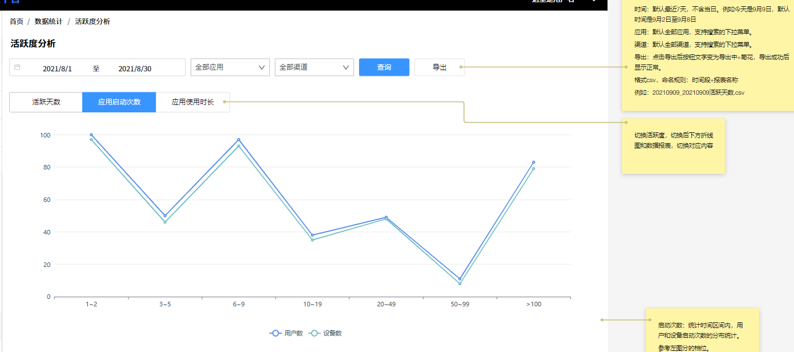

## SQL 练习
表准备
```sql
SET NAMES utf8mb4;
SET FOREIGN_KEY_CHECKS = 0;

-- ----------------------------
-- Table structure for firmware_whole
-- ----------------------------
DROP TABLE IF EXISTS `firmware_whole`;
CREATE TABLE `firmware_whole`  (
  `id` bigint(20) UNSIGNED NOT NULL AUTO_INCREMENT COMMENT '主键',
  `name` varchar(100) CHARACTER SET utf8mb4 COLLATE utf8mb4_bin NOT NULL COMMENT '固件名称',
  `version_number` varchar(50) CHARACTER SET utf8mb4 COLLATE utf8mb4_general_ci NOT NULL DEFAULT '' COMMENT '固件编号',
  `version` varchar(50) CHARACTER SET utf8mb4 COLLATE utf8mb4_general_ci NOT NULL DEFAULT '' COMMENT '版本号',
  `format_version` varchar(50) CHARACTER SET utf8mb4 COLLATE utf8mb4_general_ci NOT NULL DEFAULT '' COMMENT '格式化版本号',
  `equipment_id` bigint(20) NOT NULL DEFAULT 0 COMMENT '所属设备id',
  `status` tinyint(3) NOT NULL DEFAULT 0 COMMENT '发布状态（1未发布，2以发布，3以下架，4定时发布）',
  `is_big` tinyint(3) NOT NULL DEFAULT 0 COMMENT '是否为大版本 （1 是 2 否）',
  `url` varchar(255) CHARACTER SET utf8mb4 COLLATE utf8mb4_general_ci NOT NULL DEFAULT '' COMMENT '固件地址',
  `describe` varchar(500) CHARACTER SET utf8mb4 COLLATE utf8mb4_general_ci NOT NULL DEFAULT '' COMMENT '版本描述',
  `publish_time` int(10) NOT NULL DEFAULT 0 COMMENT '发布时间/下架时间',
  `all_upload` tinyint(3) NOT NULL DEFAULT 0 COMMENT '差分包是否确认上传完成 0 未上传完全 1 上传完全',
  `create_time` int(10) NOT NULL DEFAULT 0 COMMENT '添加时间',
  `update_time` int(10) NOT NULL DEFAULT 0 COMMENT '更新时间',
  `delete_time` int(10) NOT NULL DEFAULT 0 COMMENT '删除时间',
  PRIMARY KEY (`id`) USING BTREE,
  UNIQUE INDEX `uniq_equipment`(`equipment_id`, `version`, `delete_time`) USING BTREE,
  INDEX `name`(`name`) USING BTREE,
  INDEX `format_version`(`format_version`) USING BTREE,
  INDEX `equipment_id`(`equipment_id`) USING BTREE
) ENGINE = InnoDB AUTO_INCREMENT = 32 CHARACTER SET = utf8mb4 COLLATE = utf8mb4_general_ci COMMENT = '固件表（整包）' ROW_FORMAT = Dynamic;

-- ----------------------------
-- Records of firmware_whole
-- ----------------------------
INSERT INTO `firmware_whole` VALUES (1, '大包', 'V02_MainLine_1.0.0_20211012_2t', '1.0.2', '10200000', 116, 2, 1, 'firmware/16345490353297FMcb.rar', '', 1634549014, 0, 1634549001, 1634549001, 0);
INSERT INTO `firmware_whole` VALUES (2, '大包2', 'V02_MainLine_1.0.0_20211012_2t1', '1.0.4', '10400000', 116, 4, 2, 'firmware/1634549091347ht27Z.zip', '撒旦发射点发', 1634728500, 1, 1634549060, 1634549060, 0);
INSERT INTO `firmware_whole` VALUES (3, '记忆', 'V02_MainLine_1.0.0_20211012_2t1', '1.0.0', '10000000', 117, 3, 1, 'firmware/1634605298770cJSxy.zip', '111', 1634605701, 0, 1634605431, 1634605431, 0);
INSERT INTO `firmware_whole` VALUES (4, '记忆1', 'V02_MainLine_1.0.2_20211012_2t1', '1.0.1', '10100000', 117, 2, 2, 'firmware/1634606070777DTzNQ.zip', '222', 1634606787, 1, 1634606270, 1634606270, 0);
INSERT INTO `firmware_whole` VALUES (5, '记忆2', 'V02_MainLine_1.0.1_20211012_2t1', '1.0.2', '10200000', 117, 1, 1, 'firmware/1634607609116BpsFb.rar', '', 0, 0, 1634607820, 1634607820, 0);
INSERT INTO `firmware_whole` VALUES (6, '刘冲', 'DG2-fhajkh-dyaui', '1.2.2', '12200000', 117, 1, 1, 'http://www.sadjka.com', '111', 0, 0, 1634608944, 1634608944, 0);
INSERT INTO `firmware_whole` VALUES (7, 'liuchong', 'HJ4-asfdas-dfasf', '1.2.3', '12300000', 117, 1, 2, 'http://www.asfas.com', '111', 0, 0, 1634609083, 1634609083, 0);
INSERT INTO `firmware_whole` VALUES (8, '忆', 'hfsjka-fasfa', '1.2.4', '12400000', 117, 1, 2, 'http://www.asfas.com', '111', 0, 0, 1634610911, 1634610911, 0);
INSERT INTO `firmware_whole` VALUES (9, '4561', '123465', '1.3.0', '13000000', 117, 1, 1, 'http://ssd.com', '111', 0, 0, 1634611433, 1634611433, 0);
INSERT INTO `firmware_whole` VALUES (10, '789', 'sfasf-fafa-123', '1.3.1', '13100000', 117, 1, 1, 'http://ssd.com', '111', 0, 0, 1634611716, 1634611716, 0);
INSERT INTO `firmware_whole` VALUES (12, 'test大', 'V02_MainLine_1.0.1_20211012_2t1', '1.0.0', '10000000', 118, 3, 1, 'firmware/1634620663972kDk8t.zip', '111', 1634622074, 0, 1634621125, 1634621125, 0);
INSERT INTO `firmware_whole` VALUES (13, 'test非大', 'V02_MainLine_1.0.3_20211012_2t1', '1.0.1', '10100000', 118, 2, 2, 'firmware/1634621301719QwCFP.zip', '111', 1634622415, 1, 1634621518, 1634621518, 0);
INSERT INTO `firmware_whole` VALUES (15, '123', 'V02_MainLine_1.0.2_20211012_2t1', '1.0.2', '10200000', 118, 1, 2, 'firmware/16346244749126jQQw.rar', '暗示法散发是', 0, 1, 1634624625, 1634624625, 0);
INSERT INTO `firmware_whole` VALUES (16, '发顺丰', '123456', '1.0.3', '10300000', 118, 1, 2, 'firmware/1634625663232FAA77.rar', '', 0, 1, 1634625626, 1634625626, 0);
INSERT INTO `firmware_whole` VALUES (23, 'test', 'asdsa', '1.0.0', '10000000', 122, 3, 1, 'firmware/1634638188369abSXD.rar', '', 1634638350, 0, 1634638153, 1634638153, 0);
INSERT INTO `firmware_whole` VALUES (24, 'test01', 'adas', '1.0.1', '10100000', 122, 2, 2, 'firmware/1634638259809X2FEP.rar', '', 1634638355, 1, 1634638224, 1634638224, 0);
INSERT INTO `firmware_whole` VALUES (25, 'test03', 'adas', '1.0.0', '10000000', 124, 3, 1, 'firmware/1634638574822EdSWf.zip', '', 1634638845, 0, 1634638582, 1634638582, 0);
INSERT INTO `firmware_whole` VALUES (26, 'test05', 'sadfa', '1.0.1', '10100000', 124, 2, 2, 'firmware/1634638770962aPeyX.rar', '', 1634638850, 1, 1634638738, 1634638738, 0);
INSERT INTO `firmware_whole` VALUES (27, 'test06', 'sadfa', '1.0.0', '10000000', 125, 3, 1, 'firmware/1634639159695AXtK2.rar', '', 1634639565, 0, 1634639180, 1634639180, 0);
INSERT INTO `firmware_whole` VALUES (28, 'test10', 'asda', '1.0.1', '10100000', 125, 2, 2, 'firmware/1634639400702AM4Qh.rar', '', 1634639572, 1, 1634639435, 1634639435, 0);
INSERT INTO `firmware_whole` VALUES (29, 'test11', 'asdas', '1.0.2', '10200000', 125, 1, 2, 'firmware/1634640445064aejpJ.rar', '', 0, 0, 1634640452, 1634640452, 0);
INSERT INTO `firmware_whole` VALUES (30, '测试001', '1asdas', '1.0.0', '10000000', 126, 2, 1, 'firmware/1634699482417BFmKm.rar', '', 1634699505, 0, 1634699497, 1634699497, 0);
INSERT INTO `firmware_whole` VALUES (31, '测试002', '2asdas', '1.0.2', '10200000', 126, 1, 2, 'firmware/1634699594396dShsa.rar', '', 0, 0, 1634699600, 1634699600, 0);

SET FOREIGN_KEY_CHECKS = 1;
````
### CASE 查询
```sql
# 增加列查询
SELECT
	*,
CASE
		
		WHEN is_big = 1 THEN
		"大版本" 
		WHEN is_big = 2 THEN
		"非大版本" ELSE '' 
	END AS big_or_not 
FROM
	`firmware_whole`
	
	
# 统计数量
SELECT
CASE
		
	WHEN is_big = 1 THEN "大版本" 
	WHEN is_big = 2 THEN "非大版本" 
	ELSE NULL END AS big_or_not,
	count(*) AS cnt 
FROM
	`firmware_whole` 
	GROUP BY
	CASE
	WHEN is_big = 1 THEN "大版本" 
	WHEN is_big = 2 THEN "非大版本" 
	ELSE NULL END
# 简化写法
# 这种写法是违反标准sql的执行的 group by 在 select 之前执行
SELECT
CASE
	WHEN is_big = 1 THEN "大版本" 
	WHEN is_big = 2 THEN "非大版本" 
	ELSE NULL END AS big_or_not,
	count(*) AS cnt 
FROM
	`firmware_whole` 
	GROUP BY big_or_not
	
	
# 使用 case 进行不同条件的查询
# 分别统计了每个设备下,大版本和非大版本的数量
SELECT
	equipment_id,
	sum( CASE WHEN is_big = 1 THEN is_big ELSE 0 END ) AS big_num,
	sum( CASE WHEN is_big = 2 THEN is_big ELSE 0 END ) AS not_big_num 
FROM
	firmware_whole 
GROUP BY
	equipment_id
 
#### 新手用 WHERE 子句进行条件分支，高手用 SELECT 子句进行条件分支。
````
### CASE 进行批量更新
这里唯一索引存在问题,进行索引删除
```sql
alter table firmware_whole add UNIQUE index `uniq_equipment`(`equipment_id`, `version`, `delete_time`)

alter table firmware_whole drop INDEX uniq_equipment
````
需求: 更新 equipment_id, 123 <= equipment_id < 125 更新为 126, 125 <= equipment_id <= 126 更新为124, 其他不变
```sql
UPDATE firmware_whole SET equipment_id = CASE
WHEN 122 <=  equipment_id AND  equipment_id < 125 THEN  126
WHEN 125 <=  equipment_id AND  equipment_id <= 126 THEN  124
ELSE equipment_id
END
````
### 表之间的数据匹配
与 DECODE 函数等相比，CASE 表达式的一大优势在于能够判断表达式。
也就是说，在 CASE 表达式里，我们可以使用 BETWEEN、LIKE 和 < 、 > 等便利的谓词组合，以及能嵌套子查询的 IN 和 EXISTS 谓词。因此，CASE 表达式具有非常强大的表达能力。


```sql
SELECT course_name, 
	CASE WHEN course_id IN (SELECT course_id FROM OpenCourses WHERE `month` = 202106) THEN  '○' ELSE  '×' END AS "6 月",
	CASE WHEN course_id IN (SELECT course_id FROM OpenCourses WHERE `month` = 202107) THEN  '○' ELSE  '×' END AS "7 月",
	CASE WHEN course_id IN (SELECT course_id FROM OpenCourses WHERE `month` = 202108) THEN  '○' ELSE  '×' END AS "8 月",
FROM CourseMaster
````
使用 Exists 代替 In 查询
```sql
SELECT CM.course_name,
       CASE WHEN EXISTS (SELECT course_id FROM OpenCourses OC WHERE `month` = 202106 AND OC.course_id = CM.course_id) THEN '○' ELSE '×' END AS "6 月",
       CASE WHEN EXISTS (SELECT course_id FROM OpenCourses OC WHERE `month` = 202107 AND OC.course_id = CM.course_id) THEN '○' ELSE '×' END AS "7 月",
       CASE WHEN EXISTS (SELECT course_id FROM OpenCourses OC WHERE `month` = 202108 AND OC.course_id = CM.course_id) THEN '○' ELSE '×' END AS "8 月"
FROM CourseMaster CM
````
无论使用 IN 还是 EXISTS，得到的结果是一样的，但从性能方面来说，EXISTS 更好。通过 EXISTS 进行的子查询能够用到“month, course_id”这样的主键索引，
因此尤其是当表 OpenCourses 里数据比较多的时候更有优势。

### 在 CASE 表达式中使用聚合函数
```sql
DROP TABLE IF EXISTS `StudentClub`;

CREATE TABLE `StudentClub`  (
    `id` int UNSIGNED NOT NULL AUTO_INCREMENT,
    `std_id` int NOT NULL,
    `club_id` int NOT NULL,
    `club_name` varchar(255) CHARACTER SET utf8mb4 COLLATE utf8mb4_0900_ai_ci NOT NULL,
    `main_club_flg` varchar(255) CHARACTER SET utf8mb4 COLLATE utf8mb4_0900_ai_ci NOT NULL,
    PRIMARY KEY (`id`) USING BTREE
) ENGINE = InnoDB CHARACTER SET = utf8mb4 COLLATE = utf8mb4_0900_ai_ci ROW_FORMAT = Dynamic;
-- ----------------------------
-- Records of StudentClub
-- ----------------------------
INSERT INTO `StudentClub` VALUES (1, 100, 1, '棒球', 'Y');
INSERT INTO `StudentClub` VALUES (2, 100, 2, '管弦乐', 'N');
INSERT INTO `StudentClub` VALUES (3, 200, 2, '管弦乐', 'N');
INSERT INTO `StudentClub` VALUES (4, 200, 3, '羽毛球', 'Y');
INSERT INTO `StudentClub` VALUES (5, 200, 4, '足球', 'N');
INSERT INTO `StudentClub` VALUES (6, 300, 4, '足球', 'N');
INSERT INTO `StudentClub` VALUES (7, 400, 5, '游泳', 'N');

SET FOREIGN_KEY_CHECKS = 1;
````
```sql
# 获取只加入了一个社团的学生的社团 ID (club_id 的聚合函数依赖于 std_id 的 group_id)
select std_id, max(club_id) as club_id from StudentClub Group by std_id HAVING count(*) = 1 
# 获取加入了多个社团的学生的主社团 ID
select std_id, club_id from StudentClub where main_club_flg = "Y"
````
使用 CASE 表达式
```sql
SELECT
	std_id,
CASE
	WHEN COUNT(*) = 1 THEN MAX( club_id )
	ELSE MAX( CASE WHEN main_club_flg = "Y" THEN club_id ELSE NULL END ) 
	END AS club_id 
FROM
	StudentClub 
GROUP BY
	std_id
````
- 在 GROUP BY 子句里使用 CASE 表达式，可以灵活地选择作为聚合的单位的编号或等级。这一点在进行非定制化统计时能发挥巨大的威力。
- 在聚合函数中使用 CASE 表达式，可以轻松地将行结构的数据转换成列结构的数据。
- 相反，聚合函数也可以嵌套进 CASE 表达式里使用。
- 相比依赖于具体数据库的函数，CASE 表达式有更强大的表达能力和更好的可移植性。
- 正因为 CASE 表达式是一种表达式而不是语句，才有了这诸多优点。

### 练习一(firmware_whole)
- 一段时间范围内,每个小时的平均设备数量
- 一段时间范围内,每个小时的最大设备数量
````
平均同时在线人数
1、系统每5分钟记录一次同时在线人数2、如果统计某一天某1个小时的平均同时在线人数，将这个小时内的同时在线人数相加后取平均数。
例如：1月1日0点到0点59，将这个时段内每记录的在线人数相加后取平均数。
3、如果统计N天的某一个小时内的平均同时在线人数，将N天每天的这个时段的同时在线人数相加后取平均数。
例如：1月1日到1月30日0点到0点59将这30天的每天的0点到0点59的同时在矮人数相加后，取平均数。

最高同时在线人数
1、某一天某一个小时的最高同时在线人数，取1个小时内同时在线人数的最高值。
例如：1月1日0点到0点59，取这个时段内同时在线人数的最高值。
2、N天的最高同时在线人数，取同时在线人数最高值。
例：1月1日到1月30日0点到0点69的最高同时在线人数，取这30天内，每天0点到0点59的同时在线人数的最高值。
````
sql
```sql
# 讲时间戳格式化成时间  1636610571 => 	20211021
SELECT FROM_UNIXTIME(create_time,'%H') days FROM `firmware_whole`  
# 统计每一天的设备数量


SELECT FROM_UNIXTIME(create_time,'%h') days, count(DISTINCT(equipment_id) ) AS eqNum  FROM `firmware_whole` 
# 嵌套 where 
GROUP BY days


SELECT FROM_UNIXTIME(create_time,'%Y-%m-%d %h') days, FROM_UNIXTIME(create_time,'%h') AS dateHour,count(DISTINCT(equipment_id) ) AS eqNum  FROM `firmware_whole` 
# 嵌套 where 
GROUP BY dateHour, days ORDER BY dateHour asc


# 子查询获取最大值
select days, dateHour, 
#max(eqNum) as eqNum 
case when dateHour = "00" then max(eqNum)  end as "00",
case when dateHour = "01" then max(eqNum)  end as "01",
case when dateHour = "02" then max(eqNum)  end as "02",
case when dateHour = "03" then max(eqNum)  end as "03",
case when dateHour = "04" then max(eqNum)  end as "04",
case when dateHour = "05" then max(eqNum)  end as "05",
case when dateHour = "06" then max(eqNum)  end as "06",
case when dateHour = "07" then max(eqNum)  end as "07",
case when dateHour = "08" then max(eqNum)  end as "08", # else 0
case when dateHour = "09" then max(eqNum)  end as "09",
case when dateHour = "10" then max(eqNum)  end as "10",
case when dateHour = "11" then max(eqNum)  end as "11",
case when dateHour = "12" then max(eqNum)  end as "12",
case when dateHour = "13" then max(eqNum)  end as "13",
case when dateHour = "14" then max(eqNum)  end as "14",
case when dateHour = "15" then max(eqNum)  end as "15",
case when dateHour = "16" then max(eqNum)  end as "16",
case when dateHour = "17" then max(eqNum)  end as "17",
case when dateHour = "18" then max(eqNum)  end as "18",
case when dateHour = "19" then max(eqNum)  end as "19",
case when dateHour = "20" then max(eqNum)  end as "20",
case when dateHour = "21" then max(eqNum)  end as "21",
case when dateHour = "22" then max(eqNum)  end as "22",
case when dateHour = "23" then max(eqNum)  end as "23"
from (
	SELECT FROM_UNIXTIME(create_time,'%Y-%m-%d %H') days, FROM_UNIXTIME(create_time,'%H') AS dateHour,count(DISTINCT(equipment_id) ) AS eqNum  FROM `firmware_whole` 
	# 嵌套 where 
	GROUP BY dateHour, days ORDER BY dateHour,days  desc
) resOne GROUP BY  dateHour ORDER BY dateHour, days desc
````

### 练习二(聚合查询)
```sql
-- 男性人口
SELECT pref_name,
 SUM(population)
 FROM PopTbl2
 WHERE sex = '1'
 GROUP BY pref_name;
-- 女性人口
SELECT pref_name,
 SUM(population)
 FROM PopTbl2
 WHERE sex = '2'
 GROUP BY pref_name;
 `````
 使用 case 来优化
 ```sql
 SELECT pref_name,
 -- 男性人口
 SUM( CASE WHEN sex = '1' THEN population ELSE 0 END) AS cnt_m, 
 -- 女性人口
 SUM( CASE WHEN sex = '2' THEN population ELSE 0 END) AS cnt_f 
 FROM PopTbl2
 GROUP BY pref_name;
 ````
 分别统计每个县的“男性”（即 '1'）人数和
“女性”（即 '2'）人数。也就是说，这里是将“行结构”的数据转换成了“列
结构”的数据。除了 SUM，COUNT、AVG 等聚合函数也都可以用于将行结
构的数据转换成列结构的数据。
### 练习三(聚合查询)
```sql
DROP TABLE IF EXISTS `sdk_report`;
CREATE TABLE `sdk_report`  (
  `id` int(10) UNSIGNED NOT NULL AUTO_INCREMENT COMMENT '主键',
  `channel_id` char(10) CHARACTER SET utf8mb4 COLLATE utf8mb4_general_ci NOT NULL DEFAULT '' COMMENT '渠道id',
  `device_id` varchar(50) CHARACTER SET utf8mb4 COLLATE utf8mb4_general_ci NOT NULL DEFAULT '' COMMENT '设备id',
  `device_brand` varchar(50) CHARACTER SET utf8mb4 COLLATE utf8mb4_general_ci NOT NULL DEFAULT '' COMMENT '品牌',
  `device_model` varchar(50) CHARACTER SET utf8mb4 COLLATE utf8mb4_general_ci NOT NULL DEFAULT '' COMMENT '设备型号',
  `system_name` varchar(100) CHARACTER SET utf8mb4 COLLATE utf8mb4_general_ci NOT NULL DEFAULT '' COMMENT '系统名称',
  `system_version` varchar(100) CHARACTER SET utf8mb4 COLLATE utf8mb4_general_ci NOT NULL DEFAULT '' COMMENT '系统版本号',
  `android_version` varchar(25) CHARACTER SET utf8mb4 COLLATE utf8mb4_general_ci NOT NULL DEFAULT '' COMMENT 'android版本',
  `channel_user_id` varchar(50) CHARACTER SET utf8mb4 COLLATE utf8mb4_general_ci NOT NULL DEFAULT '' COMMENT '渠道用户id',
  `distributor_user_id` varchar(255) CHARACTER SET utf8mb4 COLLATE utf8mb4_general_ci NOT NULL COMMENT '分发用户id',
  `app_id` bigint(20) UNSIGNED NOT NULL DEFAULT 0 COMMENT '应用id',
  `app_package_name` varchar(50) CHARACTER SET utf8mb4 COLLATE utf8mb4_general_ci NOT NULL DEFAULT '' COMMENT '包名',
  `status` tinyint(3) UNSIGNED NOT NULL DEFAULT 0 COMMENT '类型 (1=开始游戏，2=玩游戏，3=退出游戏)',
  `action_status` tinyint(3) UNSIGNED NOT NULL DEFAULT 0 COMMENT '操作标识 1首次启动',
  `device_status` tinyint(3) UNSIGNED NOT NULL COMMENT '设备状态 1 新增设备',
  `run_tag` varchar(255) CHARACTER SET utf8mb4 COLLATE utf8mb4_general_ci NOT NULL DEFAULT '' COMMENT '运行标识',
  `start_time` int(10) UNSIGNED NOT NULL DEFAULT 0 COMMENT '操作时间',
  `single_run_time` int(255) UNSIGNED NOT NULL DEFAULT 0 COMMENT '单次运行时间',
  `run_time` int(10) UNSIGNED NOT NULL DEFAULT 0 COMMENT '运行时长',
  `expand` json NOT NULL COMMENT '拓展字段',
  `create_time` int(10) UNSIGNED NOT NULL DEFAULT 0 COMMENT '创建时间',
  `update_time` int(10) UNSIGNED NOT NULL DEFAULT 0 COMMENT '更新时间',
  PRIMARY KEY (`id`) USING BTREE,
  INDEX `app_package_name`(`app_package_name`) USING BTREE,
  INDEX `device_brand`(`device_brand`) USING BTREE,
  INDEX `device_model`(`device_model`) USING BTREE,
  INDEX `system_version`(`system_version`) USING BTREE,
  INDEX `system_name`(`system_name`) USING BTREE,
  INDEX `channel_id`(`channel_id`) USING BTREE,
  INDEX `device_id`(`device_id`) USING BTREE,
  INDEX `channel_user_id`(`channel_user_id`) USING BTREE,
  INDEX `app_id`(`app_id`) USING BTREE
) ENGINE = InnoDB AUTO_INCREMENT = 12 CHARACTER SET = utf8mb4 COLLATE = utf8mb4_general_ci COMMENT = '渠道上报数据' ROW_FORMAT = Dynamic;

-- ----------------------------
-- Records of sdk_report
-- ----------------------------
INSERT INTO `sdk_report` VALUES (1, '1111', '111', '', '', '', '', '', '', 'fadsf', 100179, '', 1, 1, 1, '111', 1636732800, 1, 1, 'null', 0, 0);
INSERT INTO `sdk_report` VALUES (2, '1111', '111', '', '', '', '', '', '', 'cadsf', 100179, '', 2, 0, 0, '111', 1636732800, 1, 2, 'null', 0, 0);
INSERT INTO `sdk_report` VALUES (3, '1111', '111', '', '', '', '', '', '', 'fadsf', 100169, '', 3, 0, 0, '111', 1636732800, 1, 3, 'null', 0, 0);
INSERT INTO `sdk_report` VALUES (4, '1111', '111', '', '', '', '', '', '', 'qweqer', 100129, '', 1, 1, 0, '22', 1636732800, 1, 1, 'null', 0, 0);
INSERT INTO `sdk_report` VALUES (5, '1111', '111', '', '', '', '', '', '', 'cadsf', 100129, '', 2, 1, 0, '22', 1631188905, 1, 2, 'null', 0, 0);
INSERT INTO `sdk_report` VALUES (6, '1335068101', 'dev1', '', '', '', '', '', '', 'b216d0a2-62c9-4a8e-9718-01bfeade2a56', 100119, '', 1, 1, 1, 'x1', 1636905600, 300, 3600, 'null', 0, 0);
INSERT INTO `sdk_report` VALUES (7, '', '', '', '', '', '', '', '', '5418fb0a-c226-4d48-a680-cea360f03102', 100119, '', 1, 0, 0, '', 1630425620, 0, 0, 'null', 0, 0);
INSERT INTO `sdk_report` VALUES (8, '', '', '', '', '', '', '', '', 'e71300ed-24ef-4b80-a9ef-c7acaab35a27', 0, '', 1, 0, 0, '', 1631188905, 0, 0, 'null', 0, 0);
INSERT INTO `sdk_report` VALUES (9, '', '', '', '', '', '', '', '', 'xxxx', 0, '', 2, 0, 0, '', 1631188905, 0, 0, 'null', 0, 0);
INSERT INTO `sdk_report` VALUES (10, '', '', '', '', '', '', '', '', 'b216d0a2-62c9-4a8e-9718-01bfeade2a56', 0, '', 0, 0, 0, '', 1636905600, 0, 3, 'null', 0, 0);
INSERT INTO `sdk_report` VALUES (11, '', '', '', '', '', '', '', '', 'b216d0a2-62c9-4a8e-9718-01bfeade2a56', 0, '', 0, 0, 0, '', 1636905600, 0, 0, 'null', 0, 0);

SET FOREIGN_KEY_CHECKS = 1;
````
需求:按照不同的周期范围进行统计:



```sql
SELECT
	count( CASE WHEN userCount BETWEEN 1 AND 2 THEN 1 ELSE NULL END ) AS "1-2",
	count( CASE WHEN userCount BETWEEN 3 AND 5 THEN 1 ELSE NULL END ) AS "3-5",
	count( CASE WHEN userCount BETWEEN 6 AND 9 THEN 1 ELSE NULL END ) AS "6-9",
	count( CASE WHEN userCount BETWEEN 10 AND 19 THEN 1 ELSE NULL END ) AS "10-19",
	count( CASE WHEN userCount BETWEEN 20 AND 49 THEN 1 ELSE NULL END ) AS "20-49",
	count( CASE WHEN userCount BETWEEN 50 AND 99 THEN 1 ELSE NULL END ) AS "50-99",
	count( CASE WHEN userCount > 100 THEN 1 ELSE NULL END ) AS ">100" 
FROM
	( SELECT distributor_user_id, count(*) AS userCount FROM sdk_report WHERE start_time BETWEEN 1636732800 AND 1636905600 GROUP BY distributor_user_id ) AS resultOne
````


