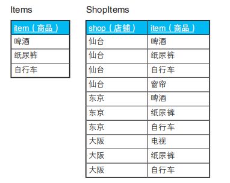
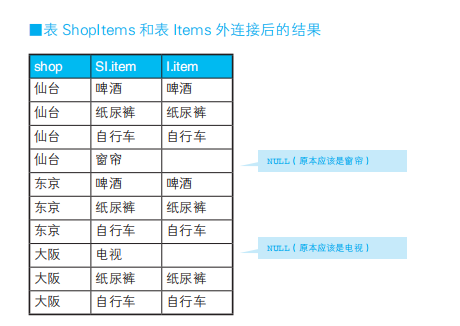
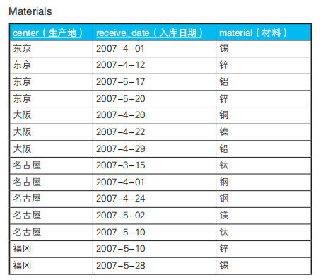
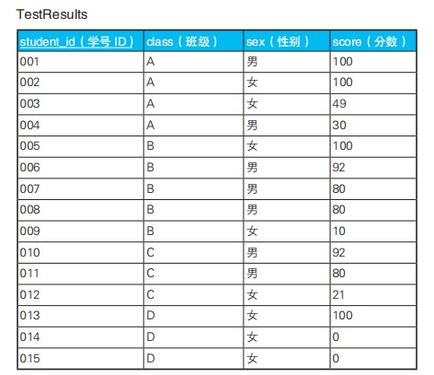

## HAVING 子句的力量
SQL 给人感觉与众不同的原因有几个。 
- 第一个原因是，它是一种基于“面向集合”思想设计的语言，同样具备这种设计思想的语言很少；
- 第二个原因的影响力不亚于第一个，即最开始学习过了某种理念的语言后，心理上会形成思维定式，从而妨碍我们理解另一种理念的语言

- SQL 语句里没有 GROUP BY 子句，此时整张表会被聚合为一行。这种情况下 HAVING 子句也是可以使用的
- 在以前的 SQL 标准里，HAVING 子句必须和 GROUP BY 子句一起使用

### 求众数(最少和最大值)
沿用 firmware_whole 表 
```sql
# 找出元素个数最多的集合
select  equipment_id, count(*) from firmware_whole GROUP BY equipment_id HAVING count(*) >= All (select COUNT(*) from firmware_whole GROUP BY equipment_id)  
# 找出元素个数最少的集合
select  equipment_id, count(*) from firmware_whole GROUP BY equipment_id HAVING count(*) <= All (select COUNT(*) from firmware_whole GROUP BY equipment_id)

# 用 all 表示 <= 或者 >= 所有
````
### 用关系除法运算进行购物篮分析


这次我们要查询的是囊括了表 Items 中所有商品的店铺。也就是说，要查询的是仙台店和东京店。
```sql
SElECT SI.shop, Count(SI.item) FROM ShopItems SI, Items I WHERE SI.item = I.item
GROUP BY SI.shop  # 到此筛选出了 仙台, 东京, 大阪 三个店铺
HAVING COUNT(SI.item) = (SELECT COUNT(item) FROM Items)
````
那么接下来我们把条件变一下，看看如何排除掉仙台店
（仙台店的仓库中存在“窗帘”，但商品表里没有“窗帘”），让结果里只出
现东京店。这类问题被称为“精确关系除法”（exact relational division），
即只选择没有剩余商品的店铺（与此相对，前一个问题被称为“带余除法”
（division with a remainder））。解决这个问题我们需要使用外连接
```sql
SELECT
	SI.shop 
FROM
	ShopItems SI
	LEFT  JOIN item I ON SI.item = I.item 
GROUP BY
	SI.shop 
HAVING
COUNT( SI.item ) = (SELECT count( item ) FROM item) # 排除掉 COUNT(SI.item) = 4 的仙台店
# 如果语句中有NULL值, 这里需要排除NULL, 如下图结果所示
AND COUNT(I.item) = (SELECT count( item ) FROM item) # 排除存在的NULL值
````

### 单重集合与多重集合
集合论中的集合不允许数据重复，被称为“单重集合”(非术语)



各生产地每天都会入库一批材料，然后使用材料生产各种各样的产
品。但是，有时材料不能按原定计划在一天内消耗完，会出现重复。这时，
为了在各生产地之间调整重复的材料，我们需要调查出存在重复材料的生
产地

```sql
-- 选中材料存在重复的生产地
SELECT center
 FROM Materials
 GROUP BY center
HAVING COUNT(material) <> COUNT(DISTINCT material);

-- 结果:
-- center
-- 东京
-- 名古屋
````
虽然我们无法通过这条 SQL 语句知道重复的材料具体是哪一种，但
是通过在 WHERE 子句中加上具体的材料作为参数，可以查出某种材料存
在重复的生产地
```sql
SELECT center,
 CASE WHEN COUNT(material) <> COUNT(DISTINCT material) THEN '存在重复'
 ELSE '不存在重复' END AS status
 FROM Materials
 GROUP BY center;
 
--  结果:
-- center 　　 status
-- ---------- ----------
-- 大阪 　　　  不存在重复
-- 东京 　　　  存在重复
-- 福冈 　　　  不存在重复
-- 名古屋      存在重复
```` 
查询某个地区存在的重复的材料(使用 exist 子句)
```sql
SELECT
    center,
    material,
    receive_date
FROM
    Materials M1
WHERE
EXISTS (
        SELECT
            *
        FROM
            Materials M2
        WHERE
            M1.center = M2.center
          AND M1.receive_date <> M2.receive_date
          AND M1.material = M2.material
    );
    
-- 结果:
-- center material
-- ------- ---------
-- 东京 锌
-- 东京 锌
-- 名古屋 钛
-- 名古屋 钢
-- 名古屋 钢
-- 名古屋 钛    
````
### 练习


查询出 75% 以上的学生分数都在 80 分以上的班级。
```sql
SELECT
  class 
FROM
  TestResult 
GROUP BY
  class 
HAVING count(*) * 0.75 <= SUM( CASE WHEN score >= 80 THEN 1 ELSE 0 END )
````

查询出分数在 50 分以上的男生的人数比分数在 50 分以上的女生的人数多的班级
```sql
SELECT class from TestResult GROUP BY class 
HAVING SUM(CASE WHEN score >= 50 and sex = "男" THEN 1 ELSE 0 END) > SUM(CASE WHEN score >= 50 and sex = "女" THEN 1 ELSE 0 END) 
````

查询出女生平均分比男生平均分高的班级。
```sql
SELECT class
 FROM TestResults
GROUP BY class
 HAVING AVG(CASE WHEN sex = '男'
 THEN score
 ELSE 0 END)
 < AVG(CASE WHEN sex = '女'
 THEN score
 ELSE 0 END) ;
 
 -- 从表中的数据我们可以发现，D 班全是女生。在上面的解答中，用于
-- 判断男生的 CASE 表达式里分支 ELSE 0 生效了，于是男生的平均分就成
-- 了 0 分。对于女生的平均分约为 33.3 的 D 班，条件 0 < 33.3 也成立，所
-- 以 D 班也出现在查询结果里了

-- 但是，如果学号 013 的学生分数刚好也是 0 分，结果会怎么样呢？这种情况下，女生的平均分会变为 0 分，所以 D 班不会被查询出来

-- 变更sql, 对空集求平均值后返回 NULL


 SELECT class
 FROM TestResults
GROUP BY class
 HAVING AVG(CASE WHEN sex = '男'
 THEN score
 ELSE NULL END)
 < AVG(CASE WHEN sex = '女'
 THEN score
 ELSE NULL END)
 ````
### 小结
- 使用小的结果集驱动大的结果集
- SQL 不是面向过程语言，没有循环、条件分支、赋值操作。
- SQL 通过不断生成子集来求得目标集合。SQL 不像面向过程语言那样通过画流程图来思考问题，而是通过画集合的关系图来思考。
- GROUP BY 子句可以用来生成子集。
- WHERE 子句用来调查集合元素的性质，而 HAVING 子句用来调查集合本身的性质。
