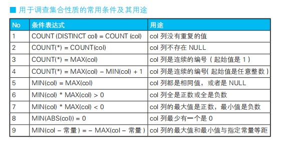

## 缺失的编号
```sql
-- 缺失的编号, 但是它的大前提是一定是 数列的起始值必须是 1, 即 id 为 1
select "缺失" as lose  from script_pos HAVING count(*) <> max(id);
select "缺失" as lose  from user_time_sum HAVING count(*) <> max(id);


-- 允许第一列不为 1
SELECT '存在缺失的编号' AS gap FROM SeqTbl HAVING COUNT(*) <> MAX(seq) - MIN(seq) + 1 ;


-- 不论是否存在缺失的编号都返回一行结果
SELECT CASE WHEN COUNT( * ) = 0 THEN '表为空' 
            WHEN COUNT( * ) <> MAX( seq ) - MIN( seq ) + 1 THEN '存在缺失的编号' ELSE '连续' 
            END AS gap 
FROM SeqTbl;
````


