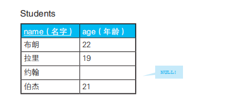

## 三值逻辑和 NULL
普通语言里的布尔型只有 true 和 false 两个值，这种
逻辑体系被称为二值逻辑。而 SQL 语言里，除此之外还有第三个值
unknown，因此这种逻辑体系被称为三值逻辑（three-valued logic）。
### 讨厌 NULL 的原因
- 1. 在进行 SQL 编码时，必须考虑违反人类直觉的三值逻辑。
- 2. 在指定 IS NULL、IS NOT NULL 的时候，不会用到索引，因而SQL 语句执行起来性能低下。
- 3. 如果四则运算以及 SQL 函数的参数中包含 NULL，会引起“NULL的传播”。
- 4. 在接收 SQL 查询结果的宿主语言中，NULL 的处理方法没有统一标准。
- 5. 与一般列的值不同，NULL 是通过在数据行的某处加上多余的位（bit）来实现的。因此 NULL 会使程序占据更多的存储空间，使得检索性能变差。
````
1 + NULL = NULL 
2 - NULL = NULL 
3 * NULL = NULL 
4 / NULL = NULL 
5 NULL / 0 = NULL
````
### 为什么使用 `IS NULL` 而不是 `= NULL`
demo
```sql
SELECT * FROM tbl_A WHERE col_1 = NULL;
````
那就是，对 NULL 使用比较谓词后得到的结果总是 `unknown`。而查询结果只会包含 WHERE 子句里的判断结果为 true 的行，不会包含判断结果为 false 和 unknown 的行。
所以无论 col_1 是不是 NULL，比较结果都是 unknown。

#### 一下实例都会被判为unknown
````
1 = NULL
2 > NULL
3 < NULL
4 <> NULL
5 NULL = NULL
````
那么，为什么对 NULL 使用比较谓词后得到的结果永远不可能为真呢？
- 这是因为，NULL 既不是值也不是变量。NULL 只是一个表示“没有值”的标记，而比较谓词只适用于值
- SQL 里的 NULL 和其他编程语言里的NULL 是完全不同的东西

````
a = 2, b = 5, c = NULL

1. a < b AND b > c
2. a > b OR b < c
3. a < b OR b < c
4. NOT (b <> c)

结果:
    1. unknown；2. unknown； 3. true； 4. unknown
````

SQL中排中率不存在
```sql
SELECT *
 FROM Students
 WHERE age = 20
 OR age <> 20;
````


如果想要结果展示出来,需要修改语句为:
```sql
SELECT *
 FROM Students
 WHERE age = 20
 OR age <> 20
 OR age IS NULL;
````
### CASE 语句中 NULL 问题
````
--col_1 为 1 时返回○、为 NULL 时返回 × 的 CASE 表达式？
CASE col_1
 WHEN 1 THEN '○'
 WHEN NULL THEN '×'
END
````
这个 CASE 表达式一定不会返回 ×。这是因为，第二个 WHEN 子句是 col_1 = NULL 的缩写形式。正如大家所知，这个式子的真值永远是 unknown。
而且 CASE 表达式的判断方法与 WHERE 子句一样，只认可真值为 true 的条件。正确的写法是像下面这样使用搜索 CASE 表达式。
```sql
CASE WHEN col_1 = 1 THEN '○'
 WHEN col_1 IS NULL THEN '×'
 END
````
### NOT IN 和 NOT EXISTS 不是等价的
在对 SQL 语句进行性能优化时，经常用到的一个技巧是将 IN 改写成 EXISTS。这是等价改写，并没有什么问题。问题在于，将 NOT IN 改写
成 NOT EXISTS 时，结果未必一样。


请注意，B 班山田的年龄是 NULL。我们考虑一下如何根据这两张表
查询“与 B 班住在东京的学生年龄不同的 A 班学生”。也就是说，希望查
询到的是拉里和伯杰。因为布朗与齐藤年龄相同，所以不是我们想要的结
果。如果单纯地按照这个条件去实现，则 SQL 语句如下所示。

```sql
select * from class_a where age not in (select age from class_b where city = "东京")
````
这条sql执行的结果是查询不到任何数据,因为这里穿插了一条为null的数据

更改语句:
```sql
# 1) 用 NOT 和 IN 等价改写 NOT IN
select * from class_a where age in (22, 23, null)

# 2)  OR 等价改写谓词 IN
SELECT * FROM Class_A WHERE NOT ( (age = 22) OR (age = 23) OR (age = NULL) );

# 3) 使用德 · 摩根定律等价改写
SELECT * FROM Class_A WHERE NOT (age = 22) AND NOT(age = 23) AND NOT (age = NULL);
````
可以看出，这里对 A 班的所有行都进行了如此繁琐的判断，然而没有一行在 WHERE 子句里被判断为 true。也就是说，如果 NOT IN 子查询
中用到的表里被选择的列中存在 NULL，则 SQL 语句整体的查询结果永远是空。这是很可怕的现象

这里可以使用 `EXISTS` 谓词
```sql
select * from class_a a where not exists (select * from class_b where a.age = b.age and b.city = "东京")
````
`EXISTS 谓词永远不会返回 unknown`。`EXISTS 只会返回 true 或者 false`。因此就有了
`IN 和 EXISTS 可以互相替换使用`，而 `NOT IN 和 NOT EXISTS 却不可以互
相替换`的混乱现象

#### 总结
- 1. NULL 不是值。
- 2. 因为 NULL 不是值，所以不能对其使用谓词(in, not in, all, exists, not exists)。
- 3. 对 NULL 使用谓词后的结果是 unknown。
- 4. unknown 参与到逻辑运算时，SQL 的运行会和预想的不一样。
- 5. 按步骤追踪 SQL 的执行过程能有效应对 4 中的情况。    
