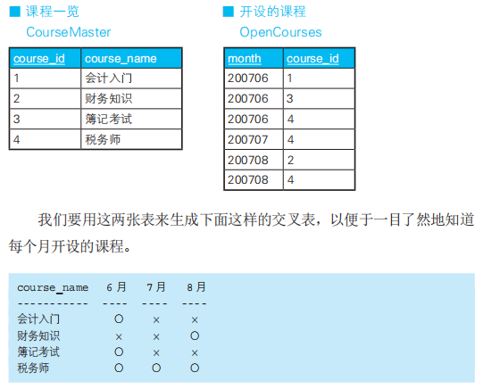
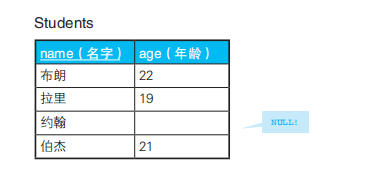

## 1.SQL 优化
### 1.1 参数是子查询时，使用 EXISTS(只要查到一行数据满足条件就会终止查询) 代替 IN (全表扫描)
如果 IN 的参数是“1, 2, 3”这样的数值列表，一般还不需要特别注意。`但是如果参数是子查询，那么就需要注意了`。



我们试着从 Class_A 表中查出同时存在于 Class_B 表中的员工, 两条 SQL 语句返回的结果是一样的，但是使用 EXISTS 的 SQL 语句更快
一些。
```sql
-- 应用于量表联查

-- 慢
SELECT *
 FROM Class_A
 WHERE id IN (SELECT id 
 FROM Class_B);

-- 快
SELECT *
 FROM Class_A A
 WHERE EXISTS
 (SELECT *
 FROM Class_B B
 WHERE A.id = B.id);
````
使用 EXISTS 时更快的原因有以下两个
- 如果连接列（id）上建立了索引，那么查询 Class_B 时不用查实际的表，只需查索引就可以了。
- 如果使用 EXISTS，那么只要查到一行数据满足条件就会终止查询，不用像`使用 IN 时一样扫描全表`。在这一点上 NOT EXISTS 也一样

当 IN 的参数是子查询时，数据库首先会执行子查询，然后将结果存储
在一张临时的工作表里（内联视图），然后扫描整个视图。很多情况下这种
做法都非常耗费资源。使用 EXISTS 的话，数据库不会生成临时的工作表。
### 1.2 参数是子查询时，使用连接代替 IN
```sql
-- 使用连接代替 IN
SELECT A.id, A.name
 FROM Class_A A INNER JOIN Class_B B
 ON A.id = B.id;
````
因为没有了子查询，所以数据库也不会生成中间表。我们很难说与 EXISTS 相比哪个
更好，但是如果没有索引，那么与连接相比，可能 EXISTS 会略胜一筹
### 1.3 避免排序
在数据库内部频繁地进行着暗中的排序, 因此了解都有哪些运算会进行排序很有必要
- GROUP BY 子句
- ORDER BY 子句
- 聚合函数（SUM、COUNT、AVG、MAX、MIN） 
- DISTINCT
- 集合运算符（UNION)
- 窗口函数（RANK、ROW_NUMBER 等）

排序如果只在内存中进行，那么还好；但是如果内存不足因而需要在
硬盘上排序，那么伴随着“呲啦呲啦”的硬盘访问声，排序的性能也会急
剧恶化
#### 1.3.1 灵活使用集合运算符的 ALL 可选项
UNION, 在默认的使用方式下，这些运算符会为了排除掉重复数据而进行排序
```sql
SELECT * FROM Class_A
 UNION 
SELECT * FROM Class_B;

-- id name
-- -- -----
-- 1  田中
-- 2  铃木
-- 3  伊集院
-- 4  西园寺
````
如果不在乎结果中是否有重复数据，或者事先知道不会有重复数据，
请使用 UNION ALL 代替 UNION。这样就不会进行排序了。
```sql
SELECT * FROM Class_A
UNION ALL
SELECT * FROM Class_B;

-- id name
-- -- ------
-- 1 田中
-- 2 铃木
-- 3 伊集院
-- 1 田中   //因为不排除重复数据所以也不需要进行排序
-- 2 铃木
-- 4 西园寺
`````
#### 1.3.2 使用 EXISTS 代替 DISTINCT(会进行排序)
为了排除重复数据，DISTINCT 也会进行排序, 如果需要对两张表的连接结果进行去重，可以考虑使用 EXISTS 代替 DISTINCT，以避免排序



从上面的商品表 Items 中找出同时存在于销售记录表 SalesHistory 中的商品。简而言之，就是找出有销售记录的商品

```sql
SELECT DISTINCT I.item_no
 FROM Items I INNER JOIN SalesHistory SH
 ON I. item_no = SH. item_no;

-- item_no
-- -------
--  10
--  20
--  30
````
其实更好的做法是使用 EXISTS。
```sql
SELECT I.item_no FROM Items I WHERE EXISTS 
    (
    SELECT SH.item_no FROM SalesHistory SH 
    WHERE I. item_no = SH.item_no
    )
````
这条语句在执行过程中不会进行排序。而且使用 EXISTS 和使用连接
一样高效
#### 1.3.3 在极值函数中使用索引（MAX/MIN）
SQL 语言里有 MAX 和 MIN 两个极值函数。使用这两个函数时都会进行排序。但是如果参数字段上建有索引，则
只需要扫描索引，不需要扫描整张表
```sql
-- 这样写需要扫描全表
SELECT MAX(item)
 FROM Items;

-- 这样写能用到索引
SELECT MAX(item_no)
 FROM Items;
````
因为 item_no 是表 Items 的唯一索引，所以效果更好。对于联合索引，
只要查询条件是联合索引的第一个字段，索引就是有效的，所以也可以对
表 SalesHistory 的 sale_date 字段使用极值函数。
#### 1.3.4 能写在 WHERE 子句里的条件不要写在 HAVING 子句里
```sql
-- 聚合后使用 HAVING 子句过滤
SELECT sale_date, SUM(quantity)
 FROM SalesHistory
 GROUP BY sale_date
HAVING sale_date = '2007-10-01';

-- 聚合前使用 WHERE 子句过滤
SELECT sale_date, SUM(quantity)
 FROM SalesHistory
 WHERE sale_date = '2007-10-01'
 GROUP BY sale_date;
````
两条 SQL 语句返回的结果是一样的, 但是从性能上来看，第二条语句写法效率更高。原因通常有两个。第
一个是在使用 GROUP BY 子句聚合时会进行排序，如果事先通过 WHERE 子
句筛选出一部分行，就能够减轻排序的负担。第二个是在 WHERE 子句的条
件里可以使用索引。HAVING 子句是针对聚合后生成的视图进行筛选的
#### 1.3.5 在 GROUP BY 子句和 ORDER BY 子句中使用索引
一般来说，GROUP BY 子句和 ORDER BY 子句都会进行排序，来对行
进行排列和替换。不过，通过指定带索引的列作为 GROUP BY 和 ORDER
BY 的列，可以实现高速查询

### 1.4 减少中间表
SQL 中，子查询的结果会被看成一张新表，这张新表与原始表一样，
可以通过代码进行操作。这种高度的相似性使得 SQL 编程具有非常强的
灵活性，但是如果不加限制地大量使用中间表，会导致查询性能下降。

#### 1.4.1 灵活使用 HAVING 子句
对聚合结果指定筛选条件时，使用 HAVING 子句是基本原则, 大多数开发者可能会倾向于像下面这样先生成一张中
间表，然后在 WHERE 子句中指定筛选条件。
```sql
SELECT *
FROM 
    (
     SELECT sale_date, MAX(quantity) AS max_qty
        FROM SalesHistory
        GROUP BY sale_date
    ) -- TMP 没用的中间表
WHERE max_qty >= 10;
````
然而，对聚合结果指定筛选条件时不需要专门生成中间表，像下面这
样使用 HAVING 子句就可以
```sql
SELECT sale_date, MAX(quantity)
FROM SalesHistory
GROUP BY sale_date
HAVING MAX(quantity) >= 10;
````
HAVING 子句和聚合操作是同时执行的，所以比起生成中间表后再执
行的 WHERE 子句，效率会更高一些，而且代码看起来也更简洁
#### 1.4.2 先进行连接再进行聚合
连接和聚合同时使用时，先进行连接操作可以避免产
生中间表。原因是，从集合运算的角度来看，连接做的是“乘法运算”。
连接表双方是一对一、一对多的关系时，连接运算后数据的行数不会增加。
而且，因为在很多设计中多对多的关系都可以分解成两个一对多的关系，
因此这个技巧在大部分情况下都可以使用

## 2. 未用到索引场景
### 2.1 在索引字段上进行运算
```sql
SELECT * 
 FROM SomeTable
 WHERE col_1 * 1.1 > 100;
````
普遍认为，SQL 语言的主要目的不是进行运算。但是实际上，数
据库引擎连这种程度的转换也不会为我们做, 假设在 col_1 设立的索引, 这里是不会应用到索引的,但是可以稍作修改
``WHERE col_1 > 100 / 1.1``, 这样就可以用到索引了
### 2.2 使用 IS NULL 谓词
索引字段是不存在 NULL 的，所以指定 IS NULL 和 IS NOT
NULL 的话会使得索引无法使用，进而导致查询性能低下
```sql
SELECT * 
 FROM SomeTable
 WHERE col_1 IS NULL;
````
然而，如果需要使用类似 IS NOT NULL 的功能，又想用到索引，那
么可以使用下面的方法，假设“col_1”列的最小值是 1
```sql
--IS NOT NULL 的代替方案
SELECT * 
 FROM SomeTable
 WHERE col_1 > 0;
````
原理很简单，只要使用不等号并指定一个比最小值还小的数，就可以
选出 col_1 中所有的值。因为 col_1 > NULL 的执行结果是 unknown，所
以当“col_1”列的值为 NULL 的行不会被选择。不过，如果要选择“非
NULL 的行”，正确的做法还是使用 IS NOT NULL。但是这种写法属实不推荐
### 2.3 使用否定形式
- <>
- != 
- NOT IN

他们会造成 sql 进行全表扫描, 例子:
```sql
SELECT *
 FROM SomeTable
 WHERE col_1 <> 100;
````
### 2.4 使用 OR
在 col_1 和 col_2 上分别建立了不同的索引，或者建立了（col_1, col_2）这样的联合索引

如果使用 OR 连接条件，那么要么用不到索引，要么用到了但是效率比 AND 要差很多
```sql
SELECT * FROM SomeTable
  WHERE col_1 > 100 OR col_2 = 'abc';
````
### 2.5 使用联合索引时，列的顺序错误(最左原则)
假设存在这样顺序的一个联合索引“col_1, col_2, col_3”
````
○ SELECT * FROM SomeTable WHERE col_1 = 10 AND col_2 = 100 AND col_3 = 500;
○ SELECT * FROM SomeTable WHERE col_1 = 10 AND col_2 = 100 ;
× SELECT * FROM SomeTable WHERE col_1 = 10 AND col_3 = 500 ;
× SELECT * FROM SomeTable WHERE col_2 = 100 AND col_3 = 500 ;
× SELECT * FROM SomeTable WHERE col_2 = 100 AND col_1 = 10 ;
````
### 2.6 使用 LIKE 谓词进行后方一致或中间一致的匹配
使用 LIKE 谓词时，只有前方一致的匹配才能用到索引。
````
× SELECT * FROM SomeTable WHERE col_1 LIKE '%a'; 
× SELECT * FROM SomeTable WHERE col_1 LIKE '%a%'; 
○ SELECT * FROM SomeTable WHERE col_1 LIKE 'a%';
````
### 2.7 进行默认的类型转换
````
× SELECT * FROM SomeTable WHERE col_1 = 10;
○ SELECT * FROM SomeTable WHERE col_1 = '10'; 
○ SELECT * FROM SomeTable WHERE col_1 = CAST(10, AS CHAR(2));
````
默认的类型转换不仅会增加额外的性能开销，还会导致索引不可用，
可以说是有百害而无一利
### 2.8 比较运算的顺序
````
× SELECT * FROM SomeTable WHERE col_1 > 10 and col_2  = 1;
○ SELECT * FROM SomeTable WHERE col_1 = '10' and col_2  > 1;
````
