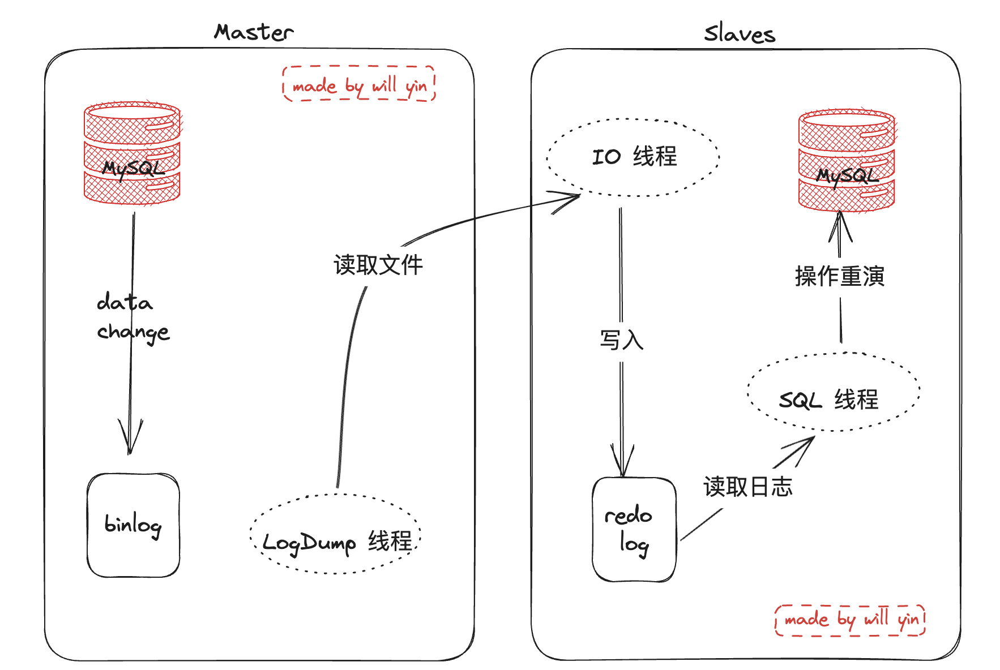

# MySQL分布式

问题背景, 生产中遇到了主主模式下, 数据不同步的问题, 业务侧都只读 `localhost`, 且`id` 为 bigint 类型 (bigint最大是2^64-1),  致使了一次线上的业务事故, 这边针对这个问题, 两方面解读

- mysql 主/主   主/从 模式
- mysql 主/主   主/从 模式下分布式 id 的生成策略

## 1.mysql 主/主   主/从 模式

在生产环境中使用单机MySQL且数据量非常庞大时，性能会受到影响影响。并且单机服务的MySQL的数据安全性也会受到影响。因此在生产环境中，我们通常搭建MySQL的集群架构，提高性能。在常见的集群架构中，最常见的就是主从架构(Master-Slaves), 一下所有操作全部基于 mysql 5.7 的版本进行演示操作

主机准备

- 172.16.27.95
- 172.16.27.97

工作目录 `/usr/local/mysql`

#### [下载安装 mysql 5.7](https://dev.mysql.com/downloads/mysql/)

安装相关依赖包

```shell
yum install -y gcc gcc-c++ cmake ncurses ncurses-devel bison wget openssl-devel.x86_64
```

创建用户组跟用户

```
groupadd mysql              创建用户组
useradd -r -g mysql mysql   创建用户且属于mysql用户组

groupadd mysql && useradd -r -g mysql mysql
```

下载安装包

```
wget https://dev.mysql.com/get/Downloads/MySQL-5.7/mysql-5.7.24-linux-glibc2.12-x86_64.tar.gz

tar -zvxf mysql-5.7.24-linux-glibc2.12-x86_64.tar.gz

mv mysql-5.7.24-linux-glibc2.12-x86_64 /usr/local/mysql
```

创建 data 和 tmp 目录

```shell
sudo mkdir -p /var/log/mysql/data/ 
sudo mkdir -p /usr/local/mysql/tmp/

chown -R mysql:mysql /var/log/mysql/data/ 
chown -R mysql:mysql /usr/local/mysql/tmp/
```

配置文件

````
[root@master1 bin]# cat /etc/my.cnf
[mysqld]
symbolic-links=0
basedir=/usr/local/mysql/
datadir=/usr/local/mysql/data/
log-error=/var/log/mysql/data/data.err 
pid-file=/usr/local/mysql/tmp/mysqld.pid
socket=/usr/local/mysql/tmp/mysql.sock
port = 3306
symbolic-links=0
symbolic-links=0
max_connections=400
innodb_file_per_table=1
lower_case_table_names=1
explicit_defaults_for_timestamp=1
default-storage-engine=InnoDb 
character-set-server=utf8mb4
collation-server=utf8mb4_unicode_ci 

[client] 
port=3306 
default-character-set=utf8mb4
socket=/usr/local/mysql/tmp/mysql.sock
````

vim ` /usr/local/mysql/support-files/mysql.server`, 在 266 行加入 `--user=root`

```
264       # Give extra arguments to mysqld with the my.cnf file. This script
265       # may be overwritten at next upgrade.
266       $bindir/mysqld_safe --user=root  --datadir="$datadir" --pid-file="$mysqld_pid_file_path" $other_args >/dev/null &
267       wait_for_pid created "$!" "$mysqld_pid_file_path"; return_value=$?
```


编译安装

```shell
$ cd /usr/local/mysql/bin
$ ./mysqld --initialize --user=mysql --basedir=/usr/local/mysql/ --datadir=/usr/local/mysql/data/ --lc_messages_dir=/usr/local/mysql/share --lc_messages=en_US

# 这里是就是临时密码
2023-09-04T08:58:54.364041Z 1 [Note] A temporary password is generated for root@localhost: :l)DMfw30JC&

# 或者直接从日志中查看密码
cat /var/log/mysql/data/data.err | grep "pass"
2023-09-04T10:30:23.407215Z 1 [Note] A temporary password is generated for root@localhost:  tZmuEk5Q6B*K
```

开机启动

```shell
cp mysql.server /etc/init.d/mysql

chmod +x /etc/init.d/mysql

chkconfig --add mysql

systemctl start mysql

ps -ef|grep mysql
```

修改密码

```shell
# 后续登录
/usr/local/mysql/bin/mysql -uroot -p':l)DMfw30JC&'

mysql> set password for root@localhost = password('yourpassword');
Query OK, 0 rows affected, 1 warning (0.00 sec)


mysql> update mysql.user set host = '%' where user ='root';
Query OK, 1 row affected (0.00 sec)
Rows matched: 1  Changed: 1  Warnings: 0
 
 
mysql> flush privileges;
Query OK, 0 rows affected (0.00 sec)


# 创建新用户
alter user 'root'@'localhost' identified by '123123';
 
grant all privileges on *.* to root@'%' identified by '123123' with grant option;

flush privileges;
```

加入环境变量

```shell
$ vim /etc/profile
export PATH=$PATH:/usr/local/mysql/bin

$ source /etc/profile
```

### 1.1 主从架构

主库可读可写，从库只读, 主从复制是通过重演 binlog来实现主库数据的异步复制。即在主库上打开binlog记录每一次的数据库操作，然后从库会有一个IO线程，负责跟主库建立TCP连接，请求主库将binlog传输到从库。此时主库上会有一个Log Dump线程，负责通过这个TCP连接吧binlog日志传输给从库的IO线程。接着从库的IO线程会把读取到的binlog日志数据写入自己的中继日志文件(Relay)中。然后从库上另外一个SQL线程会读取中继日志文件中的操作，进行操作重演，达到还原数据的目的。



1. 主库的数据发生了变更，将日志写入到主库的binlog中。
2. 主库的LogDump线程，将binlog文件传输到从库的IO线程。
3. 从库的IO线程将接收到的binlog写入到relay log中。
4. 从库的SQL线程读取relay log中的日志，并操作重演，将结果同步到从库中。

**数据准备(master 上完成)**

```mysql
mysql> grant replication slave, replication client on *.* to 'slave'@'%'  identified by 'slave';

mysql> flush privileges;


mysql> select user,host from mysql.user;
```

```mysql
mysql> create database mm;
mysql> create database ms;

mysql> create table ms.test(id int,name char(10));

mysql> INSERT INTO ms.test (id, name) VALUES (1, 'John');
mysql> INSERT INTO ms.test (id, name) VALUES (1, 'Mac');
```

**配置主(Master)数据库**

```shell
$ vim /etc/my.cnf
###### ###### ###### ###### ###### 
###### 必须添加的配置
###### ###### ###### ###### ###### 
#开启二进制日志
log-bin=mysql-bin
##标识唯一id（必须），一般使用ip最后位
server-id=1
##不同步的数据库，可设置多个   /  binlog 不记录的数据库
binlog-ignore-db=information_schema
binlog-ignore-db=performance_schema
binlog-ignore-db=mysql
##指定需要同步的数据库（和slave是相互匹配的），可以设置多个 / binlog记录的数据库
binlog-do-db=ms
binlog-do-db=mm


###### ###### ###### ###### ###### 
###### 以下配置可以自行选择是否配置
###### ###### ###### ###### ###### 
#设置存储模式不设置默认
binlog_format=MIXED
#日志清理时间
expire_logs_days=7
#日志大小
max_binlog_size=100m
#缓存大小
binlog_cache_size=4m
#最大缓存大小
max_binlog_cache_size=521m
```

重启 master 

```shell
$ service mysqld restart
```

查看 master 状态

```shell 
[root@master1 ~]# mysql -uslave -pslave
mysql: [Warning] Using a password on the command line interface can be insecure.
Welcome to the MySQL monitor.  Commands end with ; or \g.
Your MySQL connection id is 2
Server version: 5.7.24-log MySQL Community Server (GPL)

Copyright (c) 2000, 2018, Oracle and/or its affiliates. All rights reserved.

Oracle is a registered trademark of Oracle Corporation and/or its
affiliates. Other names may be trademarks of their respective
owners.

Type 'help;' or '\h' for help. Type '\c' to clear the current input statement.

mysql> show master status;
+------------------+----------+--------------+---------------------------------------------+-------------------+
| File             | Position | Binlog_Do_DB | Binlog_Ignore_DB                            | Executed_Gtid_Set |
+------------------+----------+--------------+---------------------------------------------+-------------------+
| mysql-bin.000001 |      154 | ms,mm        | information_schema,performance_schema,mysql |                   |
+------------------+----------+--------------+---------------------------------------------+-------------------+
1 row in set (0.00 sec)
```


**配置从(Slave)数据库**

```mysql
# 数据库和表结构一定要同步好, 与 master 一致
mysql> create database mm;
mysql> create database ms;

mysql> create table ms.test(id int,name char(10));
```

```shell
$ vi /etc/my.cnf
#开启二进制日志
log-bin=mysql-bin
# 这里的 id 一定不能与 master 重复
server-id=2
# binlog 不记录的数据库
binlog-ignore-db=information_schema
binlog-ignore-db=performance_schema
binlog-ignore-db=mysql


#与主库配置保持一致
replicate-do-db=ms
replicate-ignore-db=mm
slave-net-timeout=60
# 打开relaylog日志
relay_log=/usr/local/mysql/data/mysql-relay-bin
# 中继日志的索引文件
relay_log-index=/usr/local/mysql/data/mysql-relay-bin.index


# 采用通配符，是否复制那些表
# replicate-wild-ignore-table=mysql.%
# replicate-wild-ignore-table=information_schema.%


# 用于控制是否将从服务器接收到的更改写入到二进制日志中。二进制日志是MySQL用于复制和恢复的重要组成部分。
# 当log_slave_updates配置为ON时，从服务器接收到的更改将被写入到二进制日志中。这意味着从服务器上的更改将被记录下来，并可以被其他从服务器复制。这对于构建复杂的复制拓扑结构或实现高可用性非常有用。
# 当log_slave_updates配置为OFF时，从服务器接收到的更改将不会被写入到二进制日志中。这意味着从服务器上的更改不会被记录下来，其他从服务器也无法复制这些更改。这在某些情况下可能是有意义的，例如从服务器只用于读取目的，不需要将更改传播到其他从服务器。
# 需要注意的是，log_slave_updates配置只对从服务器起作用，主服务器上的更改始终会被写入到二进制日志中。
log_slave_updates=1
```

重新启动 slave

```shell
$ service mysqld restart
```

设置连接主库信息

```mysql
mysql> stop slave;

myqsl> change master to master_host='172.16.27.95',master_user='slave',master_password='slave',master_log_file='mysql-bin.000001', master_log_pos=154;

mysql> start slave;
```

查看状态

```mysql
mysql> show slave status \G;
*************************** 1. row ***************************
               Slave_IO_State: Waiting for master to send event
                  Master_Host: 172.16.27.95
                  Master_User: slave
                  Master_Port: 3306
                Connect_Retry: 60
              Master_Log_File: mysql-bin.000001
          Read_Master_Log_Pos: 154
               Relay_Log_File: mysql-relay-bin.000002
                Relay_Log_Pos: 320
        Relay_Master_Log_File: mysql-bin.000001
             Slave_IO_Running: Yes
            Slave_SQL_Running: Yes
              Replicate_Do_DB: ms
          Replicate_Ignore_DB: mm
           Replicate_Do_Table: 
       Replicate_Ignore_Table: 
      Replicate_Wild_Do_Table: 
  Replicate_Wild_Ignore_Table: 
                   Last_Errno: 0
                   Last_Error: 
                 Skip_Counter: 0
          Exec_Master_Log_Pos: 154
              Relay_Log_Space: 527
              Until_Condition: None
               Until_Log_File: 
                Until_Log_Pos: 0
           Master_SSL_Allowed: No
           Master_SSL_CA_File: 
           Master_SSL_CA_Path: 
              Master_SSL_Cert: 
            Master_SSL_Cipher: 
               Master_SSL_Key: 
        Seconds_Behind_Master: 0
Master_SSL_Verify_Server_Cert: No
                Last_IO_Errno: 0
                Last_IO_Error: 
               Last_SQL_Errno: 0
               Last_SQL_Error: 
  Replicate_Ignore_Server_Ids: 
             Master_Server_Id: 1
                  Master_UUID: 466a1b0c-4b01-11ee-b29d-000c2934dac2
             Master_Info_File: /usr/local/mysql/data/master.info
                    SQL_Delay: 0
          SQL_Remaining_Delay: NULL
      Slave_SQL_Running_State: Slave has read all relay log; waiting for more updates
           Master_Retry_Count: 86400
                  Master_Bind: 
      Last_IO_Error_Timestamp: 
     Last_SQL_Error_Timestamp: 
               Master_SSL_Crl: 
           Master_SSL_Crlpath: 
           Retrieved_Gtid_Set: 
            Executed_Gtid_Set: 
                Auto_Position: 0
         Replicate_Rewrite_DB: 
                 Channel_Name: 
           Master_TLS_Version: 
1 row in set (0.00 sec)
```

#### FAQ

**Last_IO_Error: Fatal error: The slave I/O thread stops because master and slave have equal MySQL server UUIDs; these UUIDs must be different for replication to work.**

> 说明主服务器的UUID和从服务器的UUID重复，因为我是安装成功一台数据库后直接克隆的，所以他们的UUID是一样的，就会报这个错。可以修改一下从库的UUID即可。
>
> 我们先在从库的数据库中生成一个UUID
>
> mysql>select UUID();
>
> 将数据库中查询出来的这个UUID复制出来，然后编辑从库的UUID配置文件, vi /usr/local/mysql/data/auto.cnf
>
> 进去后，将一串32位长的UUID，替换成我们刚在数据库中查询生成的UUID即可。

**Got fatal error 1236 from master when reading data from binary log: 'Could not find first log file name in binary log index file'**

>解决方法：复位
>
>stop slave;     //停止
>reset slave;    //复位
>start slave;    //开启

**在启动主从复制之后，如果需要将主服务器上已有的数据一并复制到从服务器上，可以通过以下步骤实现：**

在主服务器上创建一个数据备份：`mysqldump -u <username> -p --all-databases > backup.sql`   // 这里如果不想备份所有数据库, 可以指定数据库 `mysqldump -u <username> -p --databases mydatabase > backup.sql`

在从服务器上恢复数据备份：`mysql -u <username> -p <database_name> < backup.sql`

### 1.2 主主架构

先将之前的主从停止 ` stop slave `, 然后修改配置文件, `  vim /etc/my.cnf `

```shell
# 主库配置
log-bin=mysql-bin
server-id=1
slave-net-timeout=60
relay_log=/usr/local/mysql/data/mysql-relay-bin
relay_log-index=/usr/local/mysql/data/mysql-relay-bin.index


replicate-wild-ignore-table=mysql.%
replicate-wild-ignore-table=sys.%
replicate-wild-ignore-table=performance_schema.%
replicate-wild-ignore-table=information_schema.%

replicate_wild_do_table=ms.%


# 从库配置
log-bin=mysql-bin
server-id=2
slave-net-timeout=60
relay_log=/usr/local/mysql/data/mysql-relay-bin
relay_log-index=/usr/local/mysql/data/mysql-relay-bin.index


replicate-wild-ignore-table=mysql.%
replicate-wild-ignore-table=sys.%
replicate-wild-ignore-table=performance_schema.%
replicate-wild-ignore-table=information_schema.%

replicate_wild_do_table=ms.%
```

不要在主库上使用` binlog-do-db `或` binlog-ignore-db `选项，也不要在从库上使用` replicate-do-db `或` replicate-ignore-db `选项，因为这样可能产生跨库更新失败的问题。

推荐在从库上使用` replicate_wild_do_table `和` replicate-wild-ignore-table `两个选项来解决复制过滤问题。

**创建复制用户并授权(两台主机均执行)**

```mysql
mysql> grant replication slave, replication client on *.* to 'slave'@'%'  identified by 'slave';


mysql> flush privileges;


mysql> select user,host from mysql.user;
```

查看各自的 `binlog` 日志

```mysql
# 95
mysql> show master status;
+------------------+----------+--------------+------------------+-------------------+
| File             | Position | Binlog_Do_DB | Binlog_Ignore_DB | Executed_Gtid_Set |
+------------------+----------+--------------+------------------+-------------------+
| mysql-bin.000002 |      154 |              |                  |                   |
+------------------+----------+--------------+------------------+-------------------+
1 row in set (0.00 sec)


# # # # # # # # # # # # # # # # # # # # # # # # # # # # # # # # # # # # # # # # # # 


# 97
mysql> show master status;
+------------------+----------+--------------+------------------+-------------------+
| File             | Position | Binlog_Do_DB | Binlog_Ignore_DB | Executed_Gtid_Set |
+------------------+----------+--------------+------------------+-------------------+
| mysql-bin.000002 |      602 |              |                  |                   |
+------------------+----------+--------------+------------------+-------------------+
1 row in set (0.00 sec)
```

分别设置主机信息

```mysql
# 95 上执行
mysql> stop slave;

myqsl> change master to master_host='172.16.27.97',master_user='slave',master_password='slave',master_log_file='mysql-bin.000002', master_log_pos=602;

mysql> start slave;


# # # # # # # # # # # # # # # # # # # # # # # # # # # # # # # # # # # # # # # # # # 


# 97 上执行
mysql> stop slave;

myqsl> change master to master_host='172.16.27.95',master_user='slave',master_password='slave',master_log_file='mysql-bin.000002', master_log_pos=154;

mysql> start slave;
```


`Slave_IO_Running: Yes` 和 `Slave_SQL_Running: Yes` 出现后证明配置成功

#### keepalived + MySQL双主高可用

双主模式下如果一台机器中途宕机, 不能实现动态切换, 这里可以使用 Keepalived，可以通过虚拟IP，实现双主对外的统一接口以及自动检查、失败切换机制，从而实现MySQL数据库的高可用方案。

规划

```
Centos  CentOS Linux release 7.9.2009 (Core)

master1：172.16.27.95      安装 mysql 和 keepalived

master2: 172.16.27.97 		 安装 mysql 和 keepalived

vip：    172.16.27.100
```

[Keepalived 安装](https://www.keepalived.org/download.html)

安装依赖

```shell
yum install kernel-devel openssl-devel pdata/soft-devel gcc
```

安装 keepalived

```shell
yum install -y keepalived
```

编辑配置文件

```shell
# 95 
$ cat >/etc/keepalived/keepalived.conf<<"EOF"
! Configuration File for keepalived
global_defs {
   router_id LVS_DEVEL
   script_user root
   enable_script_security
}
vrrp_script chk_apiserver {
   # #检测mysql服务是否在运行。比如进程，用脚本检测等等
   script "/etc/keepalived/mysql_check/mysql_check.sh"
   # #脚本执行间隔，每2s检测一次
   interval 5
   # 脚本结果导致的优先级变更，检测失败（脚本返回非0）则优先级-5
   weight -5
   # 检测连续2次失败才算确定是真失败。会用weight减少优先级（1-255之间）
   fall 2 
   # 检测1次成功就算成功。但不修改优先
   rise 1
}
vrrp_instance VI_1 {
   state MASTER
   # 指定虚拟ip的网卡接口
   interface ens192
   # 本机IP
   mcast_src_ip 172.16.27.95
   # 路由器标识，MASTER和BACKUP必须是一致的
   virtual_router_id 95
   # 定义优先级，数字越大，优先级越高，在同一个vrrp_instance下，MASTER的优先级必须大于BACKUP的优先级。这样MASTER故障恢复后，就可以将vip资源再次抢回来 
   priority 100
   advert_int 2
   authentication {
       auth_type PASS
       auth_pass MYSQL_AUTH
   }
   virtual_ipaddress {
       172.16.27.100
   }
   track_script {
      mysql_check
   }
}
EOF


############################################################################


# 97 
$ cat >/etc/keepalived/keepalived.conf<<"EOF"
! Configuration File for keepalived
global_defs {
   router_id LVS_DEVEL
   script_user root
   enable_script_security
}
vrrp_script chk_apiserver {
   script "/etc/keepalived/mysql_check/mysql_check.sh"
   interval 5
   weight -5
   fall 2 
   rise 1
}
vrrp_instance VI_1 {
   state BACKUP
   # 指定虚拟ip的网卡接口
   interface ens192
   # 本机IP
   mcast_src_ip 172.16.27.97
   # 路由器标识，MASTER和BACKUP必须是一致的
   virtual_router_id 95
   # 定义优先级，数字越大，优先级越高，在同一个vrrp_instance下，MASTER的优先级必须大于BACKUP的优先级。这样MASTER故障恢复后，就可以将vip资源再次抢回来 
   priority 99
   advert_int 2
   authentication {
       auth_type PASS
       auth_pass MYSQL_AUTH
   }
   virtual_ipaddress {
       172.16.27.100
   }
   track_script {
      mysql_check
   }
}
EOF
```

创建脚本目录

```shell
mkdir -p /etc/keepalived/mysql_check/
```

```shell
vim /etc/keepalived/mysql_check/mysql_check.sh

#!/bin/bash
counter=$(netstat -na | grep "LISTEN" | grep "3306" |wc -l)

if [ "${counter}" -eq 0 ]; then
		// 这里可以添加一些告警动作
    systemctl stop keepalived
fi
```

给脚本加入执行权限

```shell
chmod +x /etc/keepalived/mysql_check/mysql_check.sh
```

```shells
systemctl status keepalived

systemctl start mysql
systemctl start keepalived


systemctl restart mysql
systemctl restart keepalived
```

可以进行测试了:

```shell
# 两台机器上都执行连接命令都成功
$ mysql -uslave -pslave -h172.16.27.100

# 停止 95 上的 mysql
$ systemctl stop mysql

# 连接依然成功
$ mysql -uslave -pslave -h172.16.27.100

# 重新启动 95 mysql / keepalived
$ systemctl start mysql
$ systemctl start keepalived

# 连接依然成功
$ mysql -uslave -pslave -h172.16.27.100
```

整个过程可以 `tail /var/log/message`

## 2.分布式 Id


滴滴 tinyID

